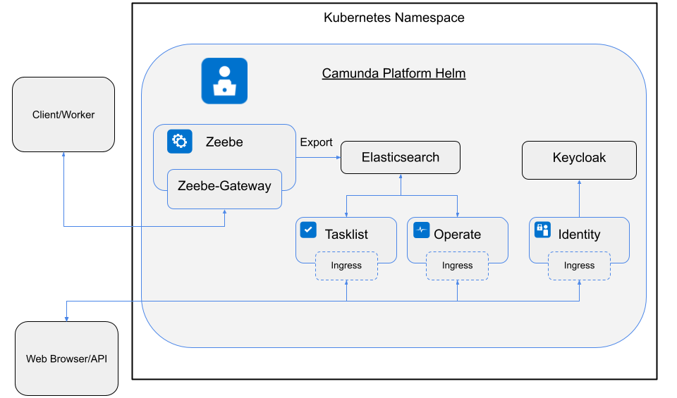

[](https://opensource.org/licenses/Apache-2.0)[](https://github.com/camunda/camunda-platform-helm/actions/workflows/go.yml)[](https://artifacthub.io/packages/search?repo=camunda-platform-helm)

- [Camunda Cloud Helm](#camunda-platform-helm)
  * [Installing Charts](#installing-charts)
  * [Configure Charts](#configure-charts)
  * [Uninstalling Charts](#uninstalling-charts)
  * [Deprecation of zeebe charts](#deprecation-of-zeebe-charts)
  * [Issues](#issues)
  * [Contributing](#contributing)
  * [Releasing the Charts](#releasing-the-charts)


# Camunda Cloud Helm
 
The Camunda Cloud Helm repo, contains and host Camunda Cloud related helm charts.

The charts can be accessed by adding the following Helm repo to your Helm setup:

```sh
helm repo add camunda-cloud https://helm.camunda.io
helm repo update
```

The charts are represented in the following image:



## Installing Charts

You can install the Helm Charts by running:

```sh
helm install <YOUR HELM RELEASE NAME> camunda-cloud/camunda-platform
```

Per default the following will be installed:

- [camunda-platform](https://github.com/camunda/camunda-platform-helm/blob/main/charts/camunda-platform/README.md)
  - [Zeebe](https://github.com/camunda/camunda-platform-helm/blob/main/charts/camunda-platform/README.md#zeebe)
  - [Zeebe Gateway](https://github.com/camunda/camunda-platform-helm/blob/main/charts/camunda-platform/README.md#zeebe-gateway)
  - [Operate](https://github.com/camunda/camunda-platform-helm/blob/main/charts/camunda-platform/README.md#operate)
  - [Tasklist](https://github.com/camunda/camunda-platform-helm/blob/main/charts/camunda-platform/README.md#tasklist)
  - [Identity](https://github.com/camunda/camunda-platform-helm/blob/main/charts/camunda-platform/README.md#identity)
  - [ElasticSearch](https://github.com/elastic/helm-charts/tree/master/elasticsearch)

Follow [the instructions in the Camunda Cloud documentation](https://docs.camunda.io/docs/self-managed/zeebe-deployment/kubernetes/index/) to install Camunda Cloud to a K8s cluster.

> ***Note**: check the [kind/ccsm-kind-values](https://github.com/camunda/camunda-platform-helm/blob/main/kind/ccsm-kind-values.yaml) file to get camunda-platform running with kind*


## Configure Charts

Helm charts can be configured via using extra values files or directly via the `--set` option. make sure to check out the [CCSM-HELM Readme](https://github.com/camunda-community-hub/camunda-platform-helm/blob/main/charts/camunda-platform/README.md) for more information.

Example to enable the prometheus servicemonitor for Zeebe:

```sh
helm install <YOUR HELM RELEASE NAME> camunda-cloud/camunda-platform --set zeebe.prometheusServiceMonitor.enabled=true
```

## Uninstalling Charts

You can remove these charts by running:

```
helm uninstall <YOUR HELM RELEASE NAME>
```

> Notice that all the services and pods will be deleted, but not the Persistence Volume Claims which are used to hold the storage for the data generated by the cluster and Elasticsearch. In order to free up the storage you need to manually delete all the Persistent Volume Claims. You can do this by running:

```
kubectl get pvc
```

Then delete the ones that you don't want to keep:

```
kubectl delete pvc <PVC ids here>
```

Or delete the related kubernetes namespace, which contains the resources.

## Deprecation of zeebe charts

With the creation of the Camunda Cloud Self Managed (CCSM) helm charts, the old zeebe-* charts have been deprecated.
This means they are no longer part of the repository and no longer maintained. The packaged charts are still available
for download.

The following charts are deprecated:

 * zeebe-full-helm
 * zeebe-cluster-helm
 * zeebe-operate-helm
 * zeebe-tasklist-helm

The new `camunda-platform` chart is a full replacement of `zeebe-full-helm` and replaces (contains) all other charts as sub-charts.
All sub-charts in `camunda-platform` are per default enabled.

For a complete migration guide see [here](https://github.com/camunda/camunda-platform-helm/blob/main/MIGRATION.md).

## Issues

Please create [new issues](https://github.com/camunda-community-hub/camunda-platform-helm) if you find problems with these charts. This repository is hosted using GitHub Pages and the source code repository can be found [here](https://github.com/camunda/camunda-platform-helm).

## Contributing

Please familiar yourself with the [contribution guide](https://github.com/camunda/camunda-platform-helm/blob/main/CONTRIBUTING.md) to find out how to contribute to this project. Please also make sure to check the [CCSM-Helm Readme](https://github.com/camunda/camunda-platform-helm/blob/main/charts/camunda-platform/README.md) to find more information about configuring and developing the charts.

## Releasing the Charts

In order to find out how to release the charts please see the corresponding [release guide](RELEASE.md).
