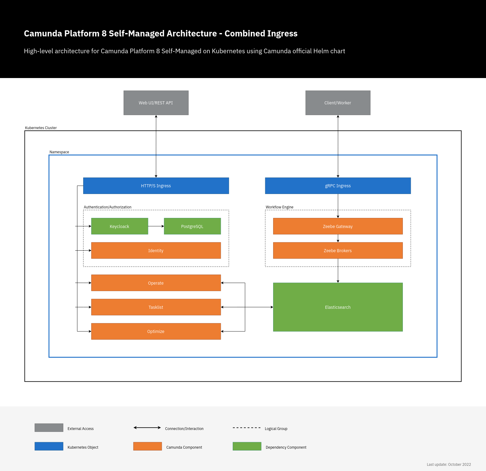

# Camunda 8 Helm Chart

Please also refer to the [documentation](https://docs.camunda.io/docs/self-managed/setup/overview/) on how to use Helm charts.

- [Architecture](#architecture)
- [Requirements](#requirements)
- [Dependencies](#dependencies)
- [Versioning](#versioning)
- [Installation](#installation)
  - [Local Kubernetes](#local-kubernetes)
  - [OpenShift](#openshift)
- [Backporting](#backporting)
- [Uninstalling Charts](#uninstalling-charts)
- [Configuration](#configuration)
- [Notes on Configuration](#notes-on-configuration)
  - [Web Modeler](#web-modeler)
  - [Elasticsearch](#elasticsearch)
  - [Keycloak](#keycloak)
- [Development](#development)
- [Releasing the Charts](#releasing-the-charts)
- [Parameters](#parameters)
  - [Global parameters](#global-parameters)
  - [Console Parameters](#console-parameters)
  - [Zeebe Parameters](#zeebe-parameters)
  - [ZeebeGateway Parameters](#zeebegateway-parameters)
  - [Operate Parameters](#operate-parameters)
  - [Tasklist Parameters](#tasklist-parameters)
  - [Optimize Parameters](#optimize-parameters)
  - [executionIdentity Parameters](#executionidentity-parameters)
  - [Identity Parameters](#identity-parameters)
  - [Identity - PostgreSQL Parameters](#identity---postgresql-parameters)
  - [Identity - Keycloak Parameters](#identity---keycloak-parameters)
  - [WebModeler Parameters](#webmodeler-parameters)
  - [WebModeler - RestAPI Parameters](#webmodeler---restapi-parameters)
  - [WebModeler - WebApp Parameters](#webmodeler---webapp-parameters)
  - [WebModeler - WebSockets Parameters](#webmodeler---websockets-parameters)
  - [WebModeler - PostgreSQL Parameters](#webmodeler---postgresql-parameters)
  - [Connectors Parameters](#connectors-parameters)
  - [Elasticsearch Parameters](#elasticsearch-parameters)
  - [Prometheus Parameters](#prometheus-parameters)

## Architecture

<p align="center">
  
</p>

## Requirements

- [Helm](https://helm.sh/) >= 3.9.x
- Kubernetes >= 1.20+
- Minimum cluster requirements include the following to run this chart with default settings.
  - All of these settings are configurable.
  - Three Kubernetes nodes to respect the default "hard" affinity settings
  - 2GB of RAM for the JVM heap

## Dependencies

Camunda 8 Helm chart is an umbrella chart for different components. Some are internal (sub-charts),
and some are external (third-party). The dependency management is fully automated and managed by Helm itself;
however, it's good to understand the dependency structure. This third-party dependency is reflected in the Helm chart
as follows:

```text
camunda-platform
  |_ elasticsearch
  |_ identity
    |_ keycloak
      |_ postgresql
  |_ optimize
  |_ operate
  |_ tasklist
  |_ zeebe
  |_ postgresql
```

> [!NOTE]
> Please note that the Connectors and Web Modeler components are part of the main chart and not implemented as sub-charts.

For example, Camunda Identity utilizes Keycloak and allows you to manage users, roles, and permissions
for Camunda 8 components.

- Keycloak is a dependency for Camunda Identity, and PostgreSQL is a dependency for Keycloak.
- Elasticsearch is a dependency for the Camunda chart, which is used in Zeebe, Operate, Tasklist, and Optimize.
- PostgreSQL is an optional dependency for the Camunda chart and is used by Web Modeler.

The values for the dependencies Keycloak and PostgreSQL can be set in the same hierarchy:

```yaml
identity:
  [identity values]
  keycloak:
    [keycloak values]
    postgresql:
      [postgresql values]
postgresql:
  [postgresql values]
```

## Versioning

After the 8.4 release (January 2024), the Camunda Helm chart version is **decoupled** from the version of the application (e.g., the chart version is `9.0.0` and the application version is `8.4.x`).

Before the 8.4 release, the Camunda Helm chart version was **coupled** with the applications version (e.g., chart version is `8.3.x` and applications version is `8.3.x`).

For more details, check out the [full version matrix](https://helm.camunda.io/camunda-platform/version-matrix).

## Installation

The first command adds the official Camunda Helm charts repo, and the second installs the Camunda
chart to your current Kubernetes context.

```shell
helm repo add camunda https://helm.camunda.io
helm install camunda-platform camunda/camunda-platform
```

Although the Camunda 8 Helm chart gets the latest version of Camunda 8 applications,
the version is still possible to diverge slightly between the chart and the apps
(more details about that can be found in [versioning](../../README.md#versioning)).

To have the latest version of the chart and apps at any time, install the chart as follows:

```shell
helm install camunda-platform camunda/camunda-platform \
    --values https://helm.camunda.io/camunda-platform/values/values-latest.yaml
```

For the previous version, you can get the latest applications patch version using our [backporting mechanism](#backporting).

### Local Kubernetes

We recommend using Helm on KIND for local environments, as the Helm configurations are battle-tested
and much closer to production systems.

For more details, follow the Camunda 8
[local Kubernetes cluster guide](https://docs.camunda.io/docs/self-managed/setup/deploy/local/local-kubernetes-cluster/).

### OpenShift

Check out [OpenShift Support](openshift/README.md) to get started with deploying the charts on Red Hat OpenShift.

## Backporting

Our Helm chart is highly customizable and constantly evolving.
Hence, currently, we backport the older charts by providing an extra value file per version.
That covers most backporting cases, like updating the application's image tags to the latest patch
version, setting env var, etc.

To install a previous chart version with the latest app patch image tags for that version,
use the values file for the minor release. For example (the values file could also be downloaded):

```shell
helm install camunda-platform camunda/camunda-platform --version 8.1 \
    --values https://helm.camunda.io/camunda-platform/values/values-v8.1.yaml
```

## Uninstalling Charts

You can remove these charts by running:

```sh
helm uninstall camunda
```

> [!NOTE]
>
> Notice that all the Services and Pods will be deleted, but not the PersistentVolumeClaims (PVC)
> which are used to hold the storage for the data generated by the cluster and Elasticsearch.

To free up the storage, you need to delete all the PVCs manually.

First, view the PVCs:

```sh
kubectl get pvc -l app.kubernetes.io/instance=camunda
kubectl get pvc -l release=camunda
```

Then delete the ones that you don't want to keep:

```sh
kubectl delete pvc -l app.kubernetes.io/instance=camunda
kubectl delete pvc -l release=camunda
```

Or you can delete the related Kubernetes namespace, which contains all PVCs.

## Configuration

The following sections contain the configuration values for the chart and each sub-chart. All of them can be overwritten
via a separate `values.yaml` file.

Check out the default [values.yaml](values.yaml) file, which contains the same content and documentation.

> [!NOTE]
>
> For more details about deploying Camunda 8 on Kubernetes, please visit the
> [Helm/Kubernetes installation instructions docs](https://docs.camunda.io/docs/self-managed/setup/overview/).

## Notes on Configuration

### Web Modeler

> [!NOTE]
>
> Non-production installations of Web Modeler are restricted to five collaborators per project. Refer to [the documentation](https://docs.camunda.io/docs/next/reference/licenses/) for more information.

#### Database

Web Modeler requires a PostgreSQL database to store the data.
You can either:

- Deploy a PostgreSQL instance as part of the Helm release by setting `postgresql.enabled` to `true` (which will enable the [postgresql chart dependency](#webmodeler---postgresql-parameters)).
- Configure a connection to an (existing) external database by setting `postgresql.enabled` to `false` and providing the values under `restapi.externalDatabase`.

#### SMTP server

Web Modeler requires an SMTP server to send (notification) emails to users.
The SMTP connection can be configured with the values under `restapi.mail`.

#### Updating Environment Variables

When configuring the `env` options in the settings listed above, the environment variables you specify in values.yaml may show up twice when running `kubectl describe deployment <deployment>`. However, the environment variable is specified in values.yaml will have precedence when the pod actually runs. To verify this, you can check the output from the following command:

```bash
kubectl exec pod/<podName> -- env
```

#### Outbound Connectors

To learn more about outbound connectors, visit [related documentation article](https://docs.camunda.io/docs/components/connectors/use-connectors/#outbound-connector).

#### Inbound Connectors

To learn more about inbound connectors, visit [related documentation article](https://docs.camunda.io/docs/components/connectors/use-connectors/#inbound-connector).

#### Using Connector Secrets

Connector secrets are generally configured via environment variables.

You can set them via `values.yaml`, or command line. For example, if you need to set a Slack token, you should configure the following:

```yaml
connectors:
  env:
    - name: SLACK_TOKEN
      value: <your actual token value>
```

After that, a Modeler user can set in their BPMN diagram a value `secrets.SLACK_TOKEN` without ever knowing the actual token.

Visit [using secrets in manual installation](https://docs.camunda.io/docs/8.0/self-managed/connectors-deployment/connectors-configuration/#secrets-in-manual-installations) to learn more.

### Elasticsearch

Camunda 8 Helm chart has a dependency on the [Elasticsearch 8 Helm Chart](https://artifacthub.io/packages/helm/bitnami/elasticsearch). All variables related to Elasticsearch can be set under `elasticsearch`.

> [!NOTE]
>
> The default setup of the Elasticsearch 8 part of Camunda 8 uses nodes that have all roles (master, data, coordinating, and ingest).
> For high-demand deployments, it's recommended to deploy the Elasticsearch master-eligible nodes as master-only nodes.

| Section | Parameter | Description | Default |
|-|-|-|-|
| `elasticsearch`| `enabled` | If true, enables Elasticsearch deployment as part of the Camunda Helm chart | `true` |

**Example:**

```yaml
elasticsearch:
  enabled: true
  image:
    tag: <YOUR_VERSION_HERE>
```

#### Elasticsearch Retention

Since moving to Elasticsearch 8, [Curator](https://github.com/elastic/curator) is deprecated in favor of [Manage the index lifecycle](https://www.elastic.co/guide/en/elasticsearch/reference/current/index-lifecycle-management.html) (ILM). Hence, each component in Camunda 8 controls its Elasticsearch index retention.

### Keycloak

When Camunda 8 Identity component is enabled by default, and it depends on
[Bitnami Keycloak chart](https://github.com/bitnami/charts/tree/main/bitnami/keycloak).
Since Keycloak is a dependency for Identity, all variables related to Keycloak can be found in
[bitnami/keycloak/values.yaml](https://github.com/bitnami/charts/blob/main/bitnami/keycloak/values.yaml)
and can be set under `identityKeycloak`.

| Section | Parameter | Description | Default |
|-|-|-|-|
| `identityKeycloak`| `enabled` | If true, enables Keycloak chart deployment as part of the Camunda Helm chart | `true` |

**Example:**

```yaml
identity:
  keycloak:
    enabled: true
```

#### Keycloak Theme

Camunda provides a custom theme for the login page used in all apps. The theme is copied from the Identity image.

The theme is added to Keycloak by default, however, since Helm v3 (the latest checked 3.10.x) doesn't merge lists
with custom values files, then you will need to add this to your own values file if you override any of
`extraVolumes`, `initContainers`, or `extraVolumeMounts`.

```yaml
identity:
  keycloak:
    extraVolumes:
    - name: camunda-theme
      emptyDir:
        sizeLimit: 10Mi
    initContainers:
    - name: copy-camunda-theme
      image: >-
        {{- $identityImageParams := (dict "base" .Values.global "overlay" .Values.global.identity) -}}
        {{- include "camundaPlatform.imageByParams" $identityImageParams }}
      imagePullPolicy: "{{ .Values.global.image.pullPolicy }}"
      command: ["sh", "-c", "cp -a /app/keycloak-theme/* /mnt"]
      volumeMounts:
      - name: camunda-theme
        mountPath: /mnt
    extraVolumeMounts:
    - name: camunda-theme
      mountPath: /opt/bitnami/keycloak/themes/identity
```

## Development

For development purposes, you might want to deploy and test the charts without creating a new helm chart release.
To do this you can run the following:

```sh
 helm install camunda --atomic --debug ./charts/camunda-platform
```

- `--atomic if set, the installation process deletes the installation on failure. The --wait flag will be set automatically if --atomic is used`

- `--debug enable verbose output`

To generate the resources/manifests without really installing them, you can use:

- `--dry-run simulate an install`

If you see errors like:

```sh
Error: found in Chart.yaml, but missing in charts/ directory: elasticsearch
```

Then you need to download the dependencies first.

Run the following to add resolve the dependencies:

```sh
make helm.repos-add
```

After this, you can run: `make helm.dependency-update`, which will update and download the dependencies for all charts.

The execution should look like this:

```text
$ make helm.dependency-update
helm dependency update charts/camunda-platform
Hang tight while we grab the latest from your chart repositories...
...Successfully got an update from the "camunda-platform" chart repository
...Successfully got an update from the "bitnami" chart repository
Update Complete. ⎈Happy Helming!⎈
Saving 6 charts
Dependency zeebe did not declare a repository. Assuming it exists in the charts directory
Dependency zeebe-gateway did not declare a repository. Assuming it exists in the charts directory
Dependency operate did not declare a repository. Assuming it exists in the charts directory
Dependency tasklist did not declare a repository. Assuming it exists in the charts directory
Dependency identity did not declare a repository. Assuming it exists in the charts directory
Deleting outdated charts
helm dependency update charts/camunda-platform/charts/identity
Hang tight while we grab the latest from your chart repositories...
...Successfully got an update from the "camunda-platform" chart repository
...Successfully got an update from the "bitnami" chart repository
Update Complete. ⎈Happy Helming!⎈
Saving 2 charts
Downloading keycloak from repo https://charts.bitnami.com/bitnami
Downloading common from repo https://charts.bitnami.com/bitnami
```

## Releasing the Charts

Please see the corresponding [release guide](../../docs/release.md) to find out how to release the chart.

## Parameters

### Global parameters

| Name                                                    | Description                                                                                                                                                                                                                                                                                              | Value                                                              |
| ------------------------------------------------------- | -------------------------------------------------------------------------------------------------------------------------------------------------------------------------------------------------------------------------------------------------------------------------------------------------------- | ------------------------------------------------------------------ |
| `global`                                                |                                                                                                                                                                                                                                                                                                          |                                                                    |
| `global.secrets`                                        | configuration for auto-generated secrets which is only used during the installation.                                                                                                                                                                                                                     |                                                                    |
| `global.secrets.autoGenerated`                          | if true, a secret object will be generated with auto-generated passwords. This secret object is NOT managed with corresponding releases and NOR part of Helm deployment/upgrade! It's generated once, and if it's deleted, you will lose the secrets.                                                    | `false`                                                            |
| `global.secrets.name`                                   | defines the name of the secret object that has the auto-generated passwords.                                                                                                                                                                                                                             | `camunda-credentials`                                              |
| `global.secrets.annotations`                            | defines the secret object annotations that utilize Helm hooks to keep that object out of the Helm deployment.                                                                                                                                                                                            | `{}`                                                               |
| `global.license`                                        |                                                                                                                                                                                                                                                                                                          |                                                                    |
| `global.license.key`                                    | if set, it will be exposed as "CAMUNDA_LICENSE_KEY" in the apps.                                                                                                                                                                                                                                         | `""`                                                               |
| `global.license.existingSecret`                         | you can provide an existing secret name for Camunda license secret.                                                                                                                                                                                                                                      | `""`                                                               |
| `global.license.existingSecretKey`                      | you can provide the key within the existing secret object for Camunda license key.                                                                                                                                                                                                                       | `""`                                                               |
| `global.compatibility`                                  | Compatibility adaptations for Kubernetes platforms                                                                                                                                                                                                                                                       |                                                                    |
| `global.compatibility.openshift.adaptSecurityContext`   | Adapt the securityContext sections of the deployment to make them compatible with Openshift restricted-v2 SCC: remove runAsUser, runAsGroup and fsGroup and let the platform use their allowed default IDs. Possible values: force (perform the adaptation always), disabled (do not perform adaptation) | `disabled`                                                         |
| `global.config`                                         | Config used in various places.                                                                                                                                                                                                                                                                           |                                                                    |
| `global.config.requestBodySize`                         | defines applications request body size which used for upload files.                                                                                                                                                                                                                                      | `10MB`                                                             |
| `global.multitenancy`                                   |                                                                                                                                                                                                                                                                                                          |                                                                    |
| `global.multitenancy.enabled`                           | if true, then enable multitenancy in all applicable components.                                                                                                                                                                                                                                          | `false`                                                            |
| `global.security`                                       |                                                                                                                                                                                                                                                                                                          |                                                                    |
| `global.security.authentication`                        |                                                                                                                                                                                                                                                                                                          |                                                                    |
| `global.security.authentication.method`                 | defines the authentication method which should be used. Possible values: basic, oidc                                                                                                                                                                                                                     | `basic`                                                            |
| `global.security.authentication.unprotectedApi`         | if true, then allow unauthenticated API access.                                                                                                                                                                                                                                                          | `false`                                                            |
| `global.security.authentication.oidc.usernameClaim`     | username claim.                                                                                                                                                                                                                                                                                          | `preferred_username`                                               |
| `global.security.authorizations`                        |                                                                                                                                                                                                                                                                                                          |                                                                    |
| `global.security.authorizations.enabled`                | if true, then enable authorizations checks in all applicable components.                                                                                                                                                                                                                                 | `true`                                                             |
| `global.security.initialization`                        |                                                                                                                                                                                                                                                                                                          |                                                                    |
| `global.security.initialization.users`                  |                                                                                                                                                                                                                                                                                                          |                                                                    |
| `global.security.initialization.users[0].username`      |                                                                                                                                                                                                                                                                                                          | `demo`                                                             |
| `global.security.initialization.users[0].password`      |                                                                                                                                                                                                                                                                                                          | `demo`                                                             |
| `global.security.initialization.users[0].name`          |                                                                                                                                                                                                                                                                                                          | `Demo User`                                                        |
| `global.security.initialization.users[0].email`         |                                                                                                                                                                                                                                                                                                          | `demo@demo.com`                                                    |
| `global.security.initialization.users.username,`        | the username of an initial user.                                                                                                                                                                                                                                                                         |                                                                    |
| `global.security.initialization.users.password,`        | the password of an initial user.                                                                                                                                                                                                                                                                         |                                                                    |
| `global.security.initialization.users.name,`            | the name of an initial user.                                                                                                                                                                                                                                                                             |                                                                    |
| `global.security.initialization.users.email,`           | the email of an initial user.                                                                                                                                                                                                                                                                            |                                                                    |
| `global.security.initialization.mappings[0].mappingID`  | the mapping-id of an initial mapping.                                                                                                                                                                                                                                                                    | `demo-user-mapping`                                                |
| `global.security.initialization.mappings[0].claimName`  | the claim-name of an initial mapping.                                                                                                                                                                                                                                                                    | `preferred_username`                                               |
| `global.security.initialization.mappings[0].claimValue` | the name of an initial user.                                                                                                                                                                                                                                                                             | `demo`                                                             |
| `global.createReleaseInfo`                              | Create config that will be used in Camunda Console.                                                                                                                                                                                                                                                      | `true`                                                             |
| `global.annotations`                                    | Annotations can be used to define common annotations, which should be applied to all deployments                                                                                                                                                                                                         | `{}`                                                               |
| `global.labels`                                         | can be used to apply immutable labels applied to all Camunda resources. These are also used in matchLabels fields in selectors.                                                                                                                                                                          |                                                                    |
| `global.labels.app`                                     | Name of the application                                                                                                                                                                                                                                                                                  | `camunda-platform`                                                 |
| `global.commonLabels`                                   | can be used to apply mutable labels to all Camunda resources.                                                                                                                                                                                                                                            | `{}`                                                               |
| `global.nodeSelector`                                   | can be used to define Kubernetes node selectors to run Camunda components, unless overridden by component-specific nodeSelector.                                                                                                                                                                         | `{}`                                                               |
| `global.image.registry`                                 | Can be used to set container image registry.                                                                                                                                                                                                                                                             | `""`                                                               |
| `global.image.tag`                                      | defines the tag / version which should be used in the most of the apps.                                                                                                                                                                                                                                  | `""`                                                               |
| `global.image.pullPolicy`                               | defines the image pull policy which should be used https://kubernetes.io/docs/concepts/containers/images/#image-pull-policy                                                                                                                                                                              | `Always`                                                           |
| `global.image.pullSecrets`                              | can be used to configure image pull secrets https://kubernetes.io/docs/concepts/containers/images/#specifying-imagepullsecrets-on-a-pod                                                                                                                                                                  | `[]`                                                               |
| `global.ingress`                                        |                                                                                                                                                                                                                                                                                                          |                                                                    |
| `global.ingress.enabled`                                | if true, an ingress resource is deployed. Only useful if an ingress controller is available, like Ingress-NGINX.                                                                                                                                                                                         | `false`                                                            |
| `global.ingress.external`                               | if true, the Ingress object will not be rendered. This setting is used when a non-Ingress resource, like a service mesh, is used to access the cluster.                                                                                                                                                  | `false`                                                            |
| `global.ingress.className`                              | Ingress.className defines the class or configuration of ingress which should be used by the controller                                                                                                                                                                                                   | `nginx`                                                            |
| `global.ingress.annotations`                            | defines the ingress related annotations, consumed mostly by the ingress controller                                                                                                                                                                                                                       | `{}`                                                               |
| `global.ingress.host`                                   | If not specified the rules applies to all inbound http traffic, if specified the rule applies to that host.                                                                                                                                                                                              | `""`                                                               |
| `global.ingress.pathType`                               | can be used to define the Ingress path type. https://kubernetes.io/docs/concepts/services-networking/ingress/#path-types                                                                                                                                                                                 | `Prefix`                                                           |
| `global.ingress.tls`                                    | configuration for tls on the ingress resource https://kubernetes.io/docs/concepts/services-networking/ingress/#tls                                                                                                                                                                                       |                                                                    |
| `global.ingress.tls.enabled`                            | if true, then tls is configured on the ingress resource. If enabled the Ingress.host need to be defined.                                                                                                                                                                                                 | `false`                                                            |
| `global.ingress.tls.secretName`                         | defines the secret name which contains the TLS private key and certificate                                                                                                                                                                                                                               | `camunda-platform`                                                 |
| `global.elasticsearch`                                  |                                                                                                                                                                                                                                                                                                          |                                                                    |
| `global.elasticsearch.enabled`                          | if true, enables elasticsearch for all components                                                                                                                                                                                                                                                        | `true`                                                             |
| `global.elasticsearch.external`                         | if true, tries to connect to an external elasticsearch                                                                                                                                                                                                                                                   | `false`                                                            |
| `global.elasticsearch.tls`                              |                                                                                                                                                                                                                                                                                                          |                                                                    |
| `global.elasticsearch.tls.enabled`                      | enable tls for external elasticsearch                                                                                                                                                                                                                                                                    | `false`                                                            |
| `global.elasticsearch.tls.existingSecret`               | provide an already existing tls secret for connecting to external elasticsearch                                                                                                                                                                                                                          | `""`                                                               |
| `global.elasticsearch.auth`                             |                                                                                                                                                                                                                                                                                                          |                                                                    |
| `global.elasticsearch.auth.username`                    | the username for external elasticsearch                                                                                                                                                                                                                                                                  | `""`                                                               |
| `global.elasticsearch.auth.password`                    | the password for external elasticsearch                                                                                                                                                                                                                                                                  | `""`                                                               |
| `global.elasticsearch.auth.existingSecret`              | you can provide an existing secret for the external elasticsearch password                                                                                                                                                                                                                               | `""`                                                               |
| `global.elasticsearch.auth.existingSecretKey`           | you can provide an existing secret key for the external elasticsearch password                                                                                                                                                                                                                           | `password`                                                         |
| `global.elasticsearch.disableExporter`                  | DEPRECATED: this value is not needed anymore. Use global.elasticsearch.enabled                                                                                                                                                                                                                           | `false`                                                            |
| `global.elasticsearch.url`                              | Configuration to configure elasticsearch url                                                                                                                                                                                                                                                             |                                                                    |
| `global.elasticsearch.url.protocol`                     | defines the elasticsearch access protocol.                                                                                                                                                                                                                                                               | `http`                                                             |
| `global.elasticsearch.url.host`                         | Elasticsearch.host defines the elasticsearch host, ideally the service name inside the namespace                                                                                                                                                                                                         | `{{ .Release.Name }}-elasticsearch`                                |
| `global.elasticsearch.url.port`                         | Elasticsearch.port defines the elasticsearch port, under which elasticsearch can be accessed                                                                                                                                                                                                             | `9200`                                                             |
| `global.elasticsearch.clusterName`                      | Elasticsearch.clusterName defines the cluster name which is used by Elasticsearch                                                                                                                                                                                                                        | `elasticsearch`                                                    |
| `global.elasticsearch.prefix`                           | Elasticsearch.prefix defines the prefix which is used by the Zeebe Elasticsearch Exporter to create Elasticsearch indexes                                                                                                                                                                                | `zeebe-record`                                                     |
| `global.opensearch`                                     |                                                                                                                                                                                                                                                                                                          |                                                                    |
| `global.opensearch.enabled`                             | enabled external opensearch                                                                                                                                                                                                                                                                              | `false`                                                            |
| `global.opensearch.aws.enabled`                         | Enabling AWS IRSA                                                                                                                                                                                                                                                                                        | `false`                                                            |
| `global.opensearch.tls`                                 |                                                                                                                                                                                                                                                                                                          |                                                                    |
| `global.opensearch.tls.enabled`                         | enable tls for external opensearch                                                                                                                                                                                                                                                                       | `false`                                                            |
| `global.opensearch.tls.existingSecret`                  | provide an already existing tls secret for connecting to external opensearch                                                                                                                                                                                                                             | `""`                                                               |
| `global.opensearch.auth`                                |                                                                                                                                                                                                                                                                                                          |                                                                    |
| `global.opensearch.auth.username`                       | the username for external opensearch                                                                                                                                                                                                                                                                     | `""`                                                               |
| `global.opensearch.auth.password`                       | the password for external opensearch                                                                                                                                                                                                                                                                     | `""`                                                               |
| `global.opensearch.auth.existingSecret`                 | you can provide an existing secret for the external opensearch password                                                                                                                                                                                                                                  | `""`                                                               |
| `global.opensearch.auth.existingSecretKey`              | you can provide an existing secret key for the external opensearch password                                                                                                                                                                                                                              | `password`                                                         |
| `global.opensearch.url`                                 | Configuration to configure opensearch url                                                                                                                                                                                                                                                                |                                                                    |
| `global.opensearch.url.protocol`                        | defines the external opensearch access protocol                                                                                                                                                                                                                                                          | `https`                                                            |
| `global.opensearch.url.host`                            | defines the external opensearch host, ideally the service name inside the namespace                                                                                                                                                                                                                      | `""`                                                               |
| `global.opensearch.url.port`                            | defines the external opensearch port, under which opensearch can be accessed                                                                                                                                                                                                                             | `443`                                                              |
| `global.zeebeClusterName`                               | ZeebeClusterName defines the cluster name for the Zeebe cluster. All Zeebe pods get this prefix in their name and the brokers uses that as cluster name.                                                                                                                                                 | `{{ .Release.Name }}-zeebe`                                        |
| `global.identity.service.url`                           |                                                                                                                                                                                                                                                                                                          | `""`                                                               |
| `global.identity.keycloak.internal`                     | It's useful for using existing Keycloak in another namespace with and access it with the combined Ingress.                                                                                                                                                                                               | `false`                                                            |
| `global.identity.keycloak.url`                          | can be used incorporate with "identityKeycloak.enabled: false" to use your own Keycloak instead of the one comes with Camunda Helm chart.                                                                                                                                                                | `{}`                                                               |
| `global.identity.keycloak.contextPath`                  | In Keycloak v16.x.x it's hard-coded as '/auth', but in v19.x.x it's '/'.                                                                                                                                                                                                                                 | `/auth`                                                            |
| `global.identity.keycloak.realm`                        | defines Keycloak realm path used for Camunda.                                                                                                                                                                                                                                                            | `/realms/camunda-platform`                                         |
| `global.identity.keycloak.auth`                         | same as "identityKeycloak.auth" but it's used for existing Keycloak.                                                                                                                                                                                                                                     | `{}`                                                               |
| `global.identity.auth`                                  | configuration, to configure identity authentication setup                                                                                                                                                                                                                                                |                                                                    |
| `global.identity.auth.enabled`                          | if true, enables the identity authentication otherwise basic-auth will be used on all services.                                                                                                                                                                                                          | `false`                                                            |
| `global.identity.auth.issuer`                           | defines the issuer name, which is used by the services to validate the JWT tokens.                                                                                                                                                                                                                       | `""`                                                               |
| `global.identity.auth.issuerBackendUrl`                 | defines the issuer backend URL, which is used by the services to validate the JWT tokens in a container to container context.                                                                                                                                                                            | `""`                                                               |
| `global.identity.auth.tokenUrl`                         | defines the token URL, which is used by the services to request JWT tokens.                                                                                                                                                                                                                              | `""`                                                               |
| `global.identity.auth.jwksUrl`                          | defines the JWKS URL, which is used by the services to validate the JWT tokens.                                                                                                                                                                                                                          | `""`                                                               |
| `global.identity.auth.type`                             | defines the type of authentication which should be used. Defaults to Keycloak                                                                                                                                                                                                                            | `KEYCLOAK`                                                         |
| `global.identity.auth.publicIssuerUrl`                  | Can be overwritten if ingress is in use and an external IP is available.                                                                                                                                                                                                                                 | `http://localhost:18080/auth/realms/camunda-platform`              |
| `global.identity.auth.admin`                            | configuration to configure Connectors authentication specifics on global level, which can be accessed by other components                                                                                                                                                                                |                                                                    |
| `global.identity.auth.admin.enabled`                    | if true, creates the admin client which is used in administration operations if needed.                                                                                                                                                                                                                  | `false`                                                            |
| `global.identity.auth.admin.clientId`                   | defines the client id.                                                                                                                                                                                                                                                                                   | `admin`                                                            |
| `global.identity.auth.admin.existingSecret`             | A string literal password can be provided. If not set, a random secret is generated. Recommended: reference an existing Kubernetes Secret using global.identity.auth.admin.existingSecret.name.                                                                                                          | `{}`                                                               |
| `global.identity.auth.admin.existingSecretKey`          | defines the key within the existing secret object.                                                                                                                                                                                                                                                       | `identity-admin-client-token`                                      |
| `global.identity.auth.identity`                         | configuration to configure Identity authentication specifics on global level, which can be accessed by other components                                                                                                                                                                                  |                                                                    |
| `global.identity.auth.identity.clientId`                | defines the client id, which is used by Identity in authentication flows.                                                                                                                                                                                                                                | `camunda-identity`                                                 |
| `global.identity.auth.identity.audience`                | defines the audience, which is used by Identity.                                                                                                                                                                                                                                                         | `camunda-identity-resource-server`                                 |
| `global.identity.auth.identity.existingSecret`          | can be used to reference an existing secret. This should ONLY be used for an external OIDC provider. If not set, a random secret is generated.                                                                                                                                                           | `{}`                                                               |
| `global.identity.auth.identity.existingSecretKey`       | defines the key within the existing secret object.                                                                                                                                                                                                                                                       | `identity-oidc-client-token`                                       |
| `global.identity.auth.identity.redirectUrl`             | defines the redirect URL, which is used by the auth platform to access Identity.                                                                                                                                                                                                                         | `http://localhost:8085`                                            |
| `global.identity.auth.identity.initialClaimName`        | defines the initial claim name, which is used by Identity to configure initial mapping rules,                                                                                                                                                                                                            | `oid`                                                              |
| `global.identity.auth.identity.initialClaimValue`       | defines the initial claim value, which is used by Identity to configure initial mapping rules.                                                                                                                                                                                                           | `""`                                                               |
| `global.identity.auth.console`                          | configuration to configure Console authentication specifics on global level, which can be accessed by other components                                                                                                                                                                                   |                                                                    |
| `global.identity.auth.console.clientId`                 | defines the client id, which is used by Console in authentication flows.                                                                                                                                                                                                                                 | `console`                                                          |
| `global.identity.auth.console.audience`                 | defines the audience which is used by Console's client API.                                                                                                                                                                                                                                              | `console-api`                                                      |
| `global.identity.auth.console.wellKnown`                | defines the uri for the well known config which is used by Console (optional).                                                                                                                                                                                                                           | `https://well-known-uri`                                           |
| `global.identity.auth.console.existingSecret`           | A string literal secret can be provided. If not set, a random secret is generated. Recommended: reference an existing Kubernetes Secret using global.identity.auth.console.existingSecret.name.                                                                                                          | `{}`                                                               |
| `global.identity.auth.console.existingSecretKey`        | defines the key within the existing secret object.                                                                                                                                                                                                                                                       | `identity-console-client-token`                                    |
| `global.identity.auth.console.redirectUrl`              | defines the root URL which is used by Keycloak to access WebModeler.                                                                                                                                                                                                                                     | `http://localhost:8080`                                            |
| `global.identity.auth.webModeler`                       | configuration to configure WebModeler authentication specifics on global level, which can be accessed by other components                                                                                                                                                                                |                                                                    |
| `global.identity.auth.webModeler.clientId`              | defines the client id, which is used by WebModeler in authentication flows.                                                                                                                                                                                                                              | `web-modeler`                                                      |
| `global.identity.auth.webModeler.clientApiAudience`     | defines the audience which is used by WebModeler's client API.                                                                                                                                                                                                                                           | `web-modeler-api`                                                  |
| `global.identity.auth.webModeler.publicApiAudience`     | defines the audience which is used by WebModeler's public API.                                                                                                                                                                                                                                           | `web-modeler-public-api`                                           |
| `global.identity.auth.webModeler.redirectUrl`           | defines the root URL which is used by Keycloak to access WebModeler.                                                                                                                                                                                                                                     | `http://localhost:8084`                                            |
| `global.identity.auth.connectors`                       | configuration to configure Connectors authentication specifics on global level, which can be accessed by other components                                                                                                                                                                                |                                                                    |
| `global.identity.auth.connectors.clientId`              | defines the client id, which is used by Connectors in authentication flows.                                                                                                                                                                                                                              | `connectors`                                                       |
| `global.identity.auth.connectors.existingSecret`        | A string literal secret can be provided. If not set, a random secret is generated. Recommended: reference an existing Kubernetes Secret using global.identity.auth.connectors.existingSecret.name.                                                                                                       | `{}`                                                               |
| `global.identity.auth.connectors.existingSecretKey`     | defines the key within the existing secret object.                                                                                                                                                                                                                                                       | `identity-connectors-client-token`                                 |
| `global.identity.auth.core`                             | configuration to configure authentication specifics on global level, which can be accessed by other components                                                                                                                                                                                           |                                                                    |
| `global.identity.auth.core.audience`                    | defines the audience, which is used by Core.                                                                                                                                                                                                                                                             | `core-api`                                                         |
| `global.identity.auth.core.clientId`                    | defines the client id, which is used by Core in authentication flows.                                                                                                                                                                                                                                    | `core`                                                             |
| `global.identity.auth.core.existingSecret`              | A string literal password can be provided. If not set, a random secret is generated. Recommended: reference an existing Kubernetes Secret using global.identity.auth.core.existingSecret.name.                                                                                                           | `{}`                                                               |
| `global.identity.auth.core.existingSecretKey`           | defines the key within the existing secret object.                                                                                                                                                                                                                                                       | `identity-core-client-token`                                       |
| `global.identity.auth.core.redirectUrl`                 | defines the root (or redirect) URL, which is used by Keycloak to access Tasklist.                                                                                                                                                                                                                        | `http://localhost:8082`                                            |
| `global.identity.auth.core.tokenScope`                  | defines the token scope, which is used by Core.                                                                                                                                                                                                                                                          | `""`                                                               |
| `global.identity.auth.optimize`                         | configuration to configure Optimize authentication specifics on global level, which can be accessed by other components                                                                                                                                                                                  |                                                                    |
| `global.identity.auth.optimize.audience`                | defines the audience, which is used by Optimize.                                                                                                                                                                                                                                                         | `optimize-api`                                                     |
| `global.identity.auth.optimize.clientId`                | defines the client id, which is used by Optimize in authentication flows.                                                                                                                                                                                                                                | `optimize`                                                         |
| `global.identity.auth.optimize.existingSecret`          | A string literal secret can be provided. If not set, a random secret is generated. Recommended: reference an existing Kubernetes Secret using global.identity.auth.optimize.existingSecret.name.                                                                                                         | `{}`                                                               |
| `global.identity.auth.optimize.existingSecretKey`       | defines the key within the existing secret object.                                                                                                                                                                                                                                                       | `identity-optimize-client-token`                                   |
| `global.identity.auth.optimize.redirectUrl`             | defines the root (or redirect) URL, which is used by Keycloak to access Optimize.                                                                                                                                                                                                                        | `http://localhost:8083`                                            |
| `global.documentStore`                                  | These parameters are used to configure the document storage backend across all Camunda components.                                                                                                                                                                                                       |                                                                    |
| `global.documentStore.activeStoreId`                    | The default document store to use. Valid values: inmemory, aws, and gcp.                                                                                                                                                                                                                                 | `inmemory`                                                         |
| `global.documentStore.type.aws.enabled`                 | Enable AWS document store configuration.                                                                                                                                                                                                                                                                 | `false`                                                            |
| `global.documentStore.type.aws.storeId`                 | Custom prefix for AWS. Default will generate env vars containing 'storeId' such as DOCUMENT_STORE_AWS_CLASS.                                                                                                                                                                                             | `AWS`                                                              |
| `global.documentStore.type.aws.region`                  | AWS region for the S3 bucket. (example: us-east-1)                                                                                                                                                                                                                                                       | `""`                                                               |
| `global.documentStore.type.aws.bucket`                  | Name of the AWS S3 bucket.                                                                                                                                                                                                                                                                               | `your-aws-bucket`                                                  |
| `global.documentStore.type.aws.bucketPath`              | (Optional) Path/prefix within the S3 bucket.                                                                                                                                                                                                                                                             | `undefined`                                                        |
| `global.documentStore.type.aws.bucketTtl`               | (Optional) Time-to-live for documents in the S3 bucket (number in days).                                                                                                                                                                                                                                 | `undefined`                                                        |
| `global.documentStore.type.aws.class`                   | Fully qualified class name for the AWS document store provider.                                                                                                                                                                                                                                          | `io.camunda.document.store.aws.AwsDocumentStoreProvider`           |
| `global.documentStore.type.aws.existingSecret`          | Reference to an existing Kubernetes secret containing AWS credentials.                                                                                                                                                                                                                                   | `aws-credentials`                                                  |
| `global.documentStore.type.aws.accessKeyIdKey`          | Key within the AWS credentials secret for AWS_ACCESS_KEY_ID.                                                                                                                                                                                                                                             | `awsAccessKeyId`                                                   |
| `global.documentStore.type.aws.secretAccessKeyKey`      | Key within the AWS credentials secret for AWS_SECRET_ACCESS_KEY.                                                                                                                                                                                                                                         | `awsSecretAccessKey`                                               |
| `global.documentStore.type.gcp.enabled`                 | Enable GCP document store configuration.                                                                                                                                                                                                                                                                 | `false`                                                            |
| `global.documentStore.type.gcp.storeId`                 | Custom prefix for GCP. Default will generate env vars containing 'storeId' such as DOCUMENT_STORE_GCP_CLASS.                                                                                                                                                                                             | `GCP`                                                              |
| `global.documentStore.type.gcp.bucket`                  | Name of the GCP bucket.                                                                                                                                                                                                                                                                                  | `your-gcp-bucket`                                                  |
| `global.documentStore.type.gcp.class`                   | Fully qualified class name for the GCP document store provider.                                                                                                                                                                                                                                          | `io.camunda.document.store.gcp.GcpDocumentStoreProvider`           |
| `global.documentStore.type.gcp.existingSecret`          | Reference to an existing Kubernetes secret containing GCP credentials.                                                                                                                                                                                                                                   | `gcp-credentials`                                                  |
| `global.documentStore.type.gcp.credentialsKey`          | Key in the GCP credentials secret that contains the service-account JSON.                                                                                                                                                                                                                                | `service-account.json`                                             |
| `global.documentStore.type.gcp.mountPath`               | Mount path for the GCP credentials secret.                                                                                                                                                                                                                                                               | `/var/secrets/gcp`                                                 |
| `global.documentStore.type.gcp.fileName`                | The file name for the GCP credentials JSON.                                                                                                                                                                                                                                                              | `service-account.json`                                             |
| `global.documentStore.type.inmemory.enabled`            | Enable in-memory document store configuration.                                                                                                                                                                                                                                                           | `true`                                                             |
| `global.documentStore.type.inmemory.storeId`            | Custom prefix for in-memory. Default will generate env vars containing 'storeId' such as DOCUMENT_STORE_INMEMORY_CLASS.                                                                                                                                                                                  | `INMEMORY`                                                         |
| `global.documentStore.type.inmemory.class`              | Fully qualified class name for the in-memory document store provider.                                                                                                                                                                                                                                    | `io.camunda.document.store.inmemory.InMemoryDocumentStoreProvider` |
| `global.extraManifests`                                 | Array of extra objects to deploy with the release.                                                                                                                                                                                                                                                       | `[]`                                                               |

### Identity Parameters

| Name                                                         | Description                                                                                                                                                                                               | Value                         |
| ------------------------------------------------------------ | --------------------------------------------------------------------------------------------------------------------------------------------------------------------------------------------------------- | ----------------------------- |
| `identity.enabled`                                           | if true, the identity deployment and its related resources are deployed via a helm release                                                                                                                | `false`                       |
| `identity.fullnameOverride`                                  | can be used to override the full name of the Identity resources                                                                                                                                           | `""`                          |
| `identity.nameOverride`                                      | can be used to partly override the name of the Identity resources (names will still be prefixed with the release name)                                                                                    | `""`                          |
| `identity.firstUser`                                         | configuration to configure properties of the first Identity user, which can be used to access all                                                                                                         |                               |
| `identity.firstUser.enabled`                                 | if true, Identity will seed the first user in Keycloak.                                                                                                                                                   | `true`                        |
| `identity.firstUser.username`                                | defines the username of the first user, needed to log in into the web applications                                                                                                                        | `demo`                        |
| `identity.firstUser.password`                                | defines the password of the first user, needed to log in into the web applications                                                                                                                        | `demo`                        |
| `identity.firstUser.email`                                   | defines the email address of the first user; a valid email address is required to use WebModeler                                                                                                          | `demo@example.org`            |
| `identity.firstUser.firstName`                               | defines the first name of the first user; a name is required to use WebModeler                                                                                                                            | `Demo`                        |
| `identity.firstUser.lastName`                                | defines the last name of the first user; a name is required to use WebModeler                                                                                                                             | `User`                        |
| `identity.firstUser.existingSecret`                          | can be used to use an own existing secret for Identity first user.                                                                                                                                        | `camunda-credentials`         |
| `identity.firstUser.existingSecretKey`                       | defines the key within the existing secret object.                                                                                                                                                        | `identity-firstuser-password` |
| `identity.users`                                             | configuration to configure properties of the Identity users, which can be used to access web applications.                                                                                                | `[]`                          |
| `identity.image`                                             | configuration to configure the identity image specifics                                                                                                                                                   |                               |
| `identity.image.registry`                                    | can be used to set container image registry.                                                                                                                                                              | `""`                          |
| `identity.image.repository`                                  | defines which image repository to use                                                                                                                                                                     | `camunda/identity`            |
| `identity.image.tag`                                         | can be set to overwrite the global tag, which should be used in that chart                                                                                                                                | `8.8.0-alpha6`                |
| `identity.image.digest`                                      | can be used to set image digest (overrides tag if set, e.g. "sha256:abcd...")                                                                                                                             | `""`                          |
| `identity.image.pullSecrets`                                 | can be used to configure image pull secrets https://kubernetes.io/docs/concepts/containers/images/#specifying-imagepullsecrets-on-a-pod                                                                   | `[]`                          |
| `identity.sidecars`                                          | can be used to attach extra containers to the identity deployment                                                                                                                                         | `[]`                          |
| `identity.initContainers`                                    | can be used to set up extra init containers for the application Pod                                                                                                                                       | `[]`                          |
| `identity.fullURL`                                           | can be used when Ingress is configured (for both multi and single domain setup).                                                                                                                          | `""`                          |
| `identity.contextPath`                                       | can be used to make Identity web application works on a custom sub-path. This is mainly used to run Camunda web applications under a single domain.                                                       | `""`                          |
| `identity.podAnnotations`                                    | can be used to define extra Identity pod annotations                                                                                                                                                      | `{}`                          |
| `identity.podLabels`                                         | can be used to define extra Identity pod labels                                                                                                                                                           | `{}`                          |
| `identity.logging`                                           | configuration for the identity logging. This template will be directly included in the identity configuration YAML file                                                                                   |                               |
| `identity.logging.level.ROOT`                                |                                                                                                                                                                                                           | `DEBUG`                       |
| `identity.logging.level.io.camunda.identity`                 | https://docs.camunda.io/docs/next/self-managed/identity/user-guide/configuration/configure-logging/#general-configuration-options                                                                         | `DEBUG`                       |
| `identity.service`                                           | configuration to configure the identity service.                                                                                                                                                          |                               |
| `identity.service.annotations`                               | can be used to define annotations, which will be applied to the identity service                                                                                                                          | `{}`                          |
| `identity.service.type`                                      | defines the type of the service https://kubernetes.io/docs/concepts/services-networking/service/#publishing-services-service-types                                                                        | `ClusterIP`                   |
| `identity.service.port`                                      | defines the port of the service on which the identity application will be available                                                                                                                       | `80`                          |
| `identity.service.metricsPort`                               | defines the port of the service on which the identity metrics will be available                                                                                                                           | `82`                          |
| `identity.service.metricsName`                               | defines the name of the service on which the identity metrics will be available                                                                                                                           | `metrics`                     |
| `identity.podSecurityContext`                                | defines the security options the Identity pod should be run with                                                                                                                                          |                               |
| `identity.podSecurityContext.runAsNonRoot`                   |                                                                                                                                                                                                           | `true`                        |
| `identity.podSecurityContext.fsGroup`                        |                                                                                                                                                                                                           | `1001`                        |
| `identity.podSecurityContext.seccompProfile`                 |                                                                                                                                                                                                           |                               |
| `identity.podSecurityContext.seccompProfile.type`            |                                                                                                                                                                                                           | `RuntimeDefault`              |
| `identity.containerSecurityContext`                          | defines the security options the Identity container should be run with                                                                                                                                    |                               |
| `identity.containerSecurityContext.allowPrivilegeEscalation` |                                                                                                                                                                                                           | `false`                       |
| `identity.containerSecurityContext.privileged`               |                                                                                                                                                                                                           | `false`                       |
| `identity.containerSecurityContext.readOnlyRootFilesystem`   |                                                                                                                                                                                                           | `true`                        |
| `identity.containerSecurityContext.runAsNonRoot`             |                                                                                                                                                                                                           | `true`                        |
| `identity.containerSecurityContext.runAsUser`                |                                                                                                                                                                                                           | `1001`                        |
| `identity.containerSecurityContext.seccompProfile`           |                                                                                                                                                                                                           |                               |
| `identity.containerSecurityContext.seccompProfile.type`      |                                                                                                                                                                                                           | `RuntimeDefault`              |
| `identity.startupProbe`                                      | configuration                                                                                                                                                                                             |                               |
| `identity.startupProbe.enabled`                              | if true, the startup probe is enabled in app container                                                                                                                                                    | `false`                       |
| `identity.startupProbe.scheme`                               | defines the startup probe schema used on calling the probePath                                                                                                                                            | `HTTP`                        |
| `identity.startupProbe.probePath`                            | defines the startup probe route used on the app                                                                                                                                                           | `/actuator/health`            |
| `identity.startupProbe.initialDelaySeconds`                  | defines the number of seconds after the container has started before the probe is initiated.                                                                                                              | `30`                          |
| `identity.startupProbe.periodSeconds`                        | defines how often the probe is executed                                                                                                                                                                   | `30`                          |
| `identity.startupProbe.successThreshold`                     | defines how often it needs to be true to be marked as ready, after failure                                                                                                                                | `1`                           |
| `identity.startupProbe.failureThreshold`                     | defines when the probe is considered as failed so the Pod will be marked Unready                                                                                                                          | `5`                           |
| `identity.startupProbe.timeoutSeconds`                       | defines the seconds after the probe times out                                                                                                                                                             | `1`                           |
| `identity.readinessProbe`                                    | configuration                                                                                                                                                                                             |                               |
| `identity.readinessProbe.enabled`                            | if true, the readiness probe is enabled in app container                                                                                                                                                  | `true`                        |
| `identity.readinessProbe.scheme`                             | defines the startup probe schema used on calling the probePath                                                                                                                                            | `HTTP`                        |
| `identity.readinessProbe.probePath`                          | defines the readiness probe route used on the app                                                                                                                                                         | `/actuator/health`            |
| `identity.readinessProbe.initialDelaySeconds`                | defines the number of seconds after the container has started before the probe is initiated.                                                                                                              | `30`                          |
| `identity.readinessProbe.periodSeconds`                      | defines how often the probe is executed                                                                                                                                                                   | `30`                          |
| `identity.readinessProbe.successThreshold`                   | defines how often it needs to be true to be marked as ready, after failure                                                                                                                                | `1`                           |
| `identity.readinessProbe.failureThreshold`                   | defines when the probe is considered as failed so the Pod will be marked Unready                                                                                                                          | `5`                           |
| `identity.readinessProbe.timeoutSeconds`                     | defines the seconds after the probe times out                                                                                                                                                             | `1`                           |
| `identity.livenessProbe`                                     | configuration                                                                                                                                                                                             |                               |
| `identity.livenessProbe.enabled`                             | if true, the liveness probe is enabled in app container                                                                                                                                                   | `false`                       |
| `identity.livenessProbe.scheme`                              | defines the startup probe schema used on calling the probePath                                                                                                                                            | `HTTP`                        |
| `identity.livenessProbe.probePath`                           | defines the liveness probe route used on the app                                                                                                                                                          | `/actuator/health`            |
| `identity.livenessProbe.initialDelaySeconds`                 | defines the number of seconds after the container has started before                                                                                                                                      | `30`                          |
| `identity.livenessProbe.periodSeconds`                       | defines how often the probe is executed                                                                                                                                                                   | `30`                          |
| `identity.livenessProbe.successThreshold`                    | defines how often it needs to be true to be considered successful after having failed                                                                                                                     | `1`                           |
| `identity.livenessProbe.failureThreshold`                    | defines when the probe is considered as failed so the container will be restarted                                                                                                                         | `5`                           |
| `identity.livenessProbe.timeoutSeconds`                      | defines the seconds after the probe times out                                                                                                                                                             | `1`                           |
| `identity.metrics.prometheus`                                | Prometheus metrics endpoint                                                                                                                                                                               | `/actuator/prometheus`        |
| `identity.nodeSelector`                                      | can be used to define on which nodes the Identity pods should run                                                                                                                                         | `{}`                          |
| `identity.tolerations`                                       | can be used to define pod toleration's https://kubernetes.io/docs/concepts/scheduling-eviction/taint-and-toleration/                                                                                      | `[]`                          |
| `identity.affinity`                                          | can be used to define pod affinity or anti-affinity https://kubernetes.io/docs/concepts/scheduling-eviction/assign-pod-node/#affinity-and-anti-affinity                                                   | `{}`                          |
| `identity.resources`                                         | configuration to set request and limit configuration for the container https://kubernetes.io/docs/concepts/configuration/manage-resources-containers/#requests-and-limits                                 |                               |
| `identity.resources.requests.memory`                         |                                                                                                                                                                                                           | `400Mi`                       |
| `identity.resources.limits.cpu`                              |                                                                                                                                                                                                           | `2000m`                       |
| `identity.resources.requests.cpu`                            |                                                                                                                                                                                                           | `600m`                        |
| `identity.resources.limits.memory`                           |                                                                                                                                                                                                           | `2Gi`                         |
| `identity.env`                                               | can be used to set extra environment variables in each identity container. See the documentation https://docs.camunda.io/docs/self-managed/identity/deployment/configuration-variables/ for more details. | `[]`                          |
| `identity.envFrom`                                           | list of environment variables to import from configMapRef and secretRef                                                                                                                                   | `[]`                          |
| `identity.command`                                           | can be used to override the default command provided by the container image. See https://kubernetes.io/docs/tasks/inject-data-application/define-command-argument-container/                              | `[]`                          |
| `identity.extraVolumes`                                      | can be used to define extra volumes for the identity pods, useful for tls and self-signed certificates                                                                                                    | `[]`                          |
| `identity.extraVolumeMounts`                                 | can be used to mount extra volumes for the identity pods, useful for tls and self-signed certificates                                                                                                     | `[]`                          |
| `identity.serviceAccount`                                    | configuration for the service account where the identity pods are assigned to                                                                                                                             |                               |
| `identity.serviceAccount.enabled`                            | if true, enables the identity service account                                                                                                                                                             | `true`                        |
| `identity.serviceAccount.name`                               | can be used to set the name of the identity service account                                                                                                                                               | `""`                          |
| `identity.serviceAccount.annotations`                        | can be used to set the annotations of the identity service account                                                                                                                                        | `{}`                          |
| `identity.serviceAccount.automountServiceAccountToken`       | can be used to control whether the service account token should be automatically mounted                                                                                                                  | `true`                        |
| `identity.externalDatabase.enabled`                          |                                                                                                                                                                                                           | `false`                       |
| `identity.externalDatabase.host`                             | Database host                                                                                                                                                                                             | `""`                          |
| `identity.externalDatabase.port`                             | Database port number                                                                                                                                                                                      | `5432`                        |
| `identity.externalDatabase.username`                         | Non-root username                                                                                                                                                                                         | `""`                          |
| `identity.externalDatabase.password`                         | Password for the non-root username                                                                                                                                                                        | `""`                          |
| `identity.externalDatabase.database`                         | The database name                                                                                                                                                                                         | `""`                          |
| `identity.externalDatabase.existingSecret`                   | Name of an existing Kubernetes Secret containing the external database credentials for Identity.                                                                                                          | `""`                          |
| `identity.externalDatabase.existingSecretPasswordKey`        | Name of an existing secret key containing the database credentials                                                                                                                                        | `""`                          |
| `identity.configuration`                                     | if specified, contents will be used as the application.yaml                                                                                                                                               | `""`                          |
| `identity.extraConfiguration`                                | if specified, contents will be used for any extra configuration files such as the log4j2.xml                                                                                                              | `{}`                          |
| `identity.dnsPolicy`                                         | https://kubernetes.io/docs/concepts/services-networking/dns-pod-service/#pod-s-dns-policy                                                                                                                 | `""`                          |
| `identity.dnsConfig`                                         | https://kubernetes.io/docs/concepts/services-networking/dns-pod-service/#pod-dns-config                                                                                                                   | `{}`                          |
| `identity.persistence`                                       | configuration for optional PVC creation                                                                                                                                                                   |                               |
| `identity.persistence.enabled`                               | can be used to create a PVC for persistent storage instead of using emptyDir                                                                                                                              | `false`                       |
| `identity.persistence.size`                                  | can be used to define the size of the persistent volume claim                                                                                                                                             | `10Gi`                        |
| `identity.persistence.accessModes`                           | can be used to define the access modes for the persistent volume claim                                                                                                                                    | `["ReadWriteOnce"]`           |
| `identity.persistence.storageClassName`                      | can be used to define the storage class to use for the persistent volume claim                                                                                                                            | `""`                          |
| `identity.persistence.existingClaim`                         | can be used to specify an existing PVC instead of creating a new one                                                                                                                                      | `""`                          |
| `identity.persistence.annotations`                           | can be used to define annotations to add to the persistent volume claim                                                                                                                                   | `{}`                          |
| `identity.persistence.selector`                              | can be used to define a label selector for the persistent volume claim                                                                                                                                    | `{}`                          |

### Identity - PostgreSQL Parameters

| Name                                                                     | Description                                                                                                                                                                                                                                                                                              | Value                                                                                    |
| ------------------------------------------------------------------------ | -------------------------------------------------------------------------------------------------------------------------------------------------------------------------------------------------------------------------------------------------------------------------------------------------------- | ---------------------------------------------------------------------------------------- |
| `identityPostgresql`                                                     | configuration for the PostgreSQL dependency chart used by Identity. For more details, check [Bitnami package for PostgreSQL](https://artifacthub.io/packages/helm/bitnami/postgresql#parameters) documentation.                                                                                          |                                                                                          |
| `identityPostgresql.enabled`                                             | Enable Identity PostgreSQL Helm chart. Required for Multi-Tenancy.                                                                                                                                                                                                                                       | `false`                                                                                  |
| `identityPostgresql.global.compatibility`                                | Compatibility adaptations for Kubernetes platforms                                                                                                                                                                                                                                                       |                                                                                          |
| `identityPostgresql.global.compatibility.openshift.adaptSecurityContext` | Adapt the securityContext sections of the deployment to make them compatible with Openshift restricted-v2 SCC: remove runAsUser, runAsGroup and fsGroup and let the platform use their allowed default IDs. Possible values: force (perform the adaptation always), disabled (do not perform adaptation) | `{{ .Values.global.compatibility.openshift.adaptSecurityContext | default "disabled" }}` |
| `identityPostgresql.image.repository`                                    | PostgreSQL repo                                                                                                                                                                                                                                                                                          | `bitnami/postgresql`                                                                     |
| `identityPostgresql.image.tag`                                           | PostgreSQL image tag                                                                                                                                                                                                                                                                                     | `15.10.0-debian-12-r2`                                                                   |
| `identityPostgresql.image.digest`                                        | can be used to set image digest (overrides tag if set, e.g. "sha256:abcd...")                                                                                                                                                                                                                            | `""`                                                                                     |
| `identityPostgresql.nameOverride`                                        | the name used for Identity PostgreSQL.                                                                                                                                                                                                                                                                   | `identity-postgresql`                                                                    |
| `identityPostgresql.auth.username`                                       | Non-root username                                                                                                                                                                                                                                                                                        | `identity`                                                                               |
| `identityPostgresql.auth.database`                                       | The database name                                                                                                                                                                                                                                                                                        | `identity`                                                                               |
| `identityPostgresql.auth.password`                                       | Password for the non-root username                                                                                                                                                                                                                                                                       | `""`                                                                                     |
| `identityPostgresql.auth.existingSecret`                                 | Name of an existing secret resource containing the database credentials                                                                                                                                                                                                                                  | `""`                                                                                     |
| `identityPostgresql.auth.secretKeys.adminPasswordKey`                    | defines the key within the existing secret object for PostgreSQL admin.                                                                                                                                                                                                                                  | `identity-postgresql-admin-password`                                                     |
| `identityPostgresql.auth.secretKeys.userPasswordKey`                     | defines the key within the existing secret object for PostgreSQL user.                                                                                                                                                                                                                                   | `identity-postgresql-user-password`                                                      |

### Identity - Keycloak Parameters

| Name                                                                                    | Description                                                                                                                                                                                                                                                                                              | Value                                                                                    |
| --------------------------------------------------------------------------------------- | -------------------------------------------------------------------------------------------------------------------------------------------------------------------------------------------------------------------------------------------------------------------------------------------------------- | ---------------------------------------------------------------------------------------- |
| `identityKeycloak`                                                                      | configuration, for the Keycloak dependency chart which is used by Identity. For more details, check [Bitnami package for Keycloak](https://artifacthub.io/packages/helm/bitnami/keycloak#parameters) documentation.                                                                                      |                                                                                          |
| `identityKeycloak.enabled`                                                              | Enable Identity Keycloak Helm chart. It is used incorporate with "global.identity.keycloak" to use your own Keycloak instead of the one comes with Camunda Helm chart                                                                                                                                    | `false`                                                                                  |
| `identityKeycloak.global.compatibility`                                                 | Compatibility adaptations for Kubernetes platforms                                                                                                                                                                                                                                                       |                                                                                          |
| `identityKeycloak.global.compatibility.openshift.adaptSecurityContext`                  | Adapt the securityContext sections of the deployment to make them compatible with Openshift restricted-v2 SCC: remove runAsUser, runAsGroup and fsGroup and let the platform use their allowed default IDs. Possible values: force (perform the adaptation always), disabled (do not perform adaptation) | `{{ .Values.global.compatibility.openshift.adaptSecurityContext | default "disabled" }}` |
| `identityKeycloak.global.security.allowInsecureImages`                                  | Allows the use of the Camunda build Keycloak image (including the Identity login theme)                                                                                                                                                                                                                  | `true`                                                                                   |
| `identityKeycloak.nameOverride`                                                         | the name used for Keycloak.                                                                                                                                                                                                                                                                              | `keycloak`                                                                               |
| `identityKeycloak.image`                                                                | configuration.                                                                                                                                                                                                                                                                                           |                                                                                          |
| `identityKeycloak.image.repository`                                                     | image repo                                                                                                                                                                                                                                                                                               | `camunda/keycloak`                                                                       |
| `identityKeycloak.image.tag`                                                            | image tag                                                                                                                                                                                                                                                                                                | `26.1.4`                                                                                 |
| `identityKeycloak.image.digest`                                                         | can be used to set image digest (overrides tag if set, e.g. "sha256:abcd...")                                                                                                                                                                                                                            | `""`                                                                                     |
| `identityKeycloak.resources`                                                            | configuration of resource requests and limits for the container, see https://kubernetes.io/docs/concepts/configuration/manage-resources-containers/#requests-and-limits                                                                                                                                  |                                                                                          |
| `identityKeycloak.resources.requests.cpu`                                               |                                                                                                                                                                                                                                                                                                          | `1000m`                                                                                  |
| `identityKeycloak.resources.requests.memory`                                            |                                                                                                                                                                                                                                                                                                          | `1Gi`                                                                                    |
| `identityKeycloak.resources.limits.cpu`                                                 |                                                                                                                                                                                                                                                                                                          | `2000m`                                                                                  |
| `identityKeycloak.resources.limits.memory`                                              |                                                                                                                                                                                                                                                                                                          | `2Gi`                                                                                    |
| `identityKeycloak.postgresql`                                                           | configuration.                                                                                                                                                                                                                                                                                           |                                                                                          |
| `identityKeycloak.postgresql.image.repository`                                          | image repo                                                                                                                                                                                                                                                                                               | `bitnami/postgresql`                                                                     |
| `identityKeycloak.postgresql.image.tag`                                                 | image tag                                                                                                                                                                                                                                                                                                | `15.10.0-debian-12-r2`                                                                   |
| `identityKeycloak.postgresql.image.digest`                                              | can be used to set image digest (overrides tag if set, e.g. "sha256:abcd...")                                                                                                                                                                                                                            | `""`                                                                                     |
| `identityKeycloak.postgresql.auth.existingSecret`                                       | defines the existing secret resource containing the database credentials                                                                                                                                                                                                                                 | `camunda-credentials`                                                                    |
| `identityKeycloak.postgresql.auth.secretKeys.adminPasswordKey`                          | defines the key within the existing secret object for PostgreSQL admin.                                                                                                                                                                                                                                  | `identity-keycloak-postgresql-admin-password`                                            |
| `identityKeycloak.postgresql.auth.secretKeys.userPasswordKey`                           | defines the key within the existing secret object for PostgreSQL user.                                                                                                                                                                                                                                   | `identity-keycloak-postgresql-user-password`                                             |
| `identityKeycloak.postgresql.primary.containerSecurityContext.enabled`                  |                                                                                                                                                                                                                                                                                                          | `true`                                                                                   |
| `identityKeycloak.postgresql.primary.containerSecurityContext.privileged`               |                                                                                                                                                                                                                                                                                                          | `false`                                                                                  |
| `identityKeycloak.postgresql.primary.containerSecurityContext.readOnlyRootFilesystem`   |                                                                                                                                                                                                                                                                                                          | `true`                                                                                   |
| `identityKeycloak.postgresql.primary.containerSecurityContext.allowPrivilegeEscalation` |                                                                                                                                                                                                                                                                                                          | `false`                                                                                  |
| `identityKeycloak.postgresql.primary.containerSecurityContext.runAsNonRoot`             |                                                                                                                                                                                                                                                                                                          | `true`                                                                                   |
| `identityKeycloak.postgresql.primary.containerSecurityContext.runAsUser`                |                                                                                                                                                                                                                                                                                                          | `1001`                                                                                   |
| `identityKeycloak.postgresql.primary.containerSecurityContext.capabilities.drop`        |                                                                                                                                                                                                                                                                                                          | `["ALL"]`                                                                                |
| `identityKeycloak.postgresql.primary.containerSecurityContext.seccompProfile.type`      |                                                                                                                                                                                                                                                                                                          | `RuntimeDefault`                                                                         |
| `identityKeycloak.postgresql.primary.podSecurityContext.enabled`                        |                                                                                                                                                                                                                                                                                                          | `true`                                                                                   |
| `identityKeycloak.postgresql.primary.podSecurityContext.runAsNonRoot`                   |                                                                                                                                                                                                                                                                                                          | `true`                                                                                   |
| `identityKeycloak.postgresql.primary.podSecurityContext.fsGroup`                        |                                                                                                                                                                                                                                                                                                          | `1001`                                                                                   |
| `identityKeycloak.proxy`                                                                | keycloak proxy                                                                                                                                                                                                                                                                                           | `edge`                                                                                   |
| `identityKeycloak.tls`                                                                  | can be used to enable TLS encryption. Required for HTTPs traffic.                                                                                                                                                                                                                                        |                                                                                          |
| `identityKeycloak.tls.enabled`                                                          | enabling tls                                                                                                                                                                                                                                                                                             | `false`                                                                                  |
| `identityKeycloak.extraVolumeMounts[0].name`                                            |                                                                                                                                                                                                                                                                                                          | `data-tmp`                                                                               |
| `identityKeycloak.extraVolumeMounts[0].mountPath`                                       |                                                                                                                                                                                                                                                                                                          | `/opt/bitnami/keycloak/data/tmp`                                                         |
| `identityKeycloak.containerSecurityContext.privileged`                                  |                                                                                                                                                                                                                                                                                                          | `false`                                                                                  |
| `identityKeycloak.containerSecurityContext.readOnlyRootFilesystem`                      |                                                                                                                                                                                                                                                                                                          | `true`                                                                                   |
| `identityKeycloak.containerSecurityContext.allowPrivilegeEscalation`                    |                                                                                                                                                                                                                                                                                                          | `false`                                                                                  |
| `identityKeycloak.containerSecurityContext.runAsNonRoot`                                |                                                                                                                                                                                                                                                                                                          | `true`                                                                                   |
| `identityKeycloak.containerSecurityContext.runAsUser`                                   |                                                                                                                                                                                                                                                                                                          | `1001`                                                                                   |
| `identityKeycloak.containerSecurityContext.capabilities.drop`                           |                                                                                                                                                                                                                                                                                                          | `["ALL"]`                                                                                |
| `identityKeycloak.containerSecurityContext.seccompProfile.type`                         |                                                                                                                                                                                                                                                                                                          | `RuntimeDefault`                                                                         |
| `identityKeycloak.podSecurityContext.runAsNonRoot`                                      |                                                                                                                                                                                                                                                                                                          | `true`                                                                                   |
| `identityKeycloak.podSecurityContext.fsGroup`                                           |                                                                                                                                                                                                                                                                                                          | `1001`                                                                                   |
| `identityKeycloak.httpRelativePath`                                                     | defines the context for Keycloak. This config is valid for Keycloak v19.x.x only                                                                                                                                                                                                                         | `/auth/`                                                                                 |
| `identityKeycloak.extraEnvVars`                                                         |                                                                                                                                                                                                                                                                                                          |                                                                                          |
| `identityKeycloak.extraEnvVars[0].name`                                                 |                                                                                                                                                                                                                                                                                                          | `KEYCLOAK_PROXY_ADDRESS_FORWARDING`                                                      |
| `identityKeycloak.extraEnvVars[0].value`                                                |                                                                                                                                                                                                                                                                                                          | `{{ .Values.global.ingress.tls.enabled }}`                                               |
| `identityKeycloak.ingress.enabled`                                                      | can be used enable ingress record generation for Keycloak.                                                                                                                                                                                                                                               | `false`                                                                                  |
| `identityKeycloak.ingress.tls`                                                          | can be used to enable TLS configuration for the host defined at ingress.hostname parameter.                                                                                                                                                                                                              | `false`                                                                                  |
| `identityKeycloak.ingress.extraTls`                                                     | configuration for additional hostnames to be covered with this ingress record.                                                                                                                                                                                                                           | `[]`                                                                                     |
| `identityKeycloak.ingress.annotations`                                                  | configures annotations to be applied to the ingress record.                                                                                                                                                                                                                                              | `{}`                                                                                     |
| `identityKeycloak.ingress.pathType`                                                     | defines Ingress path type.                                                                                                                                                                                                                                                                               | `Prefix`                                                                                 |
| `identityKeycloak.service`                                                              | configuration, to configure the service which is deployed along with keycloak                                                                                                                                                                                                                            |                                                                                          |
| `identityKeycloak.service.type`                                                         | can be set to change the service type.                                                                                                                                                                                                                                                                   | `ClusterIP`                                                                              |
| `identityKeycloak.auth`                                                                 | uses the secrets generated by keycloak, to access keycloak.                                                                                                                                                                                                                                              |                                                                                          |
| `identityKeycloak.auth.adminUser`                                                       | defines the keycloak administrator user                                                                                                                                                                                                                                                                  | `admin`                                                                                  |
| `identityKeycloak.auth.existingSecret`                                                  | can be used to reuse an existing secret containing authentication information.                                                                                                                                                                                                                           | `camunda-credentials`                                                                    |
| `identityKeycloak.auth.passwordSecretKey`                                               | defines the key within the existing secret object.                                                                                                                                                                                                                                                       | `identity-keycloak-admin-password`                                                       |

### Console Parameters

| Name                                                        | Description                                                                                                                                                                                                   | Value               |
| ----------------------------------------------------------- | ------------------------------------------------------------------------------------------------------------------------------------------------------------------------------------------------------------- | ------------------- |
| `console`                                                   | configuration for the Console.                                                                                                                                                                                |                     |
| `console.enabled`                                           | if true, the Console deployment and its related resources are deployed via a helm release                                                                                                                     | `false`             |
| `console.configuration`                                     | Configuration passed directly to Console as YAML file. More details on [Console official documenations](https://docs.camunda.io/docs/self-managed/console-deployment/configuration/)                          | `""`                |
| `console.overrideConfiguration`                             | When populated, it will override the configuration passed to Console, either auto-generated configuration or passed via `console.configuration`                                                               | `""`                |
| `console.image.registry`                                    | can be used to set container image registry.                                                                                                                                                                  | `""`                |
| `console.image.repository`                                  | defines which image repository to use                                                                                                                                                                         | `camunda/console`   |
| `console.image.tag`                                         | can be used to set the Docker image tag for the Console image (overwrites global.image.tag)                                                                                                                   | `8.8.0-alpha6`      |
| `console.image.digest`                                      | can be used to set image digest (overrides tag if set, e.g. "sha256:abcd...")                                                                                                                                 | `""`                |
| `console.image.pullSecrets`                                 | can be used to configure image pull secrets https://kubernetes.io/docs/concepts/containers/images/#specifying-imagepullsecrets-on-a-pod                                                                       | `[]`                |
| `console.sidecars`                                          | can be used to attach extra containers to the console deployment                                                                                                                                              | `[]`                |
| `console.replicas`                                          | Number of Console replicas                                                                                                                                                                                    | `1`                 |
| `console.tls.enabled`                                       | Enable TLS traffic for console                                                                                                                                                                                | `false`             |
| `console.tls.existingSecret`                                | The name of the existing secret that contains the TLS certificates. Each key of the secret corresponds to a certificate filename, and each value of a key corresponds to the content of the certificate file. | `""`                |
| `console.tls.certKeyFilename`                               | Certificate Key filename                                                                                                                                                                                      | `""`                |
| `console.keycloak.realm`                                    | Specifies the Keycloak realm used for authentication.                                                                                                                                                         | `camunda-platform`  |
| `console.contextPath`                                       | can be used to make Console web application works on a custom sub-path. This is mainly used to run Camunda web applications under a single domain.                                                            | `""`                |
| `console.initContainers`                                    | can be used to set up extra init containers for the application Pod                                                                                                                                           | `[]`                |
| `console.podAnnotations`                                    | can be used to define extra Console pod annotations                                                                                                                                                           | `{}`                |
| `console.podLabels`                                         | can be used to define extra Console pod labels                                                                                                                                                                | `{}`                |
| `console.logging`                                           | configuration for the Console logging. This template will be directly included in the configuration YAML file                                                                                                 | `{}`                |
| `console.service.annotations`                               | can be used to define annotations, which will be applied to the Console service                                                                                                                               | `{}`                |
| `console.service.type`                                      | defines the type of the service https://kubernetes.io/docs/concepts/services-networking/service/#publishing-services-service-types                                                                            | `ClusterIP`         |
| `console.service.port`                                      | defines the port number where the web application will be available                                                                                                                                           | `80`                |
| `console.service.serverName`                                | defines the port name where the web application will be available                                                                                                                                             | `http`              |
| `console.service.managementPort`                            | defines the management port used to access metrics and app status                                                                                                                                             | `9100`              |
| `console.resources.requests.memory`                         |                                                                                                                                                                                                               | `1Gi`               |
| `console.resources.limits.cpu`                              |                                                                                                                                                                                                               | `2`                 |
| `console.resources.limits.memory`                           |                                                                                                                                                                                                               | `2Gi`               |
| `console.resources.requests.cpu`                            |                                                                                                                                                                                                               | `1`                 |
| `console.env`                                               | can be used to set extra environment variables in each app container                                                                                                                                          | `[]`                |
| `console.envFrom`                                           | list of environment variables to import from configMapRef and secretRef                                                                                                                                       | `[]`                |
| `console.command`                                           | can be used to override the default command provided by the container image. See https://kubernetes.io/docs/tasks/inject-data-application/define-command-argument-container/                                  | `[]`                |
| `console.extraVolumes`                                      | can be used to define extra volumes for the Console pods, useful for TLS and self-signed certificates                                                                                                         | `[]`                |
| `console.extraVolumeMounts`                                 | can be used to mount extra volumes for the Console pods, useful for TLS and self-signed certificates                                                                                                          | `[]`                |
| `console.startupProbe.enabled`                              | if true, the startup probe is enabled in app container                                                                                                                                                        | `false`             |
| `console.startupProbe.scheme`                               | defines the startup probe scheme used on calling the probePath                                                                                                                                                | `HTTP`              |
| `console.startupProbe.probePath`                            | defines the startup probe route used on the app                                                                                                                                                               | `/health/readiness` |
| `console.startupProbe.initialDelaySeconds`                  | defines the number of seconds after the container has started before                                                                                                                                          | `30`                |
| `console.startupProbe.periodSeconds`                        | defines how often the probe is executed                                                                                                                                                                       | `30`                |
| `console.startupProbe.successThreshold`                     | defines how often it needs to be true to be marked as ready, after failure                                                                                                                                    | `1`                 |
| `console.startupProbe.failureThreshold`                     | defines when the probe is considered as failed so the Pod will be marked Unready                                                                                                                              | `5`                 |
| `console.startupProbe.timeoutSeconds`                       | defines the seconds after the probe times out                                                                                                                                                                 | `1`                 |
| `console.readinessProbe.enabled`                            | if true, the readiness probe is enabled in app container                                                                                                                                                      | `true`              |
| `console.readinessProbe.scheme`                             | defines the startup probe scheme used on calling the probePath                                                                                                                                                | `HTTP`              |
| `console.readinessProbe.probePath`                          | defines the readiness probe route used on the app                                                                                                                                                             | `/health/readiness` |
| `console.readinessProbe.initialDelaySeconds`                | defines the number of seconds after the container has started before                                                                                                                                          | `30`                |
| `console.readinessProbe.periodSeconds`                      | defines how often the probe is executed                                                                                                                                                                       | `30`                |
| `console.readinessProbe.successThreshold`                   | defines how often it needs to be true to be marked as ready, after failure                                                                                                                                    | `1`                 |
| `console.readinessProbe.failureThreshold`                   | defines when the probe is considered as failed so the Pod will be marked Unready                                                                                                                              | `5`                 |
| `console.readinessProbe.timeoutSeconds`                     | defines the seconds after the probe times out                                                                                                                                                                 | `1`                 |
| `console.livenessProbe.enabled`                             | if true, the liveness probe is enabled in app container                                                                                                                                                       | `false`             |
| `console.livenessProbe.scheme`                              | defines the startup probe scheme used on calling the probePath                                                                                                                                                | `HTTP`              |
| `console.livenessProbe.probePath`                           | defines the liveness probe route used on the app                                                                                                                                                              | `/health/liveness`  |
| `console.livenessProbe.initialDelaySeconds`                 | defines the number of seconds after the container has started before                                                                                                                                          | `30`                |
| `console.livenessProbe.periodSeconds`                       | defines how often the probe is executed                                                                                                                                                                       | `30`                |
| `console.livenessProbe.successThreshold`                    | defines how often it needs to be true to be considered successful after having failed                                                                                                                         | `1`                 |
| `console.livenessProbe.failureThreshold`                    | defines when the probe is considered as failed so the container will be restarted                                                                                                                             | `5`                 |
| `console.livenessProbe.timeoutSeconds`                      | defines the seconds after the probe times out                                                                                                                                                                 | `1`                 |
| `console.metrics.prometheus`                                | Prometheus metrics endpoint                                                                                                                                                                                   | `/prometheus`       |
| `console.serviceAccount.enabled`                            | if true, enables the Console service account                                                                                                                                                                  | `true`              |
| `console.serviceAccount.name`                               | can be used to set the name of the Console service account                                                                                                                                                    | `""`                |
| `console.serviceAccount.annotations`                        | can be used to set the annotations of the service account                                                                                                                                                     | `{}`                |
| `console.serviceAccount.automountServiceAccountToken`       | can be used to control whether the service account token should be automatically mounted                                                                                                                      | `false`             |
| `console.podSecurityContext`                                | defines the security options the Console broker pod should be run with                                                                                                                                        |                     |
| `console.podSecurityContext.runAsNonRoot`                   | run as non root                                                                                                                                                                                               | `true`              |
| `console.podSecurityContext.fsGroup`                        |                                                                                                                                                                                                               | `1001`              |
| `console.podSecurityContext.seccompProfile`                 |                                                                                                                                                                                                               |                     |
| `console.podSecurityContext.seccompProfile.type`            |                                                                                                                                                                                                               | `RuntimeDefault`    |
| `console.containerSecurityContext.allowPrivilegeEscalation` |                                                                                                                                                                                                               | `false`             |
| `console.containerSecurityContext.privileged`               |                                                                                                                                                                                                               | `false`             |
| `console.containerSecurityContext.readOnlyRootFilesystem`   |                                                                                                                                                                                                               | `true`              |
| `console.containerSecurityContext.runAsNonRoot`             |                                                                                                                                                                                                               | `true`              |
| `console.containerSecurityContext.runAsUser`                |                                                                                                                                                                                                               | `1001`              |
| `console.containerSecurityContext.seccompProfile`           |                                                                                                                                                                                                               |                     |
| `console.containerSecurityContext.seccompProfile.type`      |                                                                                                                                                                                                               | `RuntimeDefault`    |
| `console.nodeSelector`                                      | can be used to define on which nodes the Console pods should run                                                                                                                                              | `{}`                |
| `console.tolerations`                                       | can be used to define pod toleration's https://kubernetes.io/docs/concepts/scheduling-eviction/taint-and-toleration/                                                                                          | `[]`                |
| `console.affinity`                                          | can be used to define pod affinity or anti-affinity https://kubernetes.io/docs/concepts/scheduling-eviction/assign-pod-node/#affinity-and-anti-affinity                                                       | `{}`                |
| `console.dnsPolicy`                                         | https://kubernetes.io/docs/concepts/services-networking/dns-pod-service/#pod-s-dns-policy                                                                                                                     | `""`                |
| `console.dnsConfig`                                         | https://kubernetes.io/docs/concepts/services-networking/dns-pod-service/#pod-dns-config                                                                                                                       | `{}`                |

### WebModeler Parameters

| Name                           | Description                                                                                                                                   | Value          |
| ------------------------------ | --------------------------------------------------------------------------------------------------------------------------------------------- | -------------- |
| `webModeler.enabled`           | if true, the WebModeler deployment and its related resources are deployed via a helm release                                                  | `false`        |
| `webModeler.fullnameOverride`  | can be used to override the full name of the WebModeler resources                                                                             | `""`           |
| `webModeler.nameOverride`      | can be used to partly override the name of the WebModeler resources (names will still be prefixed with the release name)                      | `""`           |
| `webModeler.image`             | configuration of the WebModeler Docker images                                                                                                 |                |
| `webModeler.image.registry`    | can be used to set the Docker registry for the WebModeler images (overwrites global.image.registry)                                           | `""`           |
| `webModeler.image.tag`         | can be used to set the Docker image tag for the WebModeler images (overwrites global.image.tag)                                               | `8.8.0-alpha6` |
| `webModeler.image.digest`      | can be used to set image digest (overrides tag if set, e.g. "sha256:abcd...")                                                                 | `""`           |
| `webModeler.image.pullSecrets` | can be used to configure image pull secrets, see https://kubernetes.io/docs/concepts/containers/images/#specifying-imagepullsecrets-on-a-pod  | `[]`           |
| `webModeler.contextPath`       | can be used to make WebModeler available on a custom sub-path. This is mainly used to run the Camunda web applications under a single domain. | `""`           |

### WebModeler - RestAPI Parameters

| Name                                                                   | Description                                                                                                                                                                  | Value                         |
| ---------------------------------------------------------------------- | ---------------------------------------------------------------------------------------------------------------------------------------------------------------------------- | ----------------------------- |
| `webModeler.restapi`                                                   | configuration of the WebModeler restapi component                                                                                                                            |                               |
| `webModeler.restapi.image`                                             | configuration of the restapi Docker image                                                                                                                                    |                               |
| `webModeler.restapi.image.repository`                                  | defines which image repository to use for the restapi Docker image                                                                                                           | `camunda/web-modeler-restapi` |
| `webModeler.restapi.sidecars`                                          | can be used to attach extra containers to the restapi deployment                                                                                                             | `[]`                          |
| `webModeler.restapi.initContainers`                                    | can be used to set up extra init containers for the application Pod                                                                                                          | `[]`                          |
| `webModeler.restapi.externalDatabase`                                  | can be used to configure a connection to an external database; will only be applied if the postgresql dependency chart is disabled (with `postgresql.enabled=false`)         |                               |
| `webModeler.restapi.externalDatabase.url`                              | (DEPRECATED) defines the JDBC url of the database instance. Use host, port, and database instead of url.                                                                     | `""`                          |
| `webModeler.restapi.externalDatabase.host`                             | Database host (used when url is not provided)                                                                                                                                | `""`                          |
| `webModeler.restapi.externalDatabase.port`                             | Database port number (used when url is not provided)                                                                                                                         | `5432`                        |
| `webModeler.restapi.externalDatabase.database`                         | The database name (used when url is not provided)                                                                                                                            | `web-modeler`                 |
| `webModeler.restapi.externalDatabase.user`                             | defines the database user                                                                                                                                                    | `""`                          |
| `webModeler.restapi.externalDatabase.password`                         | can be used to provide the database user's password; ignored if `webModeler.restapi.externalDatabase.existingSecret` is set                                                  | `""`                          |
| `webModeler.restapi.externalDatabase.existingSecret`                   | Reference an existing Kubernetes Secret for the DB password (object form with `.name` is recommended in 8.4–8.7; string form will be treated as a literal password).         | `{}`                          |
| `webModeler.restapi.externalDatabase.existingSecretPasswordKey`        | string Key in the Secret data that holds the DB password; defaults to `"password"`.                                                                                          | `database-password`           |
| `webModeler.restapi.mail`                                              | configuration for emails sent by WebModeler                                                                                                                                  |                               |
| `webModeler.restapi.mail.smtpHost`                                     | defines the host name of the SMTP server to be used by WebModeler                                                                                                            | `""`                          |
| `webModeler.restapi.mail.smtpPort`                                     | defines the port number of the SMTP server                                                                                                                                   | `587`                         |
| `webModeler.restapi.mail.smtpUser`                                     | can be used to provide a user for the SMTP server                                                                                                                            | `""`                          |
| `webModeler.restapi.mail.smtpPassword`                                 | can be used to provide a password for the SMTP server; ignored if `webModeler.restapi.mail.existingSecret` is set                                                            | `""`                          |
| `webModeler.restapi.mail.smtpTlsEnabled`                               | if true, enforces TLS encryption for SMTP connections (using STARTTLS)                                                                                                       | `true`                        |
| `webModeler.restapi.mail.existingSecret`                               | A string literal SMTP password can be provided. Recommended: reference an existing Kubernetes Secret using webModeler.restapi.mail.existingSecret.name.                      | `{}`                          |
| `webModeler.restapi.mail.existingSecretPasswordKey`                    | can be used to provide the name of an existing secret key containing the SMTP password                                                                                       | `smtp-password`               |
| `webModeler.restapi.mail.fromAddress`                                  | defines the email address that will be displayed as the sender of emails sent by WebModeler                                                                                  | `""`                          |
| `webModeler.restapi.mail.fromName`                                     | defines the name that will be displayed as the sender of emails sent by WebModeler                                                                                           | `Camunda 8`                   |
| `webModeler.restapi.clusters`                                          | can be used to configure Camunda 8 clusters that will be available in Web Modeler (will override default cluster configuration that is used if `core.enabled=true`)          | `[]`                          |
| `webModeler.restapi.podAnnotations`                                    | can be used to define extra restapi pod annotations                                                                                                                          | `{}`                          |
| `webModeler.restapi.podLabels`                                         | can be used to define extra restapi pod labels                                                                                                                               | `{}`                          |
| `webModeler.restapi.logging`                                           | configuration for the restapi logging. This template will be directly included in the webModeler.restapi configuration YAML file                                             |                               |
| `webModeler.restapi.logging.level.io.camunda.modeler`                  | https://docs.camunda.io/docs/next/self-managed/modeler/web-modeler/troubleshooting/troubleshoot-zeebe-connection/#how-can-i-debug-log-grpc--zeebe-communication              | `DEBUG`                       |
| `webModeler.restapi.logging.level.io.grpc`                             |                                                                                                                                                                              | `TRACE`                       |
| `webModeler.restapi.env`                                               | can be used to set extra environment variables in each restapi container                                                                                                     | `[]`                          |
| `webModeler.restapi.envFrom`                                           | list of environment variables to import from configMapRef and secretRef                                                                                                      | `[]`                          |
| `webModeler.restapi.command`                                           | can be used to override the default command provided by the container image, see https://kubernetes.io/docs/tasks/inject-data-application/define-command-argument-container/ | `[]`                          |
| `webModeler.restapi.extraVolumes`                                      | can be used to define extra volumes for the restapi pods, useful for TLS and self-signed certificates                                                                        | `[]`                          |
| `webModeler.restapi.extraVolumeMounts`                                 | can be used to mount extra volumes for the restapi pods, useful for TLS and self-signed certificates                                                                         | `[]`                          |
| `webModeler.restapi.replicas`                                          | can be used to set the number of replicas for the restapi deployment                                                                                                         | `1`                           |
| `webModeler.restapi.podSecurityContext`                                | can be used to define the security options the restapi pod should be run with                                                                                                |                               |
| `webModeler.restapi.podSecurityContext.runAsNonRoot`                   |                                                                                                                                                                              | `true`                        |
| `webModeler.restapi.podSecurityContext.fsGroup`                        |                                                                                                                                                                              | `1001`                        |
| `webModeler.restapi.podSecurityContext.seccompProfile`                 |                                                                                                                                                                              |                               |
| `webModeler.restapi.podSecurityContext.seccompProfile.type`            |                                                                                                                                                                              | `RuntimeDefault`              |
| `webModeler.restapi.containerSecurityContext`                          | can be used to define the security options the restapi container should be run with                                                                                          |                               |
| `webModeler.restapi.containerSecurityContext.privileged`               |                                                                                                                                                                              | `false`                       |
| `webModeler.restapi.containerSecurityContext.readOnlyRootFilesystem`   |                                                                                                                                                                              | `true`                        |
| `webModeler.restapi.containerSecurityContext.allowPrivilegeEscalation` |                                                                                                                                                                              | `false`                       |
| `webModeler.restapi.containerSecurityContext.runAsNonRoot`             |                                                                                                                                                                              | `true`                        |
| `webModeler.restapi.containerSecurityContext.runAsUser`                |                                                                                                                                                                              | `1001`                        |
| `webModeler.restapi.containerSecurityContext.seccompProfile`           |                                                                                                                                                                              |                               |
| `webModeler.restapi.containerSecurityContext.seccompProfile.type`      |                                                                                                                                                                              | `RuntimeDefault`              |
| `webModeler.restapi.startupProbe`                                      | configuration of the restapi startup probe                                                                                                                                   |                               |
| `webModeler.restapi.startupProbe.enabled`                              | if true, the startup probe will be enabled for the restapi container                                                                                                         | `false`                       |
| `webModeler.restapi.startupProbe.scheme`                               | defines the startup probe schema used on calling the probePath                                                                                                               | `HTTP`                        |
| `webModeler.restapi.startupProbe.probePath`                            | defines the HTTP endpoint used for the startup probe                                                                                                                         | `/health/liveness`            |
| `webModeler.restapi.startupProbe.initialDelaySeconds`                  | defines the number of seconds after the container has started before the probe is initiated                                                                                  | `30`                          |
| `webModeler.restapi.startupProbe.periodSeconds`                        | defines how often the probe is executed                                                                                                                                      | `30`                          |
| `webModeler.restapi.startupProbe.successThreshold`                     | defines how often the probe needs to succeed to be considered successful after having failed                                                                                 | `1`                           |
| `webModeler.restapi.startupProbe.failureThreshold`                     | defines when the probe is considered failed so the container will be restarted                                                                                               | `5`                           |
| `webModeler.restapi.startupProbe.timeoutSeconds`                       | defines the number of seconds after which the probe times out                                                                                                                | `1`                           |
| `webModeler.restapi.readinessProbe`                                    | configuration of the restapi readiness probe                                                                                                                                 |                               |
| `webModeler.restapi.readinessProbe.enabled`                            | if true, the readiness probe will be enabled for the restapi container                                                                                                       | `true`                        |
| `webModeler.restapi.readinessProbe.scheme`                             | defines the startup probe schema used on calling the probePath                                                                                                               | `HTTP`                        |
| `webModeler.restapi.readinessProbe.probePath`                          | defines the HTTP endpoint used for the readiness probe                                                                                                                       | `/health/readiness`           |
| `webModeler.restapi.readinessProbe.initialDelaySeconds`                | defines the number of seconds after the container has started before the probe is initiated                                                                                  | `30`                          |
| `webModeler.restapi.readinessProbe.periodSeconds`                      | defines how often the probe is executed                                                                                                                                      | `30`                          |
| `webModeler.restapi.readinessProbe.successThreshold`                   | defines how often the probe needs to succeed to be considered successful after having failed                                                                                 | `1`                           |
| `webModeler.restapi.readinessProbe.failureThreshold`                   | defines when the probe is considered failed so the Pod will be marked unready                                                                                                | `5`                           |
| `webModeler.restapi.readinessProbe.timeoutSeconds`                     | defines the number of seconds after which the probe times out                                                                                                                | `1`                           |
| `webModeler.restapi.livenessProbe`                                     | configuration of the restapi liveness probe                                                                                                                                  |                               |
| `webModeler.restapi.livenessProbe.enabled`                             | if true, the liveness probe will be enabled for the restapi container                                                                                                        | `false`                       |
| `webModeler.restapi.livenessProbe.scheme`                              | defines the startup probe schema used on calling the probePath                                                                                                               | `HTTP`                        |
| `webModeler.restapi.livenessProbe.probePath`                           | defines the HTTP endpoint used for the liveness probe                                                                                                                        | `/health/liveness`            |
| `webModeler.restapi.livenessProbe.initialDelaySeconds`                 | defines the number of seconds after the container has started before the probe is initiated                                                                                  | `30`                          |
| `webModeler.restapi.livenessProbe.periodSeconds`                       | defines how often the probe is executed                                                                                                                                      | `30`                          |
| `webModeler.restapi.livenessProbe.successThreshold`                    | defines how often the probe needs to succeed to be considered successful after having failed                                                                                 | `1`                           |
| `webModeler.restapi.livenessProbe.failureThreshold`                    | defines when the probe is considered failed so the container will be restarted                                                                                               | `5`                           |
| `webModeler.restapi.livenessProbe.timeoutSeconds`                      | defines the number of seconds after which the probe times out                                                                                                                | `1`                           |
| `webModeler.restapi.metrics.prometheus`                                | Prometheus metrics endpoint                                                                                                                                                  | `/metrics`                    |
| `webModeler.restapi.nodeSelector`                                      | can be used to select the nodes the restapi pods should run on                                                                                                               | `{}`                          |
| `webModeler.restapi.tolerations`                                       | can be used to define pod tolerations, see https://kubernetes.io/docs/concepts/scheduling-eviction/taint-and-toleration/                                                     | `[]`                          |
| `webModeler.restapi.affinity`                                          | can be used to define pod affinity or anti-affinity, see https://kubernetes.io/docs/concepts/scheduling-eviction/assign-pod-node/#affinity-and-anti-affinity                 | `{}`                          |
| `webModeler.restapi.resources`                                         | configuration of resource requests and limits for the container, see https://kubernetes.io/docs/concepts/configuration/manage-resources-containers/#requests-and-limits      |                               |
| `webModeler.restapi.resources.requests.cpu`                            |                                                                                                                                                                              | `500m`                        |
| `webModeler.restapi.resources.requests.memory`                         |                                                                                                                                                                              | `1Gi`                         |
| `webModeler.restapi.resources.limits.cpu`                              |                                                                                                                                                                              | `1000m`                       |
| `webModeler.restapi.resources.limits.memory`                           |                                                                                                                                                                              | `2Gi`                         |
| `webModeler.restapi.service`                                           | configuration of the WebModeler restapi service                                                                                                                              |                               |
| `webModeler.restapi.service.annotations`                               | can be used to define annotations which will be applied to the service                                                                                                       | `{}`                          |
| `webModeler.restapi.service.type`                                      | defines the type of the service, see https://kubernetes.io/docs/concepts/services-networking/service/#publishing-services-service-types                                      | `ClusterIP`                   |
| `webModeler.restapi.service.port`                                      | defines the default port of the service                                                                                                                                      | `80`                          |
| `webModeler.restapi.service.managementPort`                            | defines the management port of the service                                                                                                                                   | `8091`                        |
| `webModeler.restapi.configuration`                                     | if specified, contents will be used as the application.yaml                                                                                                                  | `""`                          |
| `webModeler.restapi.extraConfiguration`                                | if specified, contents will be used for any extra configuration files such as log4j2.xml                                                                                     | `{}`                          |
| `webModeler.restapi.dnsPolicy`                                         | https://kubernetes.io/docs/concepts/services-networking/dns-pod-service/#pod-s-dns-policy                                                                                    | `""`                          |
| `webModeler.restapi.dnsConfig`                                         | https://kubernetes.io/docs/concepts/services-networking/dns-pod-service/#pod-dns-config                                                                                      | `{}`                          |

### WebModeler - WebApp Parameters

| Name                                                                  | Description                                                                                                                                                                  | Value                        |
| --------------------------------------------------------------------- | ---------------------------------------------------------------------------------------------------------------------------------------------------------------------------- | ---------------------------- |
| `webModeler.webapp.`                                                  | configuration of the WebModeler webapp component                                                                                                                             |                              |
| `webModeler.webapp.image`                                             | configuration of the webapp Docker image                                                                                                                                     |                              |
| `webModeler.webapp.image.repository`                                  | defines which image repository to use for the webapp Docker image                                                                                                            | `camunda/web-modeler-webapp` |
| `webModeler.webapp.sidecars`                                          | can be used to attach extra containers to the modeler webapp deployment                                                                                                      | `[]`                         |
| `webModeler.webapp.initContainers`                                    | can be used to set up extra init containers for the application Pod                                                                                                          | `[]`                         |
| `webModeler.webapp.podAnnotations`                                    | can be used to define extra webapp pod annotations                                                                                                                           | `{}`                         |
| `webModeler.webapp.podLabels`                                         | can be used to define extra webapp pod labels                                                                                                                                | `{}`                         |
| `webModeler.webapp.env`                                               | can be used to set extra environment variables in each webapp container                                                                                                      | `[]`                         |
| `webModeler.webapp.envFrom`                                           | list of environment variables to import from configMapRef and secretRef                                                                                                      | `[]`                         |
| `webModeler.webapp.command`                                           | can be used to override the default command provided by the container image, see https://kubernetes.io/docs/tasks/inject-data-application/define-command-argument-container/ | `[]`                         |
| `webModeler.webapp.extraVolumes`                                      | can be used to define extra volumes for the webapp pods, useful for TLS and self-signed certificates                                                                         | `[]`                         |
| `webModeler.webapp.extraVolumeMounts`                                 | can be used to mount extra volumes for the webapp pods, useful for TLS and self-signed certificates                                                                          | `[]`                         |
| `webModeler.webapp.replicas`                                          | can be used to set the number of replicas for the webapp deployment                                                                                                          | `1`                          |
| `webModeler.webapp.podSecurityContext`                                | can be used to define the security options the webapp pod should be run with                                                                                                 |                              |
| `webModeler.webapp.podSecurityContext.runAsNonRoot`                   |                                                                                                                                                                              | `true`                       |
| `webModeler.webapp.podSecurityContext.fsGroup`                        |                                                                                                                                                                              | `1001`                       |
| `webModeler.webapp.podSecurityContext.seccompProfile`                 |                                                                                                                                                                              |                              |
| `webModeler.webapp.podSecurityContext.seccompProfile.type`            |                                                                                                                                                                              | `RuntimeDefault`             |
| `webModeler.webapp.containerSecurityContext`                          | can be used to define the security options the webapp container should be run with                                                                                           |                              |
| `webModeler.webapp.containerSecurityContext.privileged`               |                                                                                                                                                                              | `false`                      |
| `webModeler.webapp.containerSecurityContext.readOnlyRootFilesystem`   |                                                                                                                                                                              | `true`                       |
| `webModeler.webapp.containerSecurityContext.allowPrivilegeEscalation` |                                                                                                                                                                              | `false`                      |
| `webModeler.webapp.containerSecurityContext.runAsNonRoot`             |                                                                                                                                                                              | `true`                       |
| `webModeler.webapp.containerSecurityContext.runAsUser`                |                                                                                                                                                                              | `1001`                       |
| `webModeler.webapp.containerSecurityContext.seccompProfile`           |                                                                                                                                                                              |                              |
| `webModeler.webapp.containerSecurityContext.seccompProfile.type`      |                                                                                                                                                                              | `RuntimeDefault`             |
| `webModeler.webapp.startupProbe`                                      | configuration of the webapp startup probe                                                                                                                                    |                              |
| `webModeler.webapp.startupProbe.enabled`                              | if true, the startup probe will be enabled for the webapp container                                                                                                          | `false`                      |
| `webModeler.webapp.startupProbe.scheme`                               | defines the startup probe schema used on calling the probePath                                                                                                               | `HTTP`                       |
| `webModeler.webapp.startupProbe.probePath`                            | defines the HTTP endpoint used for the startup probe                                                                                                                         | `/health/liveness`           |
| `webModeler.webapp.startupProbe.initialDelaySeconds`                  | defines the number of seconds after the container has started before the probe is initiated                                                                                  | `15`                         |
| `webModeler.webapp.startupProbe.periodSeconds`                        | defines how often the probe is executed                                                                                                                                      | `30`                         |
| `webModeler.webapp.startupProbe.successThreshold`                     | defines how often the probe needs to succeed to be considered successful after having failed                                                                                 | `1`                          |
| `webModeler.webapp.startupProbe.failureThreshold`                     | defines when the probe is considered failed so the container will be restarted                                                                                               | `5`                          |
| `webModeler.webapp.startupProbe.timeoutSeconds`                       | defines the number of seconds after which the probe times out                                                                                                                | `1`                          |
| `webModeler.webapp.readinessProbe`                                    | configuration of the webapp readiness probe                                                                                                                                  |                              |
| `webModeler.webapp.readinessProbe.enabled`                            | if true, the readiness probe will be enabled for the webapp container                                                                                                        | `true`                       |
| `webModeler.webapp.readinessProbe.scheme`                             | defines the startup probe schema used on calling the probePath                                                                                                               | `HTTP`                       |
| `webModeler.webapp.readinessProbe.probePath`                          | defines the HTTP endpoint used for the readiness probe                                                                                                                       | `/health/readiness`          |
| `webModeler.webapp.readinessProbe.initialDelaySeconds`                | defines the number of seconds after the container has started before the probe is initiated                                                                                  | `15`                         |
| `webModeler.webapp.readinessProbe.periodSeconds`                      | defines how often the probe is executed                                                                                                                                      | `30`                         |
| `webModeler.webapp.readinessProbe.successThreshold`                   | defines how often the probe needs to succeed to be considered successful after having failed                                                                                 | `1`                          |
| `webModeler.webapp.readinessProbe.failureThreshold`                   | defines when the probe is considered failed so the Pod will be marked unready                                                                                                | `5`                          |
| `webModeler.webapp.readinessProbe.timeoutSeconds`                     | defines the number of seconds after which the probe times out                                                                                                                | `1`                          |
| `webModeler.webapp.livenessProbe`                                     | configuration of the webapp liveness probe                                                                                                                                   |                              |
| `webModeler.webapp.livenessProbe.enabled`                             | if true, the liveness probe will be enabled for the webapp container                                                                                                         | `false`                      |
| `webModeler.webapp.livenessProbe.scheme`                              | defines the startup probe schema used on calling the probePath                                                                                                               | `HTTP`                       |
| `webModeler.webapp.livenessProbe.probePath`                           | defines the HTTP endpoint used for the liveness probe                                                                                                                        | `/health/liveness`           |
| `webModeler.webapp.livenessProbe.initialDelaySeconds`                 | defines the number of seconds after the container has started before the probe is initiated                                                                                  | `15`                         |
| `webModeler.webapp.livenessProbe.periodSeconds`                       | defines how often the probe is executed                                                                                                                                      | `30`                         |
| `webModeler.webapp.livenessProbe.successThreshold`                    | defines how often the probe needs to succeed to be considered successful after having failed                                                                                 | `1`                          |
| `webModeler.webapp.livenessProbe.failureThreshold`                    | defines when the probe is considered failed so the container will be restarted                                                                                               | `5`                          |
| `webModeler.webapp.livenessProbe.timeoutSeconds`                      | defines the number of seconds after which the probe times out                                                                                                                | `1`                          |
| `webModeler.webapp.metrics.prometheus`                                | Prometheus metrics endpoint                                                                                                                                                  | `/metrics`                   |
| `webModeler.webapp.nodeSelector`                                      | can be used to select the nodes the webapp pods should run on                                                                                                                | `{}`                         |
| `webModeler.webapp.tolerations`                                       | can be used to define pod tolerations, see https://kubernetes.io/docs/concepts/scheduling-eviction/taint-and-toleration/                                                     | `[]`                         |
| `webModeler.webapp.affinity`                                          | can be used to define pod affinity or anti-affinity, see https://kubernetes.io/docs/concepts/scheduling-eviction/assign-pod-node/#affinity-and-anti-affinity                 | `{}`                         |
| `webModeler.webapp.resources`                                         | configuration of resource requests and limits for the container, see https://kubernetes.io/docs/concepts/configuration/manage-resources-containers/#requests-and-limits      |                              |
| `webModeler.webapp.resources.requests.cpu`                            |                                                                                                                                                                              | `400m`                       |
| `webModeler.webapp.resources.requests.memory`                         |                                                                                                                                                                              | `256Mi`                      |
| `webModeler.webapp.resources.limits.cpu`                              |                                                                                                                                                                              | `800m`                       |
| `webModeler.webapp.resources.limits.memory`                           |                                                                                                                                                                              | `512Mi`                      |
| `webModeler.webapp.service`                                           | configuration of the WebModeler webapp service                                                                                                                               |                              |
| `webModeler.webapp.service.annotations`                               | can be used to define annotations which will be applied to the service                                                                                                       | `{}`                         |
| `webModeler.webapp.service.type`                                      | defines the type of the service, see https://kubernetes.io/docs/concepts/services-networking/service/#publishing-services-service-types                                      | `ClusterIP`                  |
| `webModeler.webapp.service.port`                                      | defines the port of the service                                                                                                                                              | `80`                         |
| `webModeler.webapp.service.managementPort`                            | defines the management port of the service                                                                                                                                   | `8071`                       |
| `webModeler.webapp.configuration`                                     | if specified, contents will be used as the application.yaml                                                                                                                  | `""`                         |
| `webModeler.webapp.extraConfiguration`                                | if specified, contents will be used for any extra configuration files such as log4j2.xml                                                                                     | `{}`                         |
| `webModeler.webapp.dnsPolicy`                                         | https://kubernetes.io/docs/concepts/services-networking/dns-pod-service/#pod-s-dns-policy                                                                                    | `""`                         |
| `webModeler.webapp.dnsConfig`                                         | https://kubernetes.io/docs/concepts/services-networking/dns-pod-service/#pod-dns-config                                                                                      | `{}`                         |

### WebModeler - WebSockets Parameters

| Name                                                                      | Description                                                                                                                                                                  | Value                            |
| ------------------------------------------------------------------------- | ---------------------------------------------------------------------------------------------------------------------------------------------------------------------------- | -------------------------------- |
| `webModeler.websockets`                                                   | configuration of the WebModeler websockets component                                                                                                                         |                                  |
| `webModeler.websockets.image`                                             | configuration of the websockets Docker image                                                                                                                                 |                                  |
| `webModeler.websockets.image.repository`                                  | defines which image repository to use for the websockets Docker image                                                                                                        | `camunda/web-modeler-websockets` |
| `webModeler.websockets.sidecars`                                          | can be used to attach extra containers to the modeler websockets deployment                                                                                                  | `[]`                             |
| `webModeler.websockets.initContainers`                                    | can be used to set up extra init containers for the application Pod                                                                                                          | `[]`                             |
| `webModeler.websockets.publicHost`                                        | can be used to define the host on which the WebSockets server can be reached from the WebModeler client in the browser.                                                      | `localhost`                      |
| `webModeler.websockets.publicPort`                                        | can be used to define the port number on which the WebSockets server can be reached from the WebModeler client in the browser.                                               | `8085`                           |
| `webModeler.websockets.podAnnotations`                                    | can be used to define extra websockets pod annotations                                                                                                                       | `{}`                             |
| `webModeler.websockets.podLabels`                                         | can be used to define extra websockets pod labels                                                                                                                            | `{}`                             |
| `webModeler.websockets.env`                                               | can be used to set extra environment variables in each websockets container                                                                                                  | `[]`                             |
| `webModeler.websockets.envFrom`                                           | list of environment variables to import from configMapRef and secretRef                                                                                                      | `[]`                             |
| `webModeler.websockets.command`                                           | can be used to override the default command provided by the container image, see https://kubernetes.io/docs/tasks/inject-data-application/define-command-argument-container/ | `[]`                             |
| `webModeler.websockets.extraVolumes`                                      | can be used to define extra volumes for the websockets pod; useful for logging to a file                                                                                     | `[]`                             |
| `webModeler.websockets.extraVolumeMounts`                                 | can be used to mount extra volumes for the websockets pod; useful for logging to a file                                                                                      | `[]`                             |
| `webModeler.websockets.podSecurityContext`                                | can be used to define the security options the websockets pod should be run with                                                                                             |                                  |
| `webModeler.websockets.podSecurityContext.runAsNonRoot`                   |                                                                                                                                                                              | `true`                           |
| `webModeler.websockets.podSecurityContext.fsGroup`                        |                                                                                                                                                                              | `1001`                           |
| `webModeler.websockets.podSecurityContext.seccompProfile`                 |                                                                                                                                                                              |                                  |
| `webModeler.websockets.podSecurityContext.seccompProfile.type`            |                                                                                                                                                                              | `RuntimeDefault`                 |
| `webModeler.websockets.containerSecurityContext`                          | can be used to define the security options the websockets container should be run with                                                                                       |                                  |
| `webModeler.websockets.containerSecurityContext.privileged`               |                                                                                                                                                                              | `false`                          |
| `webModeler.websockets.containerSecurityContext.readOnlyRootFilesystem`   |                                                                                                                                                                              | `true`                           |
| `webModeler.websockets.containerSecurityContext.allowPrivilegeEscalation` |                                                                                                                                                                              | `false`                          |
| `webModeler.websockets.containerSecurityContext.runAsNonRoot`             |                                                                                                                                                                              | `true`                           |
| `webModeler.websockets.containerSecurityContext.runAsUser`                |                                                                                                                                                                              | `1001`                           |
| `webModeler.websockets.containerSecurityContext.seccompProfile`           |                                                                                                                                                                              |                                  |
| `webModeler.websockets.containerSecurityContext.seccompProfile.type`      |                                                                                                                                                                              | `RuntimeDefault`                 |
| `webModeler.websockets.startupProbe`                                      | configuration of the websockets startup probe                                                                                                                                |                                  |
| `webModeler.websockets.startupProbe.enabled`                              | if true, the startup probe will be enabled for the websockets container                                                                                                      | `false`                          |
| `webModeler.websockets.startupProbe.initialDelaySeconds`                  | defines the number of seconds after the container has started before the probe is initiated                                                                                  | `10`                             |
| `webModeler.websockets.startupProbe.periodSeconds`                        | defines how often the probe is executed                                                                                                                                      | `30`                             |
| `webModeler.websockets.startupProbe.successThreshold`                     | defines how often the probe needs to succeed to be considered successful after having failed                                                                                 | `1`                              |
| `webModeler.websockets.startupProbe.failureThreshold`                     | defines when the probe is considered failed so the container will be restarted                                                                                               | `5`                              |
| `webModeler.websockets.startupProbe.timeoutSeconds`                       | defines the number of seconds after which the probe times out                                                                                                                | `1`                              |
| `webModeler.websockets.readinessProbe`                                    | configuration of the websockets readiness probe                                                                                                                              |                                  |
| `webModeler.websockets.readinessProbe.enabled`                            | if true, the readiness probe will be enabled for the websockets container                                                                                                    | `true`                           |
| `webModeler.websockets.readinessProbe.initialDelaySeconds`                | defines the number of seconds after the container has started before the probe is initiated                                                                                  | `10`                             |
| `webModeler.websockets.readinessProbe.periodSeconds`                      | defines how often the probe is executed                                                                                                                                      | `30`                             |
| `webModeler.websockets.readinessProbe.successThreshold`                   | defines how often the probe needs to succeed to be considered successful after having failed                                                                                 | `1`                              |
| `webModeler.websockets.readinessProbe.failureThreshold`                   | defines when the probe is considered failed so the Pod will be marked unready                                                                                                | `5`                              |
| `webModeler.websockets.readinessProbe.timeoutSeconds`                     | defines the number of seconds after which the probe times out                                                                                                                | `1`                              |
| `webModeler.websockets.livenessProbe`                                     | configuration of the websockets liveness probe                                                                                                                               |                                  |
| `webModeler.websockets.livenessProbe.enabled`                             | if true, the liveness probe will be enabled for the websockets container                                                                                                     | `false`                          |
| `webModeler.websockets.livenessProbe.initialDelaySeconds`                 | defines the number of seconds after the container has started before the probe is initiated                                                                                  | `10`                             |
| `webModeler.websockets.livenessProbe.periodSeconds`                       | defines how often the probe is executed                                                                                                                                      | `30`                             |
| `webModeler.websockets.livenessProbe.successThreshold`                    | defines how often the probe needs to succeed to be considered successful after having failed                                                                                 | `1`                              |
| `webModeler.websockets.livenessProbe.failureThreshold`                    | defines when the probe is considered failed so the container will be restarted                                                                                               | `5`                              |
| `webModeler.websockets.livenessProbe.timeoutSeconds`                      | defines the number of seconds after which the probe times out                                                                                                                | `1`                              |
| `webModeler.websockets.nodeSelector`                                      | can be used to select the nodes the websockets pods should run on                                                                                                            | `{}`                             |
| `webModeler.websockets.tolerations`                                       | can be used to define pod tolerations, see https://kubernetes.io/docs/concepts/scheduling-eviction/taint-and-toleration/                                                     | `[]`                             |
| `webModeler.websockets.affinity`                                          | can be used to define pod affinity or anti-affinity, see https://kubernetes.io/docs/concepts/scheduling-eviction/assign-pod-node/#affinity-and-anti-affinity                 | `{}`                             |
| `webModeler.websockets.resources`                                         | configuration of resource requests and limits for the container, see https://kubernetes.io/docs/concepts/configuration/manage-resources-containers/#requests-and-limits      |                                  |
| `webModeler.websockets.resources.requests.cpu`                            |                                                                                                                                                                              | `100m`                           |
| `webModeler.websockets.resources.requests.memory`                         |                                                                                                                                                                              | `64Mi`                           |
| `webModeler.websockets.resources.limits.cpu`                              |                                                                                                                                                                              | `200m`                           |
| `webModeler.websockets.resources.limits.memory`                           |                                                                                                                                                                              | `128Mi`                          |
| `webModeler.websockets.service`                                           | configuration of the WebModeler websockets service                                                                                                                           |                                  |
| `webModeler.websockets.service.annotations`                               | can be used to define annotations which will be applied to the service                                                                                                       | `{}`                             |
| `webModeler.websockets.service.type`                                      | defines the type of the service, see https://kubernetes.io/docs/concepts/services-networking/service/#publishing-services-service-types                                      | `ClusterIP`                      |
| `webModeler.websockets.service.port`                                      | defines the port of the service                                                                                                                                              | `80`                             |
| `webModeler.websockets.configuration`                                     | if specified, contents will be used as the application.yaml                                                                                                                  | `""`                             |
| `webModeler.websockets.extraConfiguration`                                | if specified, contents will be used for any extra configuration files such as log4j2.xml                                                                                     | `{}`                             |
| `webModeler.websockets.dnsPolicy`                                         | https://kubernetes.io/docs/concepts/services-networking/dns-pod-service/#pod-s-dns-policy                                                                                    | `""`                             |
| `webModeler.websockets.dnsConfig`                                         | https://kubernetes.io/docs/concepts/services-networking/dns-pod-service/#pod-dns-config                                                                                      | `{}`                             |
| `webModeler.serviceAccount`                                               | configuration for the service account the WebModeler pods are assigned to                                                                                                    |                                  |
| `webModeler.serviceAccount.enabled`                                       | if true, enables the WebModeler service account                                                                                                                              | `true`                           |
| `webModeler.serviceAccount.name`                                          | can be used to set the name of the WebModeler service account                                                                                                                | `""`                             |
| `webModeler.serviceAccount.annotations`                                   | can be used to set the annotations of the WebModeler service account                                                                                                         | `{}`                             |
| `webModeler.serviceAccount.automountServiceAccountToken`                  | can be used to control whether the service account token should be automatically mounted                                                                                     | `false`                          |
| `webModeler.persistence`                                                  | configuration for optional PVC creation                                                                                                                                      |                                  |
| `webModeler.persistence.enabled`                                          | can be used to create a PVC for persistent storage instead of using emptyDir                                                                                                 | `false`                          |
| `webModeler.persistence.size`                                             | can be used to define the size of the persistent volume claim                                                                                                                | `5Gi`                            |
| `webModeler.persistence.accessModes`                                      | can be used to define the access modes for the persistent volume claim                                                                                                       | `["ReadWriteOnce"]`              |
| `webModeler.persistence.storageClassName`                                 | can be used to define the storage class to use for the persistent volume claim                                                                                               | `""`                             |
| `webModeler.persistence.existingClaim`                                    | can be used to specify an existing PVC instead of creating a new one                                                                                                         | `""`                             |
| `webModeler.persistence.annotations`                                      | can be used to define annotations to add to the persistent volume claim                                                                                                      | `{}`                             |
| `webModeler.persistence.selector`                                         | can be used to define a label selector for the persistent volume claim                                                                                                       | `{}`                             |
| `webModeler.serviceAccount`                                               | configuration for the service account the WebModeler pods are assigned to                                                                                                    |                                  |

### WebModeler - PostgreSQL Parameters

| Name                                                                             | Description                                                                                                                                                                                                                                                                                              | Value                                                                                    |
| -------------------------------------------------------------------------------- | -------------------------------------------------------------------------------------------------------------------------------------------------------------------------------------------------------------------------------------------------------------------------------------------------------- | ---------------------------------------------------------------------------------------- |
| `postgresql`                                                                     | configuration for the postgresql dependency chart used by WebModeler. See the chart documentation https://github.com/bitnami/charts/tree/master/bitnami/postgresql#parameters for more details.                                                                                                          |                                                                                          |
| `webModelerPostgresql.enabled`                                                   | if true, a PostgreSQL database will be deployed as part of the Helm release by using the dependency chart                                                                                                                                                                                                | `false`                                                                                  |
| `postgresql.global.compatibility`                                                | Compatibility adaptations for Kubernetes platforms                                                                                                                                                                                                                                                       |                                                                                          |
| `webModelerPostgresql.global.compatibility.openshift.adaptSecurityContext`       | Adapt the securityContext sections of the deployment to make them compatible with Openshift restricted-v2 SCC: remove runAsUser, runAsGroup and fsGroup and let the platform use their allowed default IDs. Possible values: force (perform the adaptation always), disabled (do not perform adaptation) | `{{ .Values.global.compatibility.openshift.adaptSecurityContext | default "disabled" }}` |
| `webModelerPostgresql.nameOverride`                                              | defines the name of the Postgres resources (names will be prefixed with the release name), see https://github.com/bitnami/charts/tree/main/bitnami/postgresql#common-parameters                                                                                                                          | `postgresql-web-modeler`                                                                 |
| `webModelerPostgresql.image.repository`                                          | PostgreSQL repo                                                                                                                                                                                                                                                                                          | `bitnami/postgresql`                                                                     |
| `webModelerPostgresql.image.tag`                                                 | PostgreSQL image tag                                                                                                                                                                                                                                                                                     | `14.18.0-debian-12-r0`                                                                   |
| `webModelerPostgresql.image.digest`                                              | can be used to set image digest (overrides tag if set, e.g. "sha256:abcd...")                                                                                                                                                                                                                            | `""`                                                                                     |
| `postgresql.auth`                                                                | configuration of the database authentication                                                                                                                                                                                                                                                             |                                                                                          |
| `webModelerPostgresql.auth.username`                                             | defines the name of the database user to be created for WebModeler                                                                                                                                                                                                                                       | `web-modeler`                                                                            |
| `webModelerPostgresql.auth.password`                                             | can be used to provide the database user's password; a random password will be generated if left empty / ignored if `postgresql.auth.existingSecret` is set                                                                                                                                              | `""`                                                                                     |
| `webModelerPostgresql.auth.database`                                             | defines the name of the database to be created for WebModeler                                                                                                                                                                                                                                            | `web-modeler`                                                                            |
| `webModelerPostgresql.auth.existingSecret`                                       | can be used to provide the name of an existing secret resource containing the database password                                                                                                                                                                                                          | `""`                                                                                     |
| `webModelerPostgresql.auth.secretKeys.adminPasswordKey`                          | defines the key within the existing secret object for PostgreSQL admin.                                                                                                                                                                                                                                  | `web-modeler-postgresql-admin-password`                                                  |
| `webModelerPostgresql.auth.secretKeys.userPasswordKey`                           | defines the key within the existing secret object for PostgreSQL user.                                                                                                                                                                                                                                   | `web-modeler-postgresql-user-password`                                                   |
| `webModelerPostgresql.primary.containerSecurityContext.enabled`                  |                                                                                                                                                                                                                                                                                                          | `true`                                                                                   |
| `webModelerPostgresql.primary.containerSecurityContext.allowPrivilegeEscalation` |                                                                                                                                                                                                                                                                                                          | `false`                                                                                  |
| `webModelerPostgresql.primary.containerSecurityContext.privileged`               |                                                                                                                                                                                                                                                                                                          | `false`                                                                                  |
| `webModelerPostgresql.primary.containerSecurityContext.readOnlyRootFilesystem`   |                                                                                                                                                                                                                                                                                                          | `true`                                                                                   |
| `webModelerPostgresql.primary.containerSecurityContext.runAsNonRoot`             |                                                                                                                                                                                                                                                                                                          | `true`                                                                                   |
| `webModelerPostgresql.primary.containerSecurityContext.runAsUser`                |                                                                                                                                                                                                                                                                                                          | `1001`                                                                                   |
| `webModelerPostgresql.primary.containerSecurityContext.capabilities.drop`        |                                                                                                                                                                                                                                                                                                          | `["ALL"]`                                                                                |
| `webModelerPostgresql.primary.containerSecurityContext.seccompProfile.type`      |                                                                                                                                                                                                                                                                                                          | `RuntimeDefault`                                                                         |
| `webModelerPostgresql.primary.podSecurityContext.enabled`                        |                                                                                                                                                                                                                                                                                                          | `true`                                                                                   |
| `webModelerPostgresql.primary.podSecurityContext.runAsNonRoot`                   |                                                                                                                                                                                                                                                                                                          | `true`                                                                                   |
| `webModelerPostgresql.primary.podSecurityContext.fsGroup`                        |                                                                                                                                                                                                                                                                                                          | `1001`                                                                                   |

### Connectors Parameters

| Name                                                           | Description                                                                                                                                                                  | Value                        |
| -------------------------------------------------------------- | ---------------------------------------------------------------------------------------------------------------------------------------------------------------------------- | ---------------------------- |
| `connectors`                                                   | configuration for the Connectors.                                                                                                                                            |                              |
| `connectors.enabled`                                           | if true, the Connectors deployment and its related resources are deployed via a helm release                                                                                 | `true`                       |
| `connectors.image`                                             | configuration to configure the Connectors image specifics                                                                                                                    |                              |
| `connectors.image.registry`                                    | can be used to set container image registry.                                                                                                                                 | `""`                         |
| `connectors.image.repository`                                  | defines which image repository to use                                                                                                                                        | `camunda/connectors-bundle`  |
| `connectors.image.tag`                                         | can be set to overwrite the global tag, which should be used in that chart                                                                                                   | `8.8.0-alpha6`               |
| `connectors.image.digest`                                      | can be used to set image digest (overrides tag if set, e.g. "sha256:abcd...")                                                                                                | `""`                         |
| `connectors.image.pullSecrets`                                 | can be used to configure image pull secrets https://kubernetes.io/docs/concepts/containers/images/#specifying-imagepullsecrets-on-a-pod                                      | `[]`                         |
| `connectors.sidecars`                                          | can be used to attach extra containers to the connectors deployment                                                                                                          | `[]`                         |
| `connectors.initContainers`                                    | can be used to set up extra init containers for the application Pod                                                                                                          | `[]`                         |
| `connectors.replicas`                                          | number of Connectors replicas                                                                                                                                                | `1`                          |
| `connectors.contextPath`                                       | can be used to make Connectors web application works on a custom sub-path. This is mainly used to run Camunda web applications under a single domain.                        | `""`                         |
| `connectors.podAnnotations`                                    | can be used to define extra Connectors pod annotations                                                                                                                       | `{}`                         |
| `connectors.podLabels`                                         | can be used to define extra Connectors pod labels                                                                                                                            | `{}`                         |
| `connectors.logging`                                           | configuration for the Connectors logging. This template will be directly included in the connector configuration YAML file                                                   |                              |
| `connectors.logging.level.io.camunda.connector`                |                                                                                                                                                                              | `ERROR`                      |
| `connectors.service`                                           | configuration to configure the Connectors service.                                                                                                                           |                              |
| `connectors.service.annotations`                               | can be used to define annotations, which will be applied to the Connectors service                                                                                           | `{}`                         |
| `connectors.service.type`                                      | defines the type of the service https://kubernetes.io/docs/concepts/services-networking/service/#publishing-services-service-types                                           | `ClusterIP`                  |
| `connectors.service.serverPort`                                | defines the port number where the Connector web application will be available                                                                                                | `8080`                       |
| `connectors.service.serverName`                                | defines the port name where the Connector web application will be available                                                                                                  | `http`                       |
| `connectors.resources`                                         | configuration to set request and limit configuration for the container https://kubernetes.io/docs/concepts/configuration/manage-resources-containers/#requests-and-limits    |                              |
| `connectors.resources.requests.cpu`                            |                                                                                                                                                                              | `1`                          |
| `connectors.resources.requests.memory`                         |                                                                                                                                                                              | `1Gi`                        |
| `connectors.resources.limits.cpu`                              |                                                                                                                                                                              | `2`                          |
| `connectors.resources.limits.memory`                           |                                                                                                                                                                              | `2Gi`                        |
| `connectors.env`                                               | can be used to set extra environment variables in each Connector container                                                                                                   | `[]`                         |
| `connectors.envFrom`                                           | list of environment variables to import from configMapRef and secretRef                                                                                                      | `[]`                         |
| `connectors.command`                                           | can be used to override the default command provided by the container image. See https://kubernetes.io/docs/tasks/inject-data-application/define-command-argument-container/ | `[]`                         |
| `connectors.extraVolumes`                                      | can be used to define extra volumes for the Connectors pods, useful for TLS and self-signed certificates                                                                     | `[]`                         |
| `connectors.extraVolumeMounts`                                 | can be used to mount extra volumes for the Connectors pods, useful for TLS and self-signed certificates                                                                      | `[]`                         |
| `connectors.startupProbe`                                      | configuration                                                                                                                                                                |                              |
| `connectors.startupProbe.enabled`                              | if true, the startup probe is enabled in app container                                                                                                                       | `false`                      |
| `connectors.startupProbe.scheme`                               | defines the startup probe scheme used on calling the probePath                                                                                                               | `HTTP`                       |
| `connectors.startupProbe.probePath`                            | defines the startup probe route used on the app                                                                                                                              | `/actuator/health/readiness` |
| `connectors.startupProbe.initialDelaySeconds`                  | defines the number of seconds after the container has started before                                                                                                         | `30`                         |
| `connectors.startupProbe.periodSeconds`                        | defines how often the probe is executed                                                                                                                                      | `30`                         |
| `connectors.startupProbe.successThreshold`                     | defines how often it needs to be true to be marked as ready, after failure                                                                                                   | `1`                          |
| `connectors.startupProbe.failureThreshold`                     | defines when the probe is considered as failed so the Pod will be marked Unready                                                                                             | `5`                          |
| `connectors.startupProbe.timeoutSeconds`                       | defines the seconds after the probe times out                                                                                                                                | `1`                          |
| `connectors.readinessProbe`                                    | configuration                                                                                                                                                                |                              |
| `connectors.readinessProbe.enabled`                            | if true, the readiness probe is enabled in app container                                                                                                                     | `true`                       |
| `connectors.readinessProbe.scheme`                             | defines the startup probe scheme used on calling the probePath                                                                                                               | `HTTP`                       |
| `connectors.readinessProbe.probePath`                          | defines the readiness probe route used on the app                                                                                                                            | `/actuator/health/readiness` |
| `connectors.readinessProbe.initialDelaySeconds`                | defines the number of seconds after the container has started before the probe is initiated.                                                                                 | `30`                         |
| `connectors.readinessProbe.periodSeconds`                      | defines how often the probe is executed                                                                                                                                      | `30`                         |
| `connectors.readinessProbe.successThreshold`                   | defines how often it needs to be true to be marked as ready, after failure                                                                                                   | `1`                          |
| `connectors.readinessProbe.failureThreshold`                   | defines when the probe is considered as failed so the Pod will be marked Unready                                                                                             | `5`                          |
| `connectors.readinessProbe.timeoutSeconds`                     | defines the seconds after the probe times out                                                                                                                                | `1`                          |
| `connectors.livenessProbe`                                     | configuration                                                                                                                                                                |                              |
| `connectors.livenessProbe.enabled`                             | if true, the liveness probe is enabled in app container                                                                                                                      | `false`                      |
| `connectors.livenessProbe.scheme`                              | defines the startup probe scheme used on calling the probePath                                                                                                               | `HTTP`                       |
| `connectors.livenessProbe.probePath`                           | defines the liveness probe route used on the app                                                                                                                             | `/actuator/health/liveness`  |
| `connectors.livenessProbe.initialDelaySeconds`                 | defines the number of seconds after the container has started before                                                                                                         | `30`                         |
| `connectors.livenessProbe.initialDelaySeconds`                 | the probe is initiated.                                                                                                                                                      | `30`                         |
| `connectors.livenessProbe.periodSeconds`                       | defines how often the probe is executed                                                                                                                                      | `30`                         |
| `connectors.livenessProbe.successThreshold`                    | defines how often it needs to be true to be considered successful after having failed                                                                                        | `1`                          |
| `connectors.livenessProbe.failureThreshold`                    | defines when the probe is considered as failed so the container will be restarted                                                                                            | `5`                          |
| `connectors.livenessProbe.timeoutSeconds`                      | defines the seconds after the probe times out                                                                                                                                | `1`                          |
| `connectors.metrics.prometheus`                                | Prometheus metrics endpoint                                                                                                                                                  | `/actuator/prometheus`       |
| `connectors.serviceAccount`                                    | configuration for the service account where the Connectors pods are assigned to                                                                                              |                              |
| `connectors.serviceAccount.enabled`                            | if true, enables the Connectors service account                                                                                                                              | `true`                       |
| `connectors.serviceAccount.name`                               | can be used to set the name of the Connectors service account                                                                                                                | `""`                         |
| `connectors.serviceAccount.annotations`                        | can be used to set the annotations of the service account                                                                                                                    | `{}`                         |
| `connectors.serviceAccount.automountServiceAccountToken`       | can be used to control whether the service account token should be automatically mounted                                                                                     | `false`                      |
| `connectors.podSecurityContext`                                | defines the security options the Connectors pod should be run with                                                                                                           |                              |
| `connectors.podSecurityContext.runAsNonRoot`                   | run as non root                                                                                                                                                              | `true`                       |
| `connectors.podSecurityContext.fsGroup`                        |                                                                                                                                                                              | `1001`                       |
| `connectors.podSecurityContext.seccompProfile`                 |                                                                                                                                                                              |                              |
| `connectors.podSecurityContext.seccompProfile.type`            |                                                                                                                                                                              | `RuntimeDefault`             |
| `connectors.containerSecurityContext`                          | defines the security options the Connectors container should be run with                                                                                                     |                              |
| `connectors.containerSecurityContext.privileged`               |                                                                                                                                                                              | `false`                      |
| `connectors.containerSecurityContext.readOnlyRootFilesystem`   |                                                                                                                                                                              | `true`                       |
| `connectors.containerSecurityContext.allowPrivilegeEscalation` |                                                                                                                                                                              | `false`                      |
| `connectors.containerSecurityContext.runAsNonRoot`             |                                                                                                                                                                              | `true`                       |
| `connectors.containerSecurityContext.runAsUser`                |                                                                                                                                                                              | `1001`                       |
| `connectors.containerSecurityContext.seccompProfile`           |                                                                                                                                                                              |                              |
| `connectors.containerSecurityContext.seccompProfile.type`      |                                                                                                                                                                              | `RuntimeDefault`             |
| `connectors.nodeSelector`                                      | can be used to define on which nodes the Connectors pods should run                                                                                                          | `{}`                         |
| `connectors.tolerations`                                       | can be used to define pod toleration's https://kubernetes.io/docs/concepts/scheduling-eviction/taint-and-toleration/                                                         | `[]`                         |
| `connectors.affinity`                                          | can be used to define pod affinity or anti-affinity https://kubernetes.io/docs/concepts/scheduling-eviction/assign-pod-node/#affinity-and-anti-affinity                      | `{}`                         |
| `connectors.configuration`                                     | if specified, contents will be used as the application.yaml                                                                                                                  | `""`                         |
| `connectors.extraConfiguration`                                | if specified, contents will be used for any extra configuration files such as the log4j2.xml                                                                                 | `{}`                         |
| `connectors.dnsPolicy`                                         | https://kubernetes.io/docs/concepts/services-networking/dns-pod-service/#pod-s-dns-policy                                                                                    | `""`                         |
| `connectors.dnsConfig`                                         | https://kubernetes.io/docs/concepts/services-networking/dns-pod-service/#pod-dns-config                                                                                      | `{}`                         |
| `connectors.persistence`                                       | configuration for optional PVC creation                                                                                                                                      |                              |
| `connectors.persistence.enabled`                               | can be used to create a PVC for persistent storage instead of using emptyDir                                                                                                 | `false`                      |
| `connectors.persistence.size`                                  | can be used to define the size of the persistent volume claim                                                                                                                | `5Gi`                        |
| `connectors.persistence.accessModes`                           | can be used to define the access modes for the persistent volume claim                                                                                                       | `["ReadWriteOnce"]`          |
| `connectors.persistence.storageClassName`                      | can be used to define the storage class to use for the persistent volume claim                                                                                               | `""`                         |
| `connectors.persistence.existingClaim`                         | can be used to specify an existing PVC instead of creating a new one                                                                                                         | `""`                         |
| `connectors.persistence.annotations`                           | can be used to define annotations to add to the persistent volume claim                                                                                                      | `{}`                         |
| `connectors.persistence.selector`                              | can be used to define a label selector for the persistent volume claim                                                                                                       | `{}`                         |

### Orchestration Core Parameters

| Name                                                     | Description                                                                                                                                                                                                                                                                                                 | Value                                                                                                                                                          |
| -------------------------------------------------------- | ----------------------------------------------------------------------------------------------------------------------------------------------------------------------------------------------------------------------------------------------------------------------------------------------------------- | -------------------------------------------------------------------------------------------------------------------------------------------------------------- |
| `core`                                                   | configuration for the Orchestration Core.                                                                                                                                                                                                                                                                   |                                                                                                                                                                |
| `core.enabled`                                           | if true, all related resources are deployed via the helm release                                                                                                                                                                                                                                            | `true`                                                                                                                                                         |
| `core.debug`                                             | if true, extra info is printed.                                                                                                                                                                                                                                                                             | `false`                                                                                                                                                        |
| `core.image`                                             | configuration to configure the image specifics                                                                                                                                                                                                                                                              |                                                                                                                                                                |
| `core.image.registry`                                    | can be used to set container image registry.                                                                                                                                                                                                                                                                | `""`                                                                                                                                                           |
| `core.image.repository`                                  | defines which image repository to use                                                                                                                                                                                                                                                                       | `camunda/camunda`                                                                                                                                              |
| `core.image.tag`                                         | can be set to overwrite the global tag, which should be used in that chart                                                                                                                                                                                                                                  | `8.8.0-alpha6`                                                                                                                                                 |
| `core.image.digest`                                      | can be used to set image digest (overrides tag if set, e.g. "sha256:abcd...")                                                                                                                                                                                                                               | `""`                                                                                                                                                           |
| `core.image.pullSecrets`                                 | can be used to configure image pull secrets https://kubernetes.io/docs/concepts/containers/images/#specifying-imagepullsecrets-on-a-pod                                                                                                                                                                     | `[]`                                                                                                                                                           |
| `core.sidecars`                                          | can be used to attach extra containers to the deployment                                                                                                                                                                                                                                                    | `[]`                                                                                                                                                           |
| `core.clusterSize`                                       | defines the amount of brokers (=replicas), which are deployed via helm                                                                                                                                                                                                                                      | `3`                                                                                                                                                            |
| `core.partitionCount`                                    | defines how many partitions are set up in the cluster                                                                                                                                                                                                                                                       | `3`                                                                                                                                                            |
| `core.replicationFactor`                                 | defines how each partition is replicated, the value defines the number of nodes                                                                                                                                                                                                                             | `3`                                                                                                                                                            |
| `core.env`                                               | can be used to set extra environment variables in each broker container                                                                                                                                                                                                                                     | `[]`                                                                                                                                                           |
| `core.envFrom`                                           | list of environment variables to import from configMapRef and secretRef                                                                                                                                                                                                                                     | `[]`                                                                                                                                                           |
| `core.configMap`                                         | configuration which will be applied to the mounted config map.                                                                                                                                                                                                                                              |                                                                                                                                                                |
| `core.configMap.defaultMode`                             | can be used to set permissions on created files by default. Must be an octal value between 0000 and 0777 or a decimal value between 0 and 511. see https://github.com/kubernetes/api/blob/master/core/v1/types.go#L1615-L1623                                                                               | `754`                                                                                                                                                          |
| `core.command`                                           | can be used to override the default command provided by the container image. See https://kubernetes.io/docs/tasks/inject-data-application/define-command-argument-container/                                                                                                                                | `[]`                                                                                                                                                           |
| `core.logLevel`                                          | defines the log level which is used                                                                                                                                                                                                                                                                         | `info`                                                                                                                                                         |
| `core.log4j2`                                            | can be used to overwrite the log4j2 configuration                                                                                                                                                                                                                                                           | `""`                                                                                                                                                           |
| `core.javaOpts`                                          | can be used to set java options                                                                                                                                                                                                                                                                             | `-XX:+HeapDumpOnOutOfMemoryError -XX:HeapDumpPath=/usr/local/camunda/data -XX:ErrorFile=/usr/local/camunda/data/zeebe_error%p.log -XX:+ExitOnOutOfMemoryError` |
| `core.service`                                           | configuration for the broker service                                                                                                                                                                                                                                                                        |                                                                                                                                                                |
| `core.service.annotations`                               | can be used to define annotations, which will be applied to the service                                                                                                                                                                                                                                     | `{}`                                                                                                                                                           |
| `core.service.type`                                      | defines the type of the service https://kubernetes.io/docs/concepts/services-networking/service/#publishing-services-service-types                                                                                                                                                                          | `ClusterIP`                                                                                                                                                    |
| `core.service.httpPort`                                  | defines the port of the http endpoint, where for example metrics are provided                                                                                                                                                                                                                               | `8080`                                                                                                                                                         |
| `core.service.httpName`                                  | defines the name of the http endpoint, where for example metrics are provided                                                                                                                                                                                                                               | `http`                                                                                                                                                         |
| `core.service.commandPort`                               | defines the port of the command api endpoint, where the broker commands are sent to                                                                                                                                                                                                                         | `26501`                                                                                                                                                        |
| `core.service.commandName`                               | defines the name of the command api endpoint, where the broker commands are sent to                                                                                                                                                                                                                         | `command`                                                                                                                                                      |
| `core.service.internalPort`                              | defines the port of the internal api endpoint, which is used for internal communication                                                                                                                                                                                                                     | `26502`                                                                                                                                                        |
| `core.service.internalName`                              | defines the name of the internal api endpoint, which is used for internal communication                                                                                                                                                                                                                     | `internal`                                                                                                                                                     |
| `core.service.extraPorts`                                | can be used to expose any other ports which are required. Can be useful for exporters                                                                                                                                                                                                                       | `[]`                                                                                                                                                           |
| `core.service.grpcPort`                                  | defines the port of the gateway gRPC endpoint, where client commands (grpc) are sent to                                                                                                                                                                                                                     | `26500`                                                                                                                                                        |
| `core.service.grpcName`                                  | defines the name of the gateway gRPC endpoint, where client commands (grpc) are sent to                                                                                                                                                                                                                     | `gateway`                                                                                                                                                      |
| `core.service.managementPort`                            |                                                                                                                                                                                                                                                                                                             | `9600`                                                                                                                                                         |
| `core.service.managementName`                            |                                                                                                                                                                                                                                                                                                             | `server`                                                                                                                                                       |
| `global.core.ServiceAccount`                             | configuration for the service account where the broker pods are assigned to                                                                                                                                                                                                                                 |                                                                                                                                                                |
| `core.serviceAccount.enabled`                            | if true, enables the broker service account                                                                                                                                                                                                                                                                 | `true`                                                                                                                                                         |
| `core.serviceAccount.name`                               | can be used to set the name of the broker service account                                                                                                                                                                                                                                                   | `""`                                                                                                                                                           |
| `core.serviceAccount.annotations`                        | can be used to set the annotations of the broker service account                                                                                                                                                                                                                                            | `{}`                                                                                                                                                           |
| `core.serviceAccount.automountServiceAccountToken`       | can be used to control whether the service account token should be automatically mounted                                                                                                                                                                                                                    | `false`                                                                                                                                                        |
| `core.ingress.grpc.enabled`                              | if true, an ingress resource is deployed with the Zeebe gateway deployment. Only useful if an ingress controller is available, like nginx.                                                                                                                                                                  | `false`                                                                                                                                                        |
| `core.ingress.grpc.external`                             | if true, the Ingress object will not be rendered. This setting is used when a non-Ingress resource, like a service mesh, is used to access the cluster.                                                                                                                                                     | `false`                                                                                                                                                        |
| `core.ingress.grpc.className`                            | defines the class or configuration of ingress which should be used by the controller                                                                                                                                                                                                                        | `nginx`                                                                                                                                                        |
| `core.ingress.grpc.annotations`                          | defines the ingress related annotations, consumed mostly by the ingress controller                                                                                                                                                                                                                          | `{}`                                                                                                                                                           |
| `core.ingress.grpc.path`                                 | defines the path which is associated with the Zeebe gateway's gRPC service and port https://kubernetes.io/docs/concepts/services-networking/ingress/#ingress-rules                                                                                                                                          | `/`                                                                                                                                                            |
| `core.ingress.grpc.pathType`                             | can be used to define the Ingress path type. https://kubernetes.io/docs/concepts/services-networking/ingress/#path-types                                                                                                                                                                                    | `Prefix`                                                                                                                                                       |
| `core.ingress.grpc.host`                                 | can be used to define the host of the ingress rule. https://kubernetes.io/docs/concepts/services-networking/ingress/#ingress-rules                                                                                                                                                                          | `""`                                                                                                                                                           |
| `core.ingress.grpc.tls`                                  | configuration for tls on the ingress resource https://kubernetes.io/docs/concepts/services-networking/ingress/#tls                                                                                                                                                                                          |                                                                                                                                                                |
| `core.ingress.grpc.tls.enabled`                          | if true, then tls is configured on the ingress resource. If enabled the Ingress.host need to be defined.                                                                                                                                                                                                    | `false`                                                                                                                                                        |
| `core.ingress.grpc.tls.secretName`                       | defines the secret name which contains the TLS private key and certificate                                                                                                                                                                                                                                  | `camunda-platform-core-grpc`                                                                                                                                   |
| `core.contextPath`                                       | can be used to make Core web application works on a custom sub-path. This is mainly used to run Camunda web applications under a single domain.                                                                                                                                                             | `""`                                                                                                                                                           |
| `core.cpuThreadCount`                                    | defines how many threads can be used for the processing on each broker pod                                                                                                                                                                                                                                  | `3`                                                                                                                                                            |
| `core.ioThreadCount`                                     | defines how many threads can be used for the exporting on each broker pod                                                                                                                                                                                                                                   | `3`                                                                                                                                                            |
| `core.resources`                                         | configuration to set request and limit configuration for the container https://kubernetes.io/docs/concepts/configuration/manage-resources-containers/#requests-and-limits                                                                                                                                   |                                                                                                                                                                |
| `core.resources.requests`                                |                                                                                                                                                                                                                                                                                                             |                                                                                                                                                                |
| `core.resources.requests.cpu`                            |                                                                                                                                                                                                                                                                                                             | `1000m`                                                                                                                                                        |
| `core.resources.requests.memory`                         |                                                                                                                                                                                                                                                                                                             | `1500Mi`                                                                                                                                                       |
| `core.resources.limits.cpu`                              |                                                                                                                                                                                                                                                                                                             | `2000m`                                                                                                                                                        |
| `core.resources.limits.memory`                           |                                                                                                                                                                                                                                                                                                             | `3000Mi`                                                                                                                                                       |
| `core.persistenceType`                                   | defines the type of persistence which is used by core. Possible values are: disk, local and memory.                                                                                                                                                                                                         | `disk`                                                                                                                                                         |
| `core.pvcSize`                                           | defines the persistent volume claim size, which is used by each broker pod https://kubernetes.io/docs/concepts/storage/persistent-volumes/#persistentvolumeclaims                                                                                                                                           | `32Gi`                                                                                                                                                         |
| `core.pvcAccessModes`                                    | can be used to configure the persistent volume claim access mode https://kubernetes.io/docs/concepts/storage/persistent-volumes/#access-modes                                                                                                                                                               | `["ReadWriteOnce"]`                                                                                                                                            |
| `core.pvcStorageClassName`                               | can be used to set the storage class name which should be used by the persistent volume claim.                                                                                                                                                                                                              | `""`                                                                                                                                                           |
| `core.pvcAnnotations`                                    | can be used to specify custom annotations for persistent volume claims, enhancing storage configuration flexibility.                                                                                                                                                                                        | `{}`                                                                                                                                                           |
| `core.pvcSelector`                                       | can be used to specify a label selector for persistent volume claims for further filtering of the set of persistent volumes to select.                                                                                                                                                                      | `{}`                                                                                                                                                           |
| `core.data`                                              | configuration to configure the data handling of the Zeebe broker pods                                                                                                                                                                                                                                       |                                                                                                                                                                |
| `core.data.snapshotPeriod`                               | defines the period, after which a snapshot is created https://docs.camunda.io/docs/self-managed/zeebe-deployment/configuration/broker-config/#zeebebrokerdata                                                                                                                                               | `5m`                                                                                                                                                           |
| `core.data.disk`                                         | configuration to configure the disk storage of the Zeebe broker pods                                                                                                                                                                                                                                        |                                                                                                                                                                |
| `core.data.disk.freeSpace`                               | configuration to configure the free space handling of the Zeebe broker pods                                                                                                                                                                                                                                 |                                                                                                                                                                |
| `core.data.disk.freeSpace.processing`                    | the minimum free space which should be available on the disk, before the broker stops processing commands https://docs.camunda.io/docs/self-managed/zeebe-deployment/configuration/broker-config/#zeebebrokerdatadiskfreespace                                                                              | `3GB`                                                                                                                                                          |
| `core.data.disk.freeSpace.replication`                   | the minimum free space which should be available on the disk, before the broker stops receicing replicated events https://docs.camunda.io/docs/self-managed/zeebe-deployment/configuration/broker-config/#zeebebrokerdatadiskfreespace                                                                      | `2GB`                                                                                                                                                          |
| `core.extraVolumes`                                      | can be used to define extra volumes for the broker pods, useful for additional exporters                                                                                                                                                                                                                    | `[]`                                                                                                                                                           |
| `core.extraVolumeMounts`                                 | can be used to mount extra volumes for the broker pods, useful for additional exporters                                                                                                                                                                                                                     | `[]`                                                                                                                                                           |
| `core.extraInitContainers`                               | (Deprecated - use `initContainers` instead) ExtraInitContainers can be used to set up extra init containers for the broker pods, useful for additional exporters                                                                                                                                            | `[]`                                                                                                                                                           |
| `core.initContainers`                                    | can be used to set up extra init containers for the application Pod                                                                                                                                                                                                                                         | `[]`                                                                                                                                                           |
| `core.podAnnotations`                                    | can be used to define extra broker pod annotations                                                                                                                                                                                                                                                          | `{}`                                                                                                                                                           |
| `core.podLabels`                                         | can be used to define extra broker pod labels                                                                                                                                                                                                                                                               | `{}`                                                                                                                                                           |
| `core.podDisruptionBudget`                               | configuration to configure a pod disruption budget for the broker pods https://kubernetes.io/docs/tasks/run-application/configure-pdb/                                                                                                                                                                      |                                                                                                                                                                |
| `core.podDisruptionBudget.enabled`                       | if true a pod disruption budget is defined for the brokers                                                                                                                                                                                                                                                  | `false`                                                                                                                                                        |
| `core.podDisruptionBudget.minAvailable`                  | can be used to set how many pods should be available. Be aware that if minAvailable is set, maxUnavailable will not be set (they are mutually exclusive).                                                                                                                                                   | `0`                                                                                                                                                            |
| `core.podDisruptionBudget.maxUnavailable`                | can be used to set how many pods should be at max. unavailable                                                                                                                                                                                                                                              | `1`                                                                                                                                                            |
| `core.podSecurityContext`                                | defines the security options the pod should be run with                                                                                                                                                                                                                                                     |                                                                                                                                                                |
| `core.podSecurityContext.runAsNonRoot`                   | run as non root                                                                                                                                                                                                                                                                                             | `true`                                                                                                                                                         |
| `core.podSecurityContext.fsGroup`                        |                                                                                                                                                                                                                                                                                                             | `1001`                                                                                                                                                         |
| `core.podSecurityContext.seccompProfile`                 |                                                                                                                                                                                                                                                                                                             |                                                                                                                                                                |
| `core.podSecurityContext.seccompProfile.type`            |                                                                                                                                                                                                                                                                                                             | `RuntimeDefault`                                                                                                                                               |
| `core.containerSecurityContext`                          | defines the security options the container should be run with                                                                                                                                                                                                                                               |                                                                                                                                                                |
| `core.containerSecurityContext.allowPrivilegeEscalation` |                                                                                                                                                                                                                                                                                                             | `false`                                                                                                                                                        |
| `core.containerSecurityContext.privileged`               |                                                                                                                                                                                                                                                                                                             | `false`                                                                                                                                                        |
| `core.containerSecurityContext.readOnlyRootFilesystem`   |                                                                                                                                                                                                                                                                                                             | `true`                                                                                                                                                         |
| `core.containerSecurityContext.runAsNonRoot`             |                                                                                                                                                                                                                                                                                                             | `true`                                                                                                                                                         |
| `core.containerSecurityContext.runAsUser`                |                                                                                                                                                                                                                                                                                                             | `1001`                                                                                                                                                         |
| `core.containerSecurityContext.seccompProfile`           |                                                                                                                                                                                                                                                                                                             |                                                                                                                                                                |
| `core.containerSecurityContext.seccompProfile.type`      |                                                                                                                                                                                                                                                                                                             | `RuntimeDefault`                                                                                                                                               |
| `core.startupProbe`                                      | configuration                                                                                                                                                                                                                                                                                               |                                                                                                                                                                |
| `core.startupProbe.enabled`                              | if true, the startup probe is enabled in app container                                                                                                                                                                                                                                                      | `false`                                                                                                                                                        |
| `core.startupProbe.scheme`                               | defines the startup probe schema used on calling the probePath                                                                                                                                                                                                                                              | `HTTP`                                                                                                                                                         |
| `core.startupProbe.probePath`                            | defines the startup probe route used on the app                                                                                                                                                                                                                                                             | `/actuator/health/startup`                                                                                                                                     |
| `core.startupProbe.initialDelaySeconds`                  | defines the number of seconds after the container has started before the probe is initiated.                                                                                                                                                                                                                | `30`                                                                                                                                                           |
| `core.startupProbe.periodSeconds`                        | defines how often the probe is executed                                                                                                                                                                                                                                                                     | `30`                                                                                                                                                           |
| `core.startupProbe.successThreshold`                     | defines how often it needs to be true to be marked as ready, after failure                                                                                                                                                                                                                                  | `1`                                                                                                                                                            |
| `core.startupProbe.failureThreshold`                     | defines when the probe is considered as failed so the Pod will be marked Unready                                                                                                                                                                                                                            | `5`                                                                                                                                                            |
| `core.startupProbe.timeoutSeconds`                       | defines the seconds after the probe times out                                                                                                                                                                                                                                                               | `1`                                                                                                                                                            |
| `core.readinessProbe`                                    | configuration                                                                                                                                                                                                                                                                                               |                                                                                                                                                                |
| `core.readinessProbe.enabled`                            | if true, the readiness probe is enabled in app container                                                                                                                                                                                                                                                    | `true`                                                                                                                                                         |
| `core.readinessProbe.scheme`                             | defines the startup probe schema used on calling the probePath                                                                                                                                                                                                                                              | `HTTP`                                                                                                                                                         |
| `core.readinessProbe.probePath`                          | defines the readiness probe route used on the app                                                                                                                                                                                                                                                           | `/actuator/health/readiness`                                                                                                                                   |
| `core.readinessProbe.initialDelaySeconds`                | defines the number of seconds after the container has started before                                                                                                                                                                                                                                        | `30`                                                                                                                                                           |
| `core.readinessProbe.periodSeconds`                      | defines how often the probe is executed                                                                                                                                                                                                                                                                     | `30`                                                                                                                                                           |
| `core.readinessProbe.successThreshold`                   | defines how often it needs to be true to be marked as ready, after failure                                                                                                                                                                                                                                  | `1`                                                                                                                                                            |
| `core.readinessProbe.failureThreshold`                   | defines when the probe is considered as failed so the Pod will be marked Unready                                                                                                                                                                                                                            | `5`                                                                                                                                                            |
| `core.readinessProbe.timeoutSeconds`                     | defines the seconds after the probe times out                                                                                                                                                                                                                                                               | `1`                                                                                                                                                            |
| `core.livenessProbe`                                     | configuration                                                                                                                                                                                                                                                                                               |                                                                                                                                                                |
| `core.livenessProbe.enabled`                             | if true, the liveness probe is enabled in app container                                                                                                                                                                                                                                                     | `false`                                                                                                                                                        |
| `core.livenessProbe.scheme`                              | defines the startup probe schema used on calling the probePath                                                                                                                                                                                                                                              | `HTTP`                                                                                                                                                         |
| `core.livenessProbe.probePath`                           | defines the liveness probe route used on the app. The path is intended to be the same as the readinessProbe. Refer to this issue for more details: https://github.com/camunda/camunda-platform-helm/issues/1849                                                                                             | `/actuator/health/readiness`                                                                                                                                   |
| `core.livenessProbe.initialDelaySeconds`                 | defines the number of seconds after the container has started before                                                                                                                                                                                                                                        | `30`                                                                                                                                                           |
| `core.livenessProbe.periodSeconds`                       | defines how often the probe is executed                                                                                                                                                                                                                                                                     | `30`                                                                                                                                                           |
| `core.livenessProbe.successThreshold`                    | defines how often it needs to be true to be considered successful after having failed                                                                                                                                                                                                                       | `1`                                                                                                                                                            |
| `core.livenessProbe.failureThreshold`                    | defines when the probe is considered as failed so the container will be restarted                                                                                                                                                                                                                           | `5`                                                                                                                                                            |
| `core.livenessProbe.timeoutSeconds`                      | defines the seconds after the probe times out                                                                                                                                                                                                                                                               | `1`                                                                                                                                                            |
| `core.metrics.prometheus`                                | Prometheus metrics endpoint                                                                                                                                                                                                                                                                                 | `/actuator/prometheus`                                                                                                                                         |
| `core.nodeSelector`                                      | can be used to define on which nodes the broker pods should run                                                                                                                                                                                                                                             | `{}`                                                                                                                                                           |
| `core.tolerations`                                       | can be used to define pod toleration's https://kubernetes.io/docs/concepts/scheduling-eviction/taint-and-toleration/                                                                                                                                                                                        | `[]`                                                                                                                                                           |
| `global.core.Affinity`                                   | can be used to define pod affinity or anti-affinity https://kubernetes.io/docs/concepts/scheduling-eviction/assign-pod-node/#affinity-and-anti-affinity                                                                                                                                                     |                                                                                                                                                                |
| `core.priorityClassName`                                 | can be used to define the broker pods priority https://kubernetes.io/docs/concepts/scheduling-eviction/pod-priority-preemption/#priorityclass                                                                                                                                                               | `""`                                                                                                                                                           |
| `core.index.prefix`                                      | if specified, defines web apps index prefix in Elasticsearch/OpenSearch. Note, for Zeebe index prefix, use "global.elasticsearch.prefix".                                                                                                                                                                   | `""`                                                                                                                                                           |
| `core.history.elsRolloverDateFormat`                     | defines the date format of historical indices in a Java DateTimeFormatter compliant syntax.                                                                                                                                                                                                                 | `date`                                                                                                                                                         |
| `core.history.rolloverInterval`                          | defines the time range of the historical indices to be created.                                                                                                                                                                                                                                             | `1d`                                                                                                                                                           |
| `core.history.rolloverBatchSize`                         | defines the maximum number of process instances per batch during archiving.                                                                                                                                                                                                                                 | `100`                                                                                                                                                          |
| `core.history.waitPeriodBeforeArchiving`                 | defines the grace period for processes to be excluded from archiving for a value of 1h, any processes completed in                                                                                                                                                                                          | `1h`                                                                                                                                                           |
| `core.history.delayBetweenRuns`                          | the millisecond interval between archiver runs                                                                                                                                                                                                                                                              | `2000`                                                                                                                                                         |
| `core.history.maxDelayBetweenRuns`                       | the maximum millisecond interval between archiver runs due to failure backoffs                                                                                                                                                                                                                              | `60000`                                                                                                                                                        |
| `core.history.retention.enabled`                         | if true, the ILM Policy is created and applied to the index templates.                                                                                                                                                                                                                                      | `false`                                                                                                                                                        |
| `core.history.retention.minimumAge`                      | defines how old the data must be, before the data is deleted as a duration.                                                                                                                                                                                                                                 | `30d`                                                                                                                                                          |
| `core.history.retention.policyName`                      | defines the name of the created and applied ILM policy.                                                                                                                                                                                                                                                     | `core-record-retention-policy`                                                                                                                                 |
| `core.configuration`                                     | if specified, contents will be used as the application.yaml                                                                                                                                                                                                                                                 | `""`                                                                                                                                                           |
| `core.extraConfiguration`                                | if specified, contents will be used for any extra configuration files such as log4j2.xml                                                                                                                                                                                                                    | `{}`                                                                                                                                                           |
| `core.dnsPolicy`                                         | https://kubernetes.io/docs/concepts/services-networking/dns-pod-service/#pod-s-dns-policy                                                                                                                                                                                                                   | `""`                                                                                                                                                           |
| `core.dnsConfig`                                         | https://kubernetes.io/docs/concepts/services-networking/dns-pod-service/#pod-dns-config                                                                                                                                                                                                                     | `{}`                                                                                                                                                           |
| `core.extraVolumeClaimTemplates`                         | can be used to specify an array of extra PersistentVolumeClaim templates to be appended to the StatefulSet's volumeClaimTemplates. WARNING: volumeClaimTemplates is immutable after creation; changing this requires manual intervention (such as deleting the StatefulSet and its PVCs). Use with caution! | `[]`                                                                                                                                                           |

### Optimize Parameters

| Name                                                         | Description                                                                                                                                                                         | Value                  |
| ------------------------------------------------------------ | ----------------------------------------------------------------------------------------------------------------------------------------------------------------------------------- | ---------------------- |
| `optimize.enabled`                                           | if true, the Optimize deployment and its related resources are deployed via a helm release                                                                                          | `false`                |
| `optimize.image`                                             | configuration to configure the Optimize image specifics                                                                                                                             |                        |
| `optimize.image.registry`                                    | can be used to set container image registry                                                                                                                                         | `""`                   |
| `optimize.image.repository`                                  | defines which image repository to use                                                                                                                                               | `camunda/optimize`     |
| `optimize.image.tag`                                         | can be set to overwrite the global tag, which should be used in that chart                                                                                                          | `8.8.0-alpha6`         |
| `optimize.image.digest`                                      | can be used to set image digest (overrides tag if set, e.g. "sha256:abcd...")                                                                                                       | `""`                   |
| `optimize.image.pullSecrets`                                 | can be used to configure image pull secrets https://kubernetes.io/docs/concepts/containers/images/#specifying-imagepullsecrets-on-a-pod                                             | `[]`                   |
| `optimize.migration`                                         | configuration for Optimize migration                                                                                                                                                |                        |
| `optimize.migration.enabled`                                 | if true, run Optimize migration script as an init container                                                                                                                         | `true`                 |
| `optimize.migration.env`                                     | can be used to set environment variables for Optimize migration init container (Note: there is no need to define if optimize.env is defined)                                        | `[]`                   |
| `optimize.migration.resources`                               | configuration to set request and limit configuration for the migration container https://kubernetes.io/docs/concepts/configuration/manage-resources-containers/#requests-and-limits |                        |
| `optimize.migration.resources.requests.cpu`                  |                                                                                                                                                                                     | `600m`                 |
| `optimize.migration.resources.requests.memory`               |                                                                                                                                                                                     | `1Gi`                  |
| `optimize.migration.resources.limits.cpu`                    |                                                                                                                                                                                     | `2000m`                |
| `optimize.migration.resources.limits.memory`                 |                                                                                                                                                                                     | `2Gi`                  |
| `optimize.sidecars`                                          | can be used to attach extra containers to the optimize deployment                                                                                                                   | `[]`                   |
| `optimize.contextPath`                                       | can be used to make Optimize web application works on a custom sub-path. This is mainly used to run Camunda web applications under a single domain.                                 | `""`                   |
| `optimize.configMap`                                         | configuration which will be applied to the mounted config map.                                                                                                                      |                        |
| `optimize.configMap.defaultMode`                             | can be used to set permissions on created files by default. Must be an octal value between 0000 and 0777 or a decimal value between 0 and 511.                                      | `754`                  |
| `optimize.podAnnotations`                                    | can be used to define extra Optimize pod annotations                                                                                                                                | `{}`                   |
| `optimize.podLabels`                                         | can be used to define extra Optimize pod labels                                                                                                                                     | `{}`                   |
| `optimize.logLevel`                                          | configuration for the optimize runtime environment. https://docs.camunda.io/optimize/next/self-managed/optimize-deployment/configuration/logging/                                   | `info`                 |
| `optimize.upgradeLogLevel`                                   | sets the logging level for the Optimize update log. https://docs.camunda.io/optimize/next/self-managed/optimize-deployment/configuration/logging/                                   | `info`                 |
| `optimize.esLogLevel`                                        | sets the logging level for Elasticsearch. https://docs.camunda.io/optimize/next/self-managed/optimize-deployment/configuration/logging/                                             | `warn`                 |
| `optimize.partitionCount`                                    | defines how many Zeebe partitions are set up in the cluster and which should be imported by Optimize                                                                                | `3`                    |
| `optimize.env`                                               | can be used to set extra environment variables in each Optimize container                                                                                                           | `[]`                   |
| `optimize.envFrom`                                           | list of environment variables to import from configMapRef and secretRef                                                                                                             | `[]`                   |
| `optimize.command`                                           | can be used to override the default command provided by the container image. See https://kubernetes.io/docs/tasks/inject-data-application/define-command-argument-container/        | `[]`                   |
| `optimize.extraVolumes`                                      | can be used to define extra volumes for the Optimize pods, useful for tls and self-signed certificates                                                                              | `[]`                   |
| `optimize.extraVolumeMounts`                                 | can be used to mount extra volumes for the Optimize pods, useful for tls and self-signed certificates                                                                               | `[]`                   |
| `optimize.initContainers`                                    | can be used to set up extra init containers for the application Pod                                                                                                                 | `[]`                   |
| `optimize.serviceAccount`                                    | configuration for the service account where the Optimize pods are assigned to                                                                                                       |                        |
| `optimize.serviceAccount.enabled`                            | if true, enables the Optimize service account                                                                                                                                       | `true`                 |
| `optimize.serviceAccount.name`                               | can be used to set the name of the Optimize service account                                                                                                                         | `""`                   |
| `optimize.serviceAccount.annotations`                        | can be used to set the annotations of the Optimize service account                                                                                                                  | `{}`                   |
| `optimize.serviceAccount.automountServiceAccountToken`       | can be used to control whether the service account token should be automatically mounted                                                                                            | `false`                |
| `optimize.service`                                           | configuration to configure the Optimize service.                                                                                                                                    |                        |
| `optimize.service.annotations`                               | can be used to define annotations, which will be applied to the Optimize service                                                                                                    | `{}`                   |
| `optimize.service.type`                                      | defines the type of the service https://kubernetes.io/docs/concepts/services-networking/service/#publishing-services-service-types                                                  | `ClusterIP`            |
| `optimize.service.port`                                      | defines the port of the service, where the Optimize web application will be available                                                                                               | `80`                   |
| `optimize.service.managementPort`                            | defines the port where actuator will be available. Also required to reach backup API                                                                                                | `8092`                 |
| `optimize.podSecurityContext`                                | defines the security options the Optimize pod should be run with                                                                                                                    |                        |
| `optimize.podSecurityContext.runAsNonRoot`                   |                                                                                                                                                                                     | `true`                 |
| `optimize.podSecurityContext.fsGroup`                        |                                                                                                                                                                                     | `1001`                 |
| `optimize.podSecurityContext.seccompProfile`                 |                                                                                                                                                                                     |                        |
| `optimize.podSecurityContext.seccompProfile.type`            |                                                                                                                                                                                     | `RuntimeDefault`       |
| `optimize.containerSecurityContext`                          | defines the security options the Optimize container should be run with                                                                                                              |                        |
| `optimize.containerSecurityContext.allowPrivilegeEscalation` |                                                                                                                                                                                     | `false`                |
| `optimize.containerSecurityContext.privileged`               |                                                                                                                                                                                     | `false`                |
| `optimize.containerSecurityContext.readOnlyRootFilesystem`   |                                                                                                                                                                                     | `true`                 |
| `optimize.containerSecurityContext.runAsNonRoot`             |                                                                                                                                                                                     | `true`                 |
| `optimize.containerSecurityContext.runAsUser`                |                                                                                                                                                                                     | `1001`                 |
| `optimize.containerSecurityContext.seccompProfile`           |                                                                                                                                                                                     |                        |
| `optimize.containerSecurityContext.seccompProfile.type`      |                                                                                                                                                                                     | `RuntimeDefault`       |
| `optimize.startupProbe`                                      | configuration                                                                                                                                                                       |                        |
| `optimize.startupProbe.enabled`                              | if true, the startup probe is enabled in app container                                                                                                                              | `false`                |
| `optimize.startupProbe.scheme`                               | defines the startup probe schema used on calling the probePath                                                                                                                      | `HTTP`                 |
| `optimize.startupProbe.probePath`                            | defines the startup probe route used on the app                                                                                                                                     | `/api/readyz`          |
| `optimize.startupProbe.initialDelaySeconds`                  | defines the number of seconds after the container has started before                                                                                                                | `30`                   |
| `optimize.startupProbe.periodSeconds`                        | defines how often the probe is executed                                                                                                                                             | `30`                   |
| `optimize.startupProbe.successThreshold`                     | defines how often it needs to be true to be marked as ready, after failure                                                                                                          | `1`                    |
| `optimize.startupProbe.failureThreshold`                     | defines when the probe is considered as failed so the Pod will be marked Unready                                                                                                    | `5`                    |
| `optimize.startupProbe.timeoutSeconds`                       | defines the seconds after the probe times out                                                                                                                                       | `1`                    |
| `optimize.readinessProbe`                                    | configuration                                                                                                                                                                       |                        |
| `optimize.readinessProbe.enabled`                            | if true, the readiness probe is enabled in app container                                                                                                                            | `true`                 |
| `optimize.readinessProbe.scheme`                             | defines the startup probe schema used on calling the probePath                                                                                                                      | `HTTP`                 |
| `optimize.readinessProbe.probePath`                          | defines the readiness probe route used on the app                                                                                                                                   | `/api/readyz`          |
| `optimize.readinessProbe.initialDelaySeconds`                | defines the number of seconds after the container has started before                                                                                                                | `30`                   |
| `optimize.readinessProbe.periodSeconds`                      | defines how often the probe is executed                                                                                                                                             | `30`                   |
| `optimize.readinessProbe.successThreshold`                   | defines how often it needs to be true to be marked as ready, after failure                                                                                                          | `1`                    |
| `optimize.readinessProbe.failureThreshold`                   | defines when the probe is considered as failed so the Pod will be marked Unready                                                                                                    | `5`                    |
| `optimize.readinessProbe.timeoutSeconds`                     | defines the seconds after the probe times out                                                                                                                                       | `1`                    |
| `optimize.livenessProbe`                                     | configuration                                                                                                                                                                       |                        |
| `optimize.livenessProbe.enabled`                             | if true, the liveness probe is enabled in app container                                                                                                                             | `false`                |
| `optimize.livenessProbe.scheme`                              | defines the startup probe schema used on calling the probePath                                                                                                                      | `HTTP`                 |
| `optimize.livenessProbe.probePath`                           | defines the liveness probe route used on the app                                                                                                                                    | `/api/readyz`          |
| `optimize.livenessProbe.initialDelaySeconds`                 | defines the number of seconds after the container has started before                                                                                                                | `30`                   |
| `optimize.livenessProbe.periodSeconds`                       | defines how often the probe is executed                                                                                                                                             | `30`                   |
| `optimize.livenessProbe.successThreshold`                    | defines how often it needs to be true to be considered successful after having failed                                                                                               | `1`                    |
| `optimize.livenessProbe.failureThreshold`                    | defines when the probe is considered as failed so the container will be restarted                                                                                                   | `5`                    |
| `optimize.livenessProbe.timeoutSeconds`                      | defines the seconds after the probe times out                                                                                                                                       | `1`                    |
| `optimize.metrics.prometheus`                                | Prometheus metrics endpoint                                                                                                                                                         | `/actuator/prometheus` |
| `optimize.nodeSelector`                                      | can be used to define on which nodes the Optimize pods should run                                                                                                                   | `{}`                   |
| `optimize.tolerations`                                       | can be used to define pod toleration's https://kubernetes.io/docs/concepts/scheduling-eviction/taint-and-toleration/                                                                | `[]`                   |
| `optimize.affinity`                                          | can be used to define pod affinity or anti-affinity https://kubernetes.io/docs/concepts/scheduling-eviction/assign-pod-node/#affinity-and-anti-affinity                             | `{}`                   |
| `optimize.resources`                                         | configuration to set request and limit configuration for the container https://kubernetes.io/docs/concepts/configuration/manage-resources-containers/#requests-and-limits           |                        |
| `optimize.resources.requests.cpu`                            |                                                                                                                                                                                     | `600m`                 |
| `optimize.resources.requests.memory`                         |                                                                                                                                                                                     | `1Gi`                  |
| `optimize.resources.limits.cpu`                              |                                                                                                                                                                                     | `2000m`                |
| `optimize.resources.limits.memory`                           |                                                                                                                                                                                     | `2Gi`                  |
| `optimize.configuration`                                     | if specified, contents will be used as the environment-config.yaml                                                                                                                  | `""`                   |
| `optimize.extraConfiguration`                                | if specified, contents will be used for any extra configuration files such as environment-logback.xml                                                                               | `{}`                   |
| `optimize.dnsPolicy`                                         | https://kubernetes.io/docs/concepts/services-networking/dns-pod-service/#pod-s-dns-policy                                                                                           | `""`                   |
| `optimize.dnsConfig`                                         | https://kubernetes.io/docs/concepts/services-networking/dns-pod-service/#pod-dns-config                                                                                             | `{}`                   |
| `optimize.persistence`                                       | configuration for optional PVC creation                                                                                                                                             |                        |
| `optimize.persistence.enabled`                               | can be used to create a PVC for persistent storage instead of using emptyDir                                                                                                        | `false`                |
| `optimize.persistence.size`                                  | can be used to define the size of the persistent volume claim                                                                                                                       | `10Gi`                 |
| `optimize.persistence.accessModes`                           | can be used to define the access modes for the persistent volume claim                                                                                                              | `["ReadWriteOnce"]`    |
| `optimize.persistence.storageClassName`                      | can be used to define the storage class to use for the persistent volume claim                                                                                                      | `""`                   |
| `optimize.persistence.existingClaim`                         | can be used to specify an existing PVC instead of creating a new one                                                                                                                | `""`                   |
| `optimize.persistence.annotations`                           | can be used to define annotations to add to the persistent volume claim                                                                                                             | `{}`                   |
| `optimize.persistence.selector`                              | can be used to define a label selector for the persistent volume claim                                                                                                              | `{}`                   |

### Elasticsearch Parameters

| Name                                                                   | Description                                                                                                                                                                                                                                                                                              | Value                                                                                    |
| ---------------------------------------------------------------------- | -------------------------------------------------------------------------------------------------------------------------------------------------------------------------------------------------------------------------------------------------------------------------------------------------------- | ---------------------------------------------------------------------------------------- |
| `elasticsearch`                                                        |                                                                                                                                                                                                                                                                                                          |                                                                                          |
| `elasticsearch.enabled`                                                |                                                                                                                                                                                                                                                                                                          | `true`                                                                                   |
| `elasticsearch.global.compatibility`                                   | Compatibility adaptations for Kubernetes platforms                                                                                                                                                                                                                                                       |                                                                                          |
| `elasticsearch.global.compatibility.openshift.adaptSecurityContext`    | Adapt the securityContext sections of the deployment to make them compatible with Openshift restricted-v2 SCC: remove runAsUser, runAsGroup and fsGroup and let the platform use their allowed default IDs. Possible values: force (perform the adaptation always), disabled (do not perform adaptation) | `{{ .Values.global.compatibility.openshift.adaptSecurityContext | default "disabled" }}` |
| `elasticsearch.image.repository`                                       |                                                                                                                                                                                                                                                                                                          | `bitnami/elasticsearch`                                                                  |
| `elasticsearch.image.tag`                                              |                                                                                                                                                                                                                                                                                                          | `8.18.0`                                                                                 |
| `elasticsearch.image.digest`                                           | can be used to set image digest (overrides tag if set, e.g. "sha256:abcd...")                                                                                                                                                                                                                            | `""`                                                                                     |
| `elasticsearch.master.replicaCount`                                    | defines number of master-elegible replicas to deploy                                                                                                                                                                                                                                                     | `3`                                                                                      |
| `elasticsearch.master.podAntiAffinityPreset`                           | defines Pod anti-affinity preset. Ignored if master.affinity is set                                                                                                                                                                                                                                      | `hard`                                                                                   |
| `elasticsearch.master.containerSecurityContext.readOnlyRootFilesystem` |                                                                                                                                                                                                                                                                                                          | `true`                                                                                   |
| `elasticsearch.master.masterOnly`                                      |                                                                                                                                                                                                                                                                                                          | `false`                                                                                  |
| `elasticsearch.master.heapSize`                                        |                                                                                                                                                                                                                                                                                                          | `1024m`                                                                                  |
| `elasticsearch.master.persistence.size`                                |                                                                                                                                                                                                                                                                                                          | `64Gi`                                                                                   |
| `elasticsearch.master.resources.requests.cpu`                          | cpu request                                                                                                                                                                                                                                                                                              | `1`                                                                                      |
| `elasticsearch.master.resources.requests.memory`                       | request                                                                                                                                                                                                                                                                                                  | `2Gi`                                                                                    |
| `elasticsearch.master.resources.limits.cpu`                            | cpu limit                                                                                                                                                                                                                                                                                                | `2`                                                                                      |
| `elasticsearch.master.resources.limits.memory`                         | memory limit                                                                                                                                                                                                                                                                                             | `2Gi`                                                                                    |
| `elasticsearch.master.extraEnvVars[0].name`                            | env                                                                                                                                                                                                                                                                                                      | `ELASTICSEARCH_ENABLE_REST_TLS`                                                          |
| `elasticsearch.master.extraEnvVars[0].value`                           | env value                                                                                                                                                                                                                                                                                                | `false`                                                                                  |
| `elasticsearch.sysctlImage.enabled`                                    |                                                                                                                                                                                                                                                                                                          | `true`                                                                                   |
| `elasticsearch.data.replicaCount`                                      |                                                                                                                                                                                                                                                                                                          | `0`                                                                                      |
| `elasticsearch.coordinating.replicaCount`                              |                                                                                                                                                                                                                                                                                                          | `0`                                                                                      |
| `elasticsearch.ingest.enabled`                                         |                                                                                                                                                                                                                                                                                                          | `false`                                                                                  |

### Prometheus Parameters

| Name                                      | Description                                                                                                                                                    | Value     |
| ----------------------------------------- | -------------------------------------------------------------------------------------------------------------------------------------------------------------- | --------- |
| `PrometheusServiceMonitor`                | configuration to configure a prometheus service monitor                                                                                                        |           |
| `prometheusServiceMonitor.enabled`        | if true then a service monitor will be deployed, which allows an installed prometheus controller to scrape metrics from the deployed pods                      | `false`   |
| `promotheuServiceMonitor.labels`          | can be set to configure extra labels, which will be added to the servicemonitor and can be used on the prometheus controller for selecting the servicemonitors |           |
| `prometheusServiceMonitor.labels.release` |                                                                                                                                                                | `metrics` |
| `prometheusServiceMonitor.scrapeInterval` | can be set to configure the interval at which metrics should be scraped                                                                                        | `10s`     |
