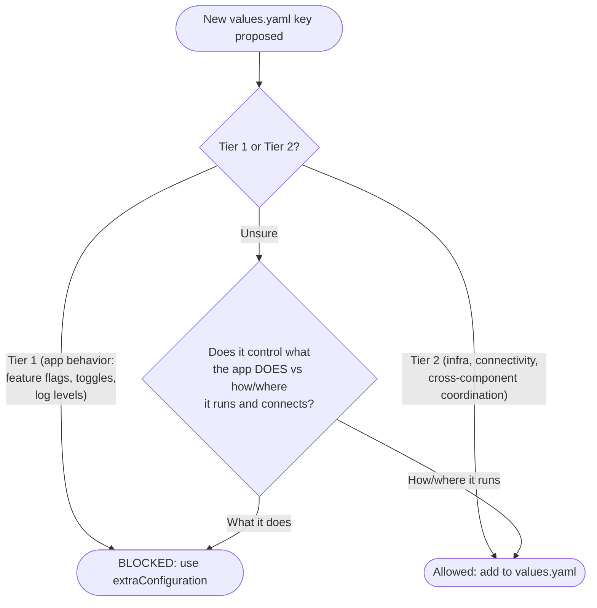

# Standardize `<component>.extraConfiguration` as the Application Configuration Mechanism

- Status: proposed
- Date: 2026-05-06
- Decision-makers: Distribution team

## Context and Problem Statement

The Camunda Helm chart historically added abstraction layers over application-level configuration to simplify inconsistent component setups (e.g., log levels, feature flags, resource permission toggles). Over time, this produced a third configuration layer sitting between the application's native config and Kubernetes deployment concerns. Critically, these Helm-level parameters were not a 1:1 mapping to native application properties — they were a simplified abstraction that required its own Helm-specific documentation and did not transfer to other deployment methods such as ECS, Docker, or Jar. Instead of having a single configuration reference for all deployment methods, operators were required to learn a Helm-specific configuration layer on top of the application's own.

The 8.8 re-architecture of the Orchestration Cluster (consolidating Operate, Tasklist, and Zeebe into a single application) significantly reduced the number of components requiring individual configuration, making a large portion of the existing per-component Helm abstraction keys redundant for the orchestration cluster. `<component>.extraConfiguration` existed in earlier releases but as an unordered map with inconsistent behavior across components (e.g., Optimize and Console used different merge strategies). In 8.9, it was unified across all components into an ordered list of file entries — making it consistent, Spring-native, and the documented recommended path for application configuration without Helm needing to understand the content.

As additional deployment methods (ECS, Docker, Jar) have become first-class targets too, the mismatch between Helm-specific configuration abstractions and deployment-method-agnostic application configuration has become increasingly visible. Knowledge of the Helm abstraction layer does not transfer to other deployment methods, and a new application feature that requires configuration currently demands changes to the Helm chart even when no Kubernetes-specific concern is involved.

## Decision Drivers

- **Separation of concerns**: Helm charts should configure Kubernetes infrastructure — pods, services, networking, storage — not application behavior. Application-level configuration has no Kubernetes-specific concern and should not require chart changes.
- **Portability**: Tier 1 application configuration knowledge must transfer across all deployment methods (Helm, ECS, Docker, Jar). The property identifiers are portable across deployment methods; each method has its own injection syntax (mounted file, env var, system property) but no Helm-specific key vocabulary is needed. Helm-specific abstraction keys do not transfer and create a siloed knowledge requirement. Tier 2 infrastructure and connectivity config is inherently platform-specific — each deployment method has its own native mechanism (Helm chart wiring, ALB/ACM for TLS in ECS, sidecar proxies in bare-metal) and no portable abstraction is attempted.
- **Application team autonomy**: Application teams must be able to introduce and document new configuration without requiring Helm chart changes in the common case.
- **Complexity reduction**: Accumulated abstraction layers increase upgrade risk and chart surface area. Removing them reduces the gap between chart values and Kubernetes primitives.
- **Established path**: `<component>.extraConfiguration` is already the documented recommended path as of 8.9, making this decision a formalization rather than a new direction.

## Considered Options

- **Option A — Status quo**: Keep all existing app config keys; continue adding new ones as needed. Rejected because it perpetuates the growing abstraction layer, increases chart complexity with every new application feature, and continues to require Helm chart changes for purely application-level concerns.
- **Option B — Big bang removal**: Remove all app config keys from values.yaml in a single release. Rejected because it constitutes a breaking change without a migration window, violating upgrade expectations for existing operators and providing no documented migration path.
- **Option C — Incremental deprecation with extraConfiguration as the standard (chosen)**: Freeze new Tier 1 additions immediately across all active chart versions, deprecate existing Tier 1 keys in 8.10 with a migration path, and target removal in 8.11.

## Configuration Classification

Not all `values.yaml` keys are equal. This ADR governs only **Tier 1** keys.

**Tier 1 — Application behavior** (governed by this ADR)
Keys that control *what the application does*: feature flags, toggles, and
application-level settings that map to application config files or env vars
controlling application logic. These must use `<component>.extraConfiguration`.
Examples: `orchestration.security.authorizations.enabled`, `global.multitenancy.enabled`, `orchestration.logLevel`.

**Tier 2 — Infrastructure and connectivity** (not governed by this ADR)
Keys that control *how or where the application runs and connects*. Three
sub-categories:

- **Kubernetes infrastructure**: resources, affinity, serviceAccount, volumes,
  deploymentStrategy. These are pure Kubernetes scheduling and workload
  concerns with no application semantics. The chart exists precisely to manage
  these — they are its primary responsibility.

- **Connectivity**: external endpoints, credentials, TLS certificates. These
  describe the environment the application runs in, not the application itself
  — the same binary connects to different endpoints in staging vs production.
  Forcing operators to express these via `extraConfiguration` would trade a
  structured, validated values.yaml field for a raw string the chart cannot
  reason about or validate.

  Connectivity config should be scoped **globally** when the value is genuinely
  identical across all components (e.g. `global.tls.caBundle`, identity
  provider URLs), and **component-scoped** when components can independently
  vary (e.g. Orchestration and Optimize can point at different Elasticsearch
  clusters, so per-component database config is correct). The chart should not
  impose a false global abstraction when components can independently vary —
  doing so leaks an incorrect architectural assumption into the values API.

- **Cross-component coordination**: values the chart uses to distribute
  configuration across multiple components to wire them together (e.g.
  `global.identity.auth.issuer` is injected into every component that needs to
  verify tokens; `global.identity.auth.<component>.clientId` is read by other
  components to call that component). Moving these to per-component
  `extraConfiguration` is technically possible — operators of non-Helm
  deployments (e.g. ECS with basic auth) already set equivalent values
  independently per component — but it would eliminate a coordination
  convenience the chart genuinely provides: change a shared value once and it
  propagates consistently to every dependent component. Removing it from
  `values.yaml` shifts that coordination burden entirely onto the operator with
  no chart-level consistency guarantee.

Note: Tier 2 is inherently platform-specific. Helm manages TLS via init containers
and secret mounts; ECS terminates TLS at the load balancer via ACM; bare-metal
deployments use sidecar proxies or JVM truststore files. There is no portable
abstraction for Tier 2 across deployment methods, and the chart does not attempt
one. The portability driver in this ADR applies exclusively to Tier 1 — the Spring
Boot property identifiers are portable across deployment methods; each method has
its own injection syntax (mounted file, env var in ECS, system property in a Jar
deployment) but no Helm-specific key vocabulary is needed.

The classification of identity and connectivity configuration as Tier 2 should be
revisited going towards 8.11. The Identity component is expected to evolve significantly
— if cross-component identity wiring is simplified or moves closer to standard
OIDC env vars, some current Tier 2 identity keys may become candidates for
migration to `extraConfiguration`. A future ADR revision should reassess this
boundary once the post-8.11 identity architecture is stable.

The practical test:
*Does this control what the application does, or how and where it runs and connects?*

## Decision Outcome

`<component>.extraConfiguration` is adopted as the standard and recommended mechanism for passing application configuration through the Camunda Helm chart. It is an ordered list of file entries (each with a `file` name and `content` string, and an optional `springImport` flag) that are mounted individually into the container's config directory and loaded via Spring Boot's `spring.config.import` semantics — later entries override earlier ones for duplicate keys. Non-Spring files (e.g., Log4j2 XML) can be mounted without triggering Spring import by setting `springImport: false`. For Node.js and custom-loader components (Console, Optimize), entries are merged at template time into a single override file. Where this ADR or existing chart behavior explicitly retains `<component>.configuration` as an escape hatch, that path remains supported only for those documented cases and is not the recommended mechanism for new application configuration. See the [Camunda Helm application configuration docs](https://docs.camunda.io/docs/self-managed/deployment/helm/configure/application-configs/) for the full reference and examples.

The following rules apply from this decision forward:

### Constraints (Quick Reference)

**Scope: all active chart versions (8.7, 8.8, 8.9, 8.10, ...) from the date this ADR is accepted.**

**Blocked** (Tier 1 — must use `<component>.extraConfiguration` instead):
- Feature flags and toggles (e.g. `orchestration.security.authorizations.enabled`, `global.multitenancy.enabled`)
- Application log levels
- Application-level feature configuration
- Any key that maps to a Spring Boot property, env var controlling app logic, or application config file entry

**Allowed** (Tier 2 — may add to `values.yaml`):
- Kubernetes infrastructure: resources, affinity, serviceAccount, volumes, strategy
- Connectivity: external endpoints, credentials, TLS certificates
- Cross-component coordination: shared auth config, service discovery wiring

---

- **No new Tier 1 keys shall be added to the Helm chart.** New application features that require Tier 1 configuration must use `<component>.extraConfiguration` exclusively. New features that require Tier 2 configuration (connectivity, infrastructure, cross-component coordination) may introduce new `values.yaml` keys subject to the Tier 2 classification defined above. **This rule applies to all active chart versions from the date this ADR is accepted.**
- All existing application-specific keys in values.yaml are deprecated as of Camunda 8.10, with documented migration hints mapping each deprecated key to the equivalent extraConfiguration pattern.
- Removal is targeted for Camunda 8.11. The keys in scope for removal are all Tier 1 values.yaml entries — those that configure application behavior rather than Tier 2 infrastructure, connectivity, or cross-component coordination concerns. Sequencing and any version-specific exceptions are tracked in product-hub#3562.
- `<component>.configuration` (full application config file override) remains available as an advanced escape hatch for operators who intentionally want to take full control of the application configuration file. It is not the recommended path and is not part of the standard mechanism.

### Positive Consequences

- Helm chart values focus on what they are best placed to manage: Kubernetes infrastructure (pods, services, networking, storage), connectivity to external systems, and cross-component coordination — not application behavior.
- Tier 1 application configuration is consistent and portable across all deployment methods (Helm, ECS, Docker, Jar) — the property identifiers are portable; each method has its own injection syntax (mounted file, env var, system property) but no Helm-specific key vocabulary is needed.
- Application teams own their configuration surface and can introduce new settings without touching the Helm chart.
- Operators see fewer, clearer Helm values with an unambiguous pattern for application configuration.
- Upgrades reduce the risk that chart evolution silently overrides operator configuration, since operator-provided extraConfiguration entries are layered last.

### Negative Consequences

- Existing users relying on application-specific Helm values must migrate to extraConfiguration; the impact is mitigated by the deprecation cycle — keys are deprecated in 8.10 and removed no earlier than 8.11, with documented migration hints for each. Further investigations in a migration tool related to product-hub#3563 will be considered.
- Migration guidance and per-key mapping documentation is required before removal (owned by the Distribution team in coordination with application and docs teams).
- Tier 1 application behavior that was previously a single global key (e.g. a feature toggle applied across multiple components) must now be provided per component via `extraConfiguration`. Operators can reduce repetition using YAML anchors or a dedicated shared values file (e.g. `shared-app-config.yaml`) composed via multiple `-f` flags. Note: Tier 2 concerns — TLS certificates, authentication endpoints, and cross-component coordination — are unaffected and remain expressible as `values.yaml` keys.

## Links

- Builds on [ADR 0033 — Migrate application configuration from environment variables to ConfigMap-mounted files](0033-migrate-application-configuration-from-environment.md): established the ConfigMap-mounted config pattern this ADR standardizes around.
- Builds on [ADR 0061 — Introduce a unified configuration mechanism for Camunda Platform core components](0061-introduce-a-unified-configuration-mechanism-for-camunda.md): introduced the unified ConfigMap for the orchestration StatefulSet; this ADR extends that direction to the operator-facing values API.
- Coordinated via product-hub#3562 (removal scope and sequencing) and product-hub#3563 (migration tooling investigation).
- [Camunda Helm application configuration docs](https://docs.camunda.io/docs/self-managed/deployment/helm/configure/application-configs/)
