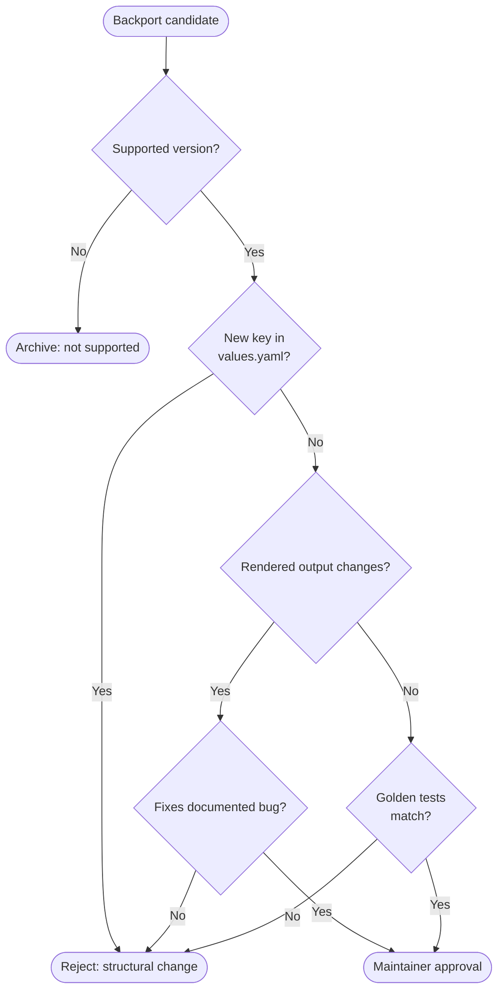

The Camunda Helm chart is the integration point between the Camunda application components and Kubernetes. To maintain consistency, reliability, and ownership boundaries, contributions from application teams should follow a structured collaboration process. This ensures all configuration, feature, and bug-fix changes align with established review, testing, and documentation standards.

## When App Teams Should Contribute Independently

App teams are expected to contribute directly when changes primarily affect their application configuration, such as:

- Adjustments to the ConfigMap or application-specific configuration fields.
- Additions of new configuration properties to `values.yaml` or related templates.
  - Note: With 8.9+, applications should be configured per default via the [`<component>.extraConfiguration`](https://docs.camunda.io/docs/next/self-managed/deployment/helm/configure/application-configs/#componentnameextraconfiguration) key.
- Adding or updating secret references (for example, credential or endpoint configurations).

Larger architectural or user-facing changes, such as new components or features that affect multiple components, should always be designed and implemented in collaboration with the Distribution team.

:::note
Read the [contribution guide](https://github.com/camunda/camunda-platform-helm/blob/main/CONTRIBUTING.md) to learn how to contribute.
:::

## General Collaboration Workflow

### Initiate discussion (PDP/kickoff)

For any major change, the process begins with a design discussion (PDP or kickoff meeting). The intent is to define the change scope, clarify responsibilities, and ensure alignment with existing Helm and Kubernetes design.

### Determine ownership

Depending on the nature of the change, either:

- The Distro team implements the change directly.
- The app team member creates the implementation, while the Distro team acts as reviewer and owner of Helm-related concerns.

The Distro team remains the final reviewer and approval authority for all Helm chart modifications.

### Propose an issue

Each contribution begins with a GitHub issue describing:

- Context and motivation.
- The configuration or feature change.
- Expected impact on existing values or manifests.
- Linked documentation or references (if available).

### Alignment and pull request (PR)

Once agreed, the App team raises a PR referencing the issue. The Distro team participates during design review and functional validation stages to ensure chart consistency.

## Contribution Policy

### Configuration documentation

Before adding or modifying any configuration in the Helm chart, contributors must ensure the change is properly documented.

- Ideally, the configuration property should already be reflected in the user documentation.
- At minimum, a GitHub issue must describe the property clearly — its purpose, effect, default behavior, and any important constraints.

This requirement serves as a hard contribution criterion. Self-Managed engineers review documentation clarity as part of the code review process. Through this step, reviewers also deepen understanding of how the application integrates with its Helm configuration.

:::note
Configuration values represent the main handover point between the application and the Helm chart. Clear, accurate documentation ensures maintainability and shared understanding across teams.
:::

### Helm documentation

The `values.yaml` file follows [Helm's best practices](https://helm.sh/docs/chart_best_practices/values/).

This means:

- Variable names should begin with a lowercase letter, and words should be separated using camelCase.
- Every defined property in `values.yaml` should be documented. The documentation string should begin with the name of the property that it describes, followed by at least a one-sentence description.

We use [bitnami/readme-generator-for-helm](https://github.com/bitnami/readme-generator-for-helm) to generate the Helm chart values docs from the values file. Ensure to follow the same convention as the tool.

### New applications: minimal requirements

To ensure consistency and operational reliability across all components shipped within the Camunda Platform Helm chart, any new application introduced into the chart must meet a set of minimal, mandatory requirements:

1. **Enable/Disable flag (`enabled`):** Allows users to explicitly opt-in to running the component, avoids accidental deployments, and ensures backward compatibility in chart upgrades.
2. **Environment Variable Configuration:** Allows users to configure runtime behavior without modifying template files.

   ```yaml
   <appName>:
     env: {}
   ```

3. **TLS / Java Keystore (JKS) Integration:** Provides consistent TLS behavior across all chart components and ensures secure communication patterns are applied uniformly.

   ```yaml
   <appName>:
     tls:
       enabled: false
       existingSecret: ""
       jks:
         secret:
           existingSecret: ""
           existingSecretKey: ""
           inlineSecret: ""
   ```

### Pull request requirements

Every pull request (PR) related to Helm chart changes must adhere to the following checklist:

- **Linked issue:** Every PR must reference a clearly described GitHub issue.
- **Unit tests:** Changes should include or update corresponding unit tests where applicable.
- **Documentation updates:** User or technical documentation must reflect configuration or behavior changes.
- **Passing CI:** All CI checks must pass successfully before merge.
- **Code review:** At least one formal review must be completed and approved.
- **Atomic changes:** Aim for small, focused PRs that address a single issue or configuration change to simplify review and reduce merge complexity.

### Helm version

To have a smooth contribution experience, before working on a new PR make sure to use the exact Helm version that's currently used in the repo.

The Helm version is set in the [`.tool-versions`](https://github.com/camunda/camunda-platform-helm/blob/main/.tool-versions) file, so you can use the [asdf version manager](https://github.com/asdf-vm/asdf) to install Helm locally or just install the same version manually.

To install the Helm version that's used in this repo using asdf, in the repo root, run:

```bash
make tools.asdf-install
```

## Tests

:::note
For more details about Helm chart testing, read the blog post: [Advanced Test Practices For Helm Charts](https://medium.com/@zelldon91/advanced-test-practices-for-helm-charts-587caeeb4cb).
:::

In order to make sure that the Helm charts work properly and that further development doesn't break anything, we have introduced tests for the Helm charts. The tests are written in Go, using the [Terratest framework](https://terratest.gruntwork.io/).

We separate our tests into two parts, with different targets and goals.

1. **Template tests** (unit tests) verify the general structure. Is it YAML-conformant, does it have the right value/structure if set, do the default values not change or are they set at all?
2. **Integration tests** verify whether the charts can be installed and used. This means: are the manifests accepted by the K8s API, and do they work? (it can be valid YAML but not accepted by Kubernetes). Can the services reach each other and are they working?

**For new contributions it is expected to write new unit tests, but no integration tests.** We keep the count of integration tests to a minimum, and the knowledge for writing them is not expected for contributors.

Tests can be found in the chart directory under `test/`. For each component we have a sub-directory in the `test/` directory.

To run the tests, execute `make go.test` at the repository root.

### Unit tests

As mentioned earlier, we expect unit tests on new contributions. The unit tests (template tests) are divided into two parts: golden file tests and explicit property tests. In this section we explain when which test type should be used.

#### Golden files

We write new golden file tests for default values, where we can compare a complete manifest with its properties. Most of the golden file tests are part of `goldenfiles_test.go` in the corresponding sub-chart testing directory. For an example see `/test/zeebe/goldenfiles_test.go`.

If the complete manifest can be enabled by a toggle, we also write a golden file test. This test is part of a `<manifestFileName>_test.go` file. The `<manifestFileName>` corresponds to the template filename in the sub-chart `templates` dir. For example, the Prometheus `templates/service-monitor.yaml` can be enabled by a toggle, so we write a golden file test in `test/servicemonitor_test.go`.

To generate the golden files, run `go.test-golden-updated` at the repository root. This will add a new golden file in a `golden` sub-dir and run the corresponding test. The golden files should be named related to the manifest.

#### Properties tests

For things that are not enabled or set by default, we write a property test. Here we directly set the specific property/variable and verify that the Helm chart can be rendered and the property is set correctly on the object. This kind of test should be part of a `<manifestFileName>_test.go` file. The `<manifestFileName>` corresponds to the template filename in the sub-chart `templates` dir. For example, for the Zeebe StatefulSet manifest we have the test `test/zeebe/statefulset_test.go` under the `zeebe` sub-dir.

It is always helpful to check existing tests to get a better understanding of how to write new tests, so do not hesitate to read and copy from them.

### Test license headers

Make sure that new Go tests contain the Apache license headers, otherwise the CI license check will fail. For adding and checking the license we use [addlicense](https://github.com/google/addlicense). To install it locally, run `make go.addlicense-install`. Afterward, you can run `make go.addlicense-run` to add the missing license header to a new Go file.

## Backporting Policy

Backports exist to deliver **critical fixes and stability improvements** to **actively supported** Camunda Helm chart releases, while minimizing regression risk and avoiding surprising changes for users.

**Golden rule:** _If upgrading to a patch release changes a user's deployment in an unexpected way, the backport failed._

Backporting must only be performed within actively supported versions as defined by the [Standard and Extended Support Periods](https://confluence.camunda.com/spaces/HAN/pages/245400921/Standard+and+Extended+Support+Periods).

### Quick decision flow



### What we backport

We backport only changes that are **safe and predictable**:

- **Vital:** security fixes and "won't install / won't start" problems.
- **Functional:** logic/template fixes or documentation fixes that **do not change the chart API**.

### What we do _not_ backport

We reject backports that are likely to surprise users:

- **Structural:** anything that adds/changes the config surface (especially new keys/toggles in `values.yaml`) or big dependency upgrades.
- **Anything requiring manual intervention:** if users must run commands or edit/delete resources, it's a migration and must wait for a minor/major release.
- **Unexpected manifest changes:** if the rendered output changes in places unrelated to the bug fix, it's blocked.

### General backporting guidance

Backports must be minimal and focused on corrective action. Prefer smaller PRs targeting specific issues.

All backports should maintain consistent behavior across supported versions to ensure predictability during upgrades.

Each backport PR should include clear labeling (for example, `backport/<release>`) and link to the original fix or discussion for traceability.

Backported changes follow the same testing and documentation requirements as any mainline contribution. CI must pass and any altered functionality must be covered by tests.

### Backporting commits in subdirectory versioning

#### `format-patch`

`git format-patch` will export the git commits to a series of patch files that can be applied to a different branch or a different sub-directory.

To export the last 3 commits as patch files, run:

```bash
git format-patch HEAD^3
```

New files will be created starting with `0001-`, `0002-`, etc.

#### Applying patch files without AI

Suppose you have a patch file `0001-refactor-web-modeler-make-webapp-memory-config-dynam.patch` that you want to apply to the `charts/camunda-platform-8.7` directory:

```bash
git apply -p3 --directory=charts/camunda-platform-8.7 0001-refactor-web-modeler-make-webapp-memory-config-dynam.patch
```

In many cases, this will apply cleanly. If the command does not work, you can try using OpenCode or your editor's AI integration.

#### Applying patch files with AI

If you have an AI tool integrated into your IDE, a query you can use is:

```
I have exported commits as patch files starting with 000*.patch using git format-patch. Please apply the patch to the charts/camunda-platform-8.7 directory.
```
