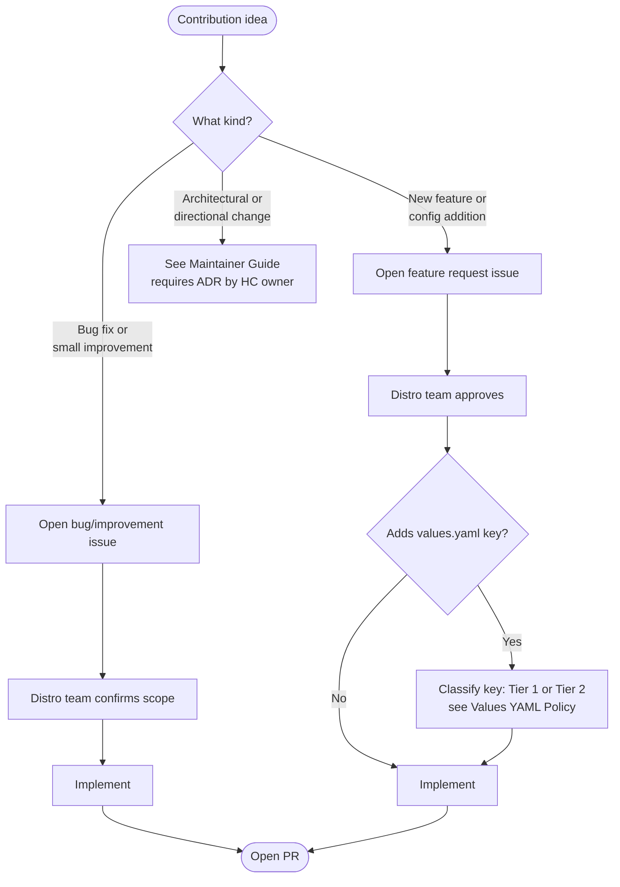

The Camunda Helm chart is the integration point between the Camunda application components and Kubernetes. All contributors — internal app teams and external open-source contributors — follow the same contribution process and the same rules.

For HC owners and Distro team members (reviewers, release managers, ADR authors): see the [Maintainer Guide](./maintainer-guide.md). For technical setup (cloning, toolchain, local builds): see [CONTRIBUTING.md](https://github.com/camunda/camunda-platform-helm/blob/main/CONTRIBUTING.md).

---

## How to Contribute

All contributions start with a GitHub issue — scope must be agreed before a PR is opened.



### Contribution rules

1. **Open an issue first.** Scope must be agreed with the Distro team before a PR is opened. Unsolicited PRs without a linked issue may be closed.
2. **Get approval before implementing.** For features and config additions, wait for explicit Distro team approval on the issue.
3. **Application behavior config goes in `extraConfiguration`, not `values.yaml`.** A new feature toggle, log level, or Spring Boot property must use `<component>.extraConfiguration`. See [Values YAML Policy](./policies/values-yaml-policy.md).
4. **Document before you merge.** The configuration property must be reflected in user documentation or, at minimum, clearly described in the issue. See [Ticket & Label Policy](./policies/ticket-and-label.md) for issue requirements.
5. **Follow `values.yaml` conventions.** Variable names begin with a lowercase letter and use camelCase; every defined property must be documented. See [Code Style](./reference/code-style.md).
6. **New applications must meet minimal requirements** — enable/disable flag, env block, and TLS block:

```yaml
<appName>:
  enabled: false

  env: {}

  tls:
    enabled: false
    existingSecret: ""
    jks:
      secret:
        existingSecret: ""
        existingSecretKey: ""
        inlineSecret: ""
```

---

## Pull Request Requirements

Every PR related to Helm chart changes must satisfy the following checklist before requesting review:

- [ ] **Linked issue** — the PR references a clearly described GitHub issue.
- [ ] **`crev` review** — run [`crev`](https://github.com/camunda/crev) against the PR and address or acknowledge all findings before requesting review.
- [ ] **Configuration key classification** — if the PR adds a `values.yaml` key, confirm it is Tier 2, additive, opt-in, and non-breaking. See [Values YAML Policy](./policies/values-yaml-policy.md).
- [ ] **Unit tests** — changes include or update corresponding unit tests. See [Testing Guide](./reference/testing.md).
- [ ] **Documentation updates** — user or technical documentation reflects configuration or behavior changes.
- [ ] **Passing CI** — all CI checks pass before merge.
- [ ] **Atomic changes** — the PR is small and focused on a single issue or config change.
- [ ] **Human review** — at least one approval from the Distro team.

### Helm version

Use the exact Helm version pinned in [`.tool-versions`](https://github.com/camunda/camunda-platform-helm/blob/main/.tool-versions). Install via asdf:

```bash
make tools.asdf-install
```

---

## Tests

Tests are written in Go using the [Terratest framework](https://terratest.gruntwork.io/) and live under `test/` in each chart directory. Run all tests with:

```bash
make go.test
```

For full details on test types (golden files, property tests), license headers, and how to run a single test, see [Testing Guide](./reference/testing.md).
