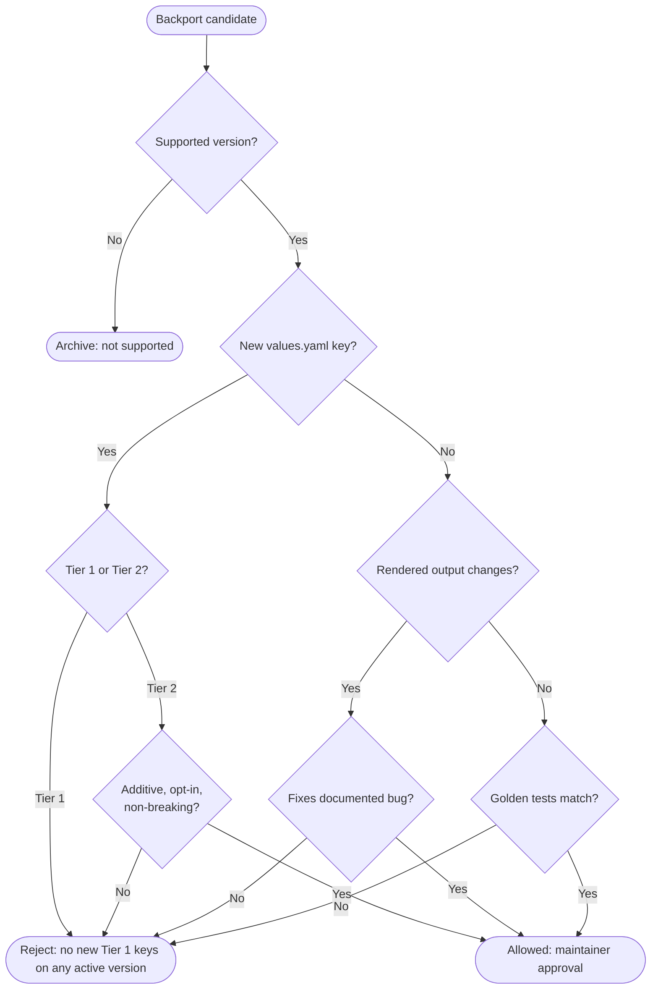

Backports exist to deliver critical fixes and stability improvements to actively supported Camunda Helm chart releases, while minimizing regression risk and avoiding surprising changes for users.

**Golden rule:** If upgrading to a patch release changes a user's deployment in an unexpected way, the backport failed.

## Supported versions

Backporting must only be performed within actively supported versions as defined by the [Standard and Extended Support Periods](https://confluence.camunda.com/spaces/HAN/pages/245400921/Standard+and+Extended+Support+Periods).

## Three-way logic: what gets backported and when

### Tier 1 key additions — never backported

Tier 1 keys control application behavior (feature flags, toggles, log levels, Spring Boot properties). Per [Values YAML Policy](./values-yaml-policy.md) and ADR 91, no new Tier 1 keys may be added to any active chart version. This rule applies regardless of how additive the key appears to be. There are no exceptions.

### Tier 2 key additions — always allowed on any active version

Tier 2 keys control infrastructure and connectivity (resources, affinity, TLS, Gateway API wiring, cross-component coordination). These are always allowed as backports because they are additive, opt-in, and default to prior behavior. The supported-version constraint does not restrict Tier 2 additions — they may be applied to all active chart lines.

See [Values YAML Policy](./values-yaml-policy.md) for the full Tier 2 definition and examples.

### Other changes (bug fixes, template fixes) — stable supported versions only

Bug fixes, template fixes, and documentation updates may be backported to stable supported versions. Alpha chart lines allow breaking changes freely and do not apply the same constraints. For the definition of "non-breaking," see [Breaking Changes Policy](./breaking-changes.md).

## Decision diagram

## What we backport

We backport only changes that are safe and predictable:

- **Vital:** security fixes and "won't install / won't start" problems.
- **Functional:** logic/template fixes or documentation fixes that do not change the chart API.
- **Tier 2 key additions:** infrastructure and connectivity keys that are additive, opt-in, and default to prior behavior. See [Values YAML Policy](./values-yaml-policy.md).

## What we do not backport

We reject backports that are likely to surprise users:

- **Tier 1 key additions:** any new values.yaml key that controls application behavior — regardless of chart version.
- **Structural:** anything that adds/changes the config surface (especially new keys/toggles in `values.yaml`) beyond the Tier 2 exception above, or big dependency upgrades.
- **Anything requiring manual intervention:** if users must run commands or edit/delete resources, it's a migration and must wait for a minor/major release.
- **Unexpected manifest changes:** if the rendered output changes in places unrelated to the bug fix, it's blocked.

## Process: opening a backport PR

1. Label the PR with `backport/<release>` (e.g., `backport/8.9`).
2. Include a direct link to the original fix PR or issue for traceability.
3. Keep the backport minimal and focused on the corrective action — do not bundle unrelated changes.
4. Ensure consistent behavior across all supported versions to preserve predictability during upgrades.
5. All backport PRs follow the same testing and documentation requirements as mainline contributions — CI must pass and any altered functionality must be covered by tests.
6. Obtain maintainer approval before merge.

For whether a proposed change qualifies as non-breaking, refer to [Breaking Changes Policy](./breaking-changes.md).
