## Definition of a breaking change

A breaking change is any change that breaks a previously stable interface/contract and requires user action to upgrade.

### Helm chart "Public API"

For the Camunda Helm chart, _the stable interface is `values.yaml`_: user-provided values are rendered by Helm templates into Kubernetes manifests. A change is breaking if it changes how existing `values.yaml` inputs map to rendered manifests in a way that is not backward compatible.

### Classifying changes (examples)

- **Tier 2 key addition (additive):** Adding a new optional Tier 2 (infra/connectivity) field that is additive, opt-in, and defaults to prior behavior is **not** a breaking change. See [Values YAML Policy](./values-yaml-policy.md) for the Tier 2 definition.
  - _Example_: add optional `global.gateway.tls.enabled` that defaults to `false`.
- **Tier 1 key addition:** Adding a new Tier 1 (application behavior) key to `values.yaml` is **not allowed** on any active chart version — regardless of whether it seems additive — because it extends the Helm chart's application-behavior surface in violation of ADR 91. See [Values YAML Policy](./values-yaml-policy.md).
- **Bug:** A defect that forces users to apply mitigations (overrides/workarounds) to get expected behavior.
  - _Example_: users must set a specific env var or template override to avoid incorrect behavior.
- **Breaking change:** Remove/rename an existing field, or change its meaning/defaults such that upgrades require user updates.
  - _Example_: deprecate a values.yaml key without backward compatibility.
- **Unstructured override interaction:** Changes involving unstructured fields (e.g., `<component>.env` or `extraConfiguration`) are typically not breaking API changes to the chart, but can cause upgrade issues due to user-specific overrides; treat resulting incompatibilities as bugs (see [Unstructured fields](#unstructured-fields)).
  - _Example_: a user-set env var workaround in `extraConfiguration` conflicts after an upgrade because the underlying behavior changed.

## Breaking Change Policy

**Default rule:** Breaking changes are prohibited in all released charts. Changes to the `values.yaml` schema, configuration structure, or rendering logic must be backward compatible. When a change cannot be made backward compatible, follow the **Deprecation Policy**.

### Exceptions

Two narrow exceptions exist where a breaking change is permitted without a deprecation cycle:

- **Alpha charts:** Breaking changes are allowed between alpha releases (e.g., `8.9-alpha3 → 8.9-alpha4`). However, breaking changes introduced during the alpha cycle must be resolved before the first stable release — the alpha-to-stable boundary (e.g., `8.9-alpha6 → 8.9.0`) must be backward compatible with the previous stable minor (e.g., `8.8.x`).
- **Critical fix:** A breaking change in any released chart (patch or minor) is allowed only to address a critical security vulnerability or severe malfunction where the standard deprecation cycle would leave users insecure or fundamentally broken. Must follow the **Breaking change checklist**.

All other changes — including architectural improvements, schema simplification, and key removal — must go through the **Deprecation Policy** regardless of release boundary.

```mermaid
flowchart TD
    Start([Change required]) --> Alpha{Alpha chart?}
    Alpha -- Yes --> AlphaBoundary{Alpha-to-stable\nboundary?}
    AlphaBoundary -- No --> Free([Breaking change allowed\nbetween alpha releases])
    AlphaBoundary -- Yes --> Compat([Must be backward compatible\nwith previous stable minor])
    Alpha -- No --> Critical{Critical security or\nsevere malfunction?}
    Critical -- Yes --> Checklist([Follow Breaking Change Checklist])
    Critical -- No --> Deprecate([Follow Deprecation Policy\ndeprecate now · remove next major])
```

## Breaking change checklist

### Evaluate and justify breaking change

A critical-fix breaking change is justified only if all of the following are true:

1. **No reasonable compatible approach:** A backward-compatible design exists only with disproportionate complexity, risk, or long-term maintenance cost (e.g., supporting two schemas/behaviors would be fragile, delay delivery significantly, or create ongoing upgrade/support burden).
2. **Necessary outcome:** The change is required to deliver at least one of:
   - a critical fix (security / severe malfunction), or
   - a correctness fix that prevents wrong/unsafe deployments, or
   - an essential architectural/maintainability improvement that otherwise blocks future work.
3. **Customer impact is acceptable and understood:** Impacted users can be identified/estimated, and the migration is practical (clear steps; no "guessing" required).
4. **Migration is documented:** Exact migration steps exist and can be included in docs/release notes/upgrade guide.

If a breaking change is not justifiable, follow the [Deprecation Policy](#deprecation-policy).

#### Approval / alignment

1. Document and align with EM and PM justification of the breaking change (rationale, scope, customer impact, target version).
2. Mark the change as breaking in the issue and PR (label `breaking-change` + clear description). See [Ticket & Label Policy](./ticket-and-label.md) for the `breaking change` label definition.
3. Notify and align with primary stakeholders:
   - **InfraEx** and [**#oc-reliability-testing**](https://camunda.slack.com/archives/C0807665N8G) — closest day-to-day chart users; must explicitly acknowledge before proceeding.
   - QA and infra.
4. Proceed only once EM/PM approved and all stakeholder teams explicitly acknowledged.

#### Documentation

5. Prepare and publish:
   - Add docs about what changed (breaking behavior) and required customer actions.
   - Add release notes (breaking change callout).
   - Add release announcements (link to docs/migration guidance).
   - Add upgrade guide (steps + links to docs).

#### Merge and final internal communication

- Merge PR(s).
- Broadcast internally to [#engineering](https://camunda.slack.com/archives/C01H4NG9XDY) and [#oc-reliability-testing](https://camunda.slack.com/archives/C0807665N8G), and after alignment with PM, in [#team-tech-gtm](https://camunda.slack.com/archives/C03N6LM5QVD).

## Deprecation Policy

**Default rule:** Deprecate in one minor release, remove in the next major release. Customers must never be forced to update values without at least one minor release of warning with clear migration guidance.

Major chart releases follow Camunda's release cycle.

### Deprecation timeline: Tier 1 keys

As a concrete example of this policy in action: all existing Tier 1 (application behavior) keys in `values.yaml` were deprecated in Camunda 8.10 with documented migration hints, and are targeted for removal in Camunda 8.11. Sequencing and version-specific exceptions are tracked in [product-hub#3562](https://github.com/camunda/product-hub/issues/3562).

For the classification of Tier 1 vs Tier 2 keys and the rationale behind this deprecation, see [Values YAML Policy](./values-yaml-policy.md).

### Deprecation Checklist

1. **Deprecate (keep compatibility):**
   - Add a `values.yaml` comment: `DEPRECATED since vX.Y.Z; remove in vNextMajor; use instead: ...`.
   - On install/upgrade, warn if the deprecated key is set (old key, replacement, removal version).
   - If both old and new are set: new wins + warning.

2. **Document:**
   - Release notes: "Deprecations" entry (old → new, removal version).
   - Upgrade guide: migration steps (before/after) + removal version.
   - Examples: use new format only.

3. **Communicate:**
   - Notify InfraEx, QA, infra, and [Reliability Team (#oc-reliability-testing)](https://camunda.slack.com/archives/C0807665N8G).

4. **Remove (next major only):**
   - Delete the key, its template references, and the deprecation warning.
   - Follow the approval and documentation steps from the [Breaking change checklist](#breaking-change-checklist).

## Reference

### Unstructured fields

`extraConfiguration` is the correct and primary mechanism for injecting application-level configuration into Camunda components (feature flags, log levels, Spring Boot properties, etc.). Per [ADR 91](../adr/0091-adopt-component-extraconfiguration-as-the-standard-application-configuration-mechanism.md) and the [Values YAML Policy](./values-yaml-policy.md), `<component>.env` is a legacy escape hatch — new application configuration should not use it.

Because `extraConfiguration` entries fall outside Helm's awareness or validation scope, they introduce variability that can affect upgrade stability. For example, if a user overrides an application property via `extraConfiguration` to work around a previous limitation, and a subsequent chart update or upstream Camunda release resolves that limitation internally, the existing override may conflict with the new behavior.

From a versioning and stability standpoint, this scenario does not constitute a breaking change in the Helm chart's API. The core capability — the ability to inject application configuration — remains stable. However, if the functional outcome in the application layer deviates from expectations, it should be treated as a bug, not a breaking API change.

Framing stability in this way helps maintain consistency in the Camunda Helm chart release process, ensuring that users can rely on `values.yaml` as the stable interface while understanding the inherent risks of unstructured overrides and Helm's limitations in validating them.

For the backporting policy as it relates to breaking changes, see [Backporting Policy](./backporting.md).
