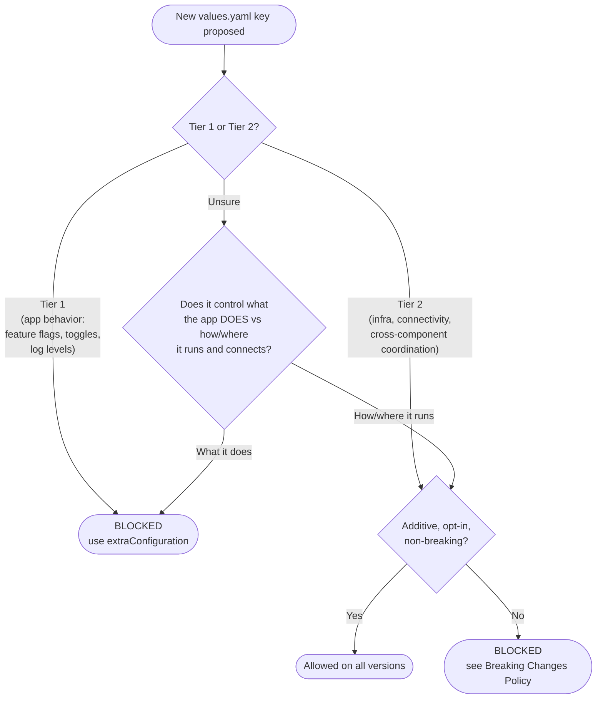

## Quick reference

| | **Tier 1 — Application Behavior** | **Tier 2 — Infrastructure & Connectivity** |
|---|---|---|
| **What it controls** | What the application *does*: feature flags, toggles, log levels, Spring Boot properties, env vars controlling application logic | How/where the application *runs and connects*: Kubernetes scheduling, external endpoints, TLS, Gateway API wiring, cross-component coordination |
| **Rule** | **BLOCKED** — use `<component>.extraConfiguration` instead | **Allowed** — add to `values.yaml` when additive, opt-in, and non-breaking |
| **Backportable?** | No — blocked on all active chart versions | Yes — allowed on all active chart versions including released lines |
| **Example keys** | `orchestration.security.authorizations.enabled`, `global.multitenancy.enabled`, `orchestration.logLevel` | `resources`, `affinity`, `serviceAccount`, `global.gateway.name`, `global.gateway.tls.*`, `global.identity.auth.issuer` |

## Relationship to ADR 91

This is the living policy document derived from [ADR 0091 — Standardize `<component>.extraConfiguration` as the Application Configuration Mechanism](../adr/0091-adopt-component-extraconfiguration-as-the-standard-application-configuration-mechanism.md). ADR 91 remains the authoritative record of the original decision rationale, considered options, and positive/negative consequences. When this document and the ADR conflict, the ADR takes precedence — open a PR to bring this file up to date.

## Tier 1 — Application Behavior (Blocked)

Tier 1 keys control *what the application does*: feature flags, toggles, and application-level settings that map to application config files or env vars controlling application logic.

**Examples:**
- `orchestration.security.authorizations.enabled`
- `global.multitenancy.enabled`
- `orchestration.logLevel`

**Rule:** No new Tier 1 keys may be added to any active chart version. This applies to all active chart versions from the date ADR 91 was accepted. When a new application feature requires Tier 1 configuration, use `<component>.extraConfiguration` exclusively.

### Using extraConfiguration

`extraConfiguration` is an ordered list of file entries (each with a `file` name and `content` string) mounted individually into the container's config directory and loaded via Spring Boot's `spring.config.import` semantics — later entries override earlier ones for duplicate keys.

```yaml
orchestration:
  extraConfiguration:
    - file: feature-flags.yaml
      content: |
        camunda.authorizations.enabled: true
        camunda.multitenancy.enabled: false
    - file: logging.yaml
      content: |
        logging.level.io.camunda: INFO
```

Non-Spring files (e.g., Log4j2 XML) can be mounted without triggering Spring import by setting `springImport: false`. For the full reference and examples, see the [Camunda Helm application configuration docs](https://docs.camunda.io/docs/self-managed/deployment/helm/configure/application-configs/).

## Tier 2 — Infrastructure & Connectivity (Allowed)

Tier 2 keys control *how or where the application runs and connects*. They are allowed in `values.yaml` when additive, opt-in, and non-breaking. For the definition of non-breaking, see [Breaking Changes Policy](./breaking-changes.md).

### Sub-categories

**Kubernetes infrastructure** — pure Kubernetes scheduling and workload concerns with no application semantics. The chart exists precisely to manage these.

Examples: `resources`, `affinity`, `serviceAccount`, `volumes`, `deploymentStrategy`

**Connectivity** — external endpoints, credentials, TLS certificates, and Gateway API wiring. These describe the environment the application runs in, not the application itself. The same binary connects to different endpoints in staging vs production. Forcing operators to express these via `extraConfiguration` would trade a structured, validated values.yaml field for a raw string the chart cannot reason about or validate.

Examples: external Elasticsearch/OpenSearch endpoints, credential references, TLS cert secrets, `global.gateway.name`, `global.gateway.namespace`, `global.gateway.tls.*` (added in [#6198](https://github.com/camunda/camunda-platform-helm/pull/6198))

**Cross-component coordination** — values the chart uses to distribute configuration across multiple components to wire them together. Removing these from `values.yaml` would shift the coordination burden entirely onto the operator with no chart-level consistency guarantee.

Examples: `global.identity.auth.issuer` (injected into every component that verifies tokens), `global.identity.auth.<component>.clientId` (read by other components to call that component)

### Scoping guidance

Connectivity config should be scoped **globally** when the value is genuinely identical across all components (e.g., `global.tls.caBundle`, identity provider URLs), and **component-scoped** when components can independently vary (e.g., Orchestration and Optimize can point at different Elasticsearch clusters). The chart should not impose a false global abstraction when components can independently vary — doing so leaks an incorrect architectural assumption into the values API.

## Decision diagram



## Deprecation timeline

All existing Tier 1 (application behavior) keys in `values.yaml` were **deprecated in Camunda 8.10** with documented migration hints mapping each key to the equivalent `extraConfiguration` pattern. **Removal is targeted for Camunda 8.11.**

This deprecation follows the standard deprecation process defined in [Breaking Changes Policy — Deprecation Policy](./breaking-changes.md#deprecation-policy).
