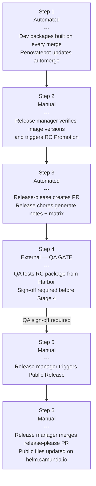

This document is for Distro team maintainers. For contribution process, see the [Maintainer Guide](../maintainer-guide.md).

The charts are built, linted, and tested on every push to the main branch. The release process follows a **3-stage pipeline** that ensures the exact artifact tested by QA is what gets publicly released — no rebuilding at release time.

## Architecture Overview

```
┌─────────────────────┐     ┌─────────────────────┐     ┌─────────────────────┐     ┌─────────────────────┐
│  1. DEV BUILD       │     │  2. RC PROMOTION    │     │  3. QA GATE         │     │  4. PUBLIC RELEASE  │
│  (Every merge)      │ ──► │  (Manual trigger)   │ ──► │  (External)         │ ──► │  (Manual trigger)   │
├─────────────────────┤     ├─────────────────────┤     ├─────────────────────┤     ├─────────────────────┤
│ • Build dev package │     │ • Retag dev → RC    │     │ • QA validates RC   │     │ • Pull RC from      │
│ • Push to Harbor    │     │ • Create release-   │     │   from Harbor       │     │   Harbor            │
│ • Cosign signing    │     │   please PR         │     │ • Sign-off required │     │ • Publish to GitHub │
└─────────────────────┘     └─────────────────────┘     │   before Stage 4    │     │   Releases          │
        ↓                           ↓                    └─────────────────────┘     │ • Cosign signing    │
   Harbor (internal)          Harbor (retag only)                  ↓                 └─────────────────────┘
   {version}-dev-{sha}        {version}-rc               QA approval required                  ↓
                                                                                       GitHub Releases
                                                                                       helm.camunda.io
```

## Registries

| Registry | Purpose | Access |
|---|---|---|
| **Harbor** (`registry.camunda.cloud/team-distribution`) | Internal dev/RC storage | Internal only |
| **GitHub Releases** (`helm.camunda.io`) | Public releases | Public |

## Release Pipeline

### Stage 1: Dev Package Build

**Workflow:** [`chart-build-dev.yaml`](https://github.com/camunda/camunda-platform-helm/blob/main/.github/workflows/chart-build-dev.yaml)

**Trigger:** Automatic on every merge to `main` (for paths: `charts/camunda-platform-*/**`).

**What happens:**

1. Builds dev packages for all **active** chart versions (alpha + standard support).
2. Computes the release version using `release-please --dry-run`.
3. Applies release transformations (removes dev comments, badges).
4. Generates release notes using `generate-release-notes.sh` (included in the package).
5. Packages the chart with the **final release version** in `Chart.yaml`.
6. Pushes to Harbor with dev tags.
7. Signs with Cosign.

**Tagging scheme:**

| Tag | Example | Purpose |
|---|---|---|
| `{version}-dev-{sha}` | `13.4.0-dev-abc1234` | Immutable, traceable to commit |
| `{chart-major}-dev-latest` | `13-dev-latest` | Rolling, always points to latest |

**Workflow summary** shows:

- Package location and tags.
- All component image versions (from `values.yaml`).
- Cosign verification status.

> **Note:** The `Chart.yaml` inside the package contains the **real release version** (e.g. `13.4.0`), not the dev tag. This is computed via `release-please` dry-run at build time.

### Stage 2: RC Promotion

**Workflow:** [`chart-promote-rc.yaml`](https://github.com/camunda/camunda-platform-helm/blob/main/.github/workflows/chart-promote-rc.yaml)

**Trigger:** Manual `workflow_dispatch` with input:

- `dev-tag`: The dev package to promote (e.g. `13.4.0-dev-abc1234` or `13-dev-latest`).

**What happens:**

1. Resolves rolling tags to actual dev tags via the Harbor API.
2. Validates the commit is on the `main` branch.
3. Runs `release-please release-pr` to create/update the release PR.
4. Adds RC tags to the **same artifact** in Harbor (no rebuild!).

**Tagging scheme:**

| Tag | Example | Purpose |
|---|---|---|
| `{version}-rc` | `13.4.0-rc` | Immutable RC tag |
| `{chart-major}-rc-latest` | `13-rc-latest` | Rolling, always points to latest RC |

**Release-Please PR:**

- Updates `Chart.yaml` version and changelog annotations.
- Updates `.release-please-manifest.json`.
- Triggers `chart-release-chores.yaml`, which generates:
  - Release notes (`RELEASE-NOTES.md`).
  - Version matrix files (component versions mapping).
  - Updated README.

### Stage 3: Public Release

**Workflow:** [`chart-release-public.yaml`](https://github.com/camunda/camunda-platform-helm/blob/main/.github/workflows/chart-release-public.yaml)

**Trigger:** Manual `workflow_dispatch` with input:

- `rc-tag`: The RC package to release (e.g. `13.4.0-rc` or `13-rc-latest`).

**What happens:**

1. Pulls the RC package from Harbor.
2. Extracts metadata (version, app version) from the packaged `Chart.yaml`.
3. Uploads to GitHub Releases using `helm-cr`.
4. Updates the Helm repo index (`gh-pages` branch).
5. Signs with Cosign and uploads the bundle to the release.
6. Labels the `release-please` PR with `autorelease: published`.

**Release tag format:** `camunda-platform-{appVersion}-{version}` (e.g. `camunda-platform-8.8-13.4.0`).

**After public release:**

1. Merge the `release-please` PR to sync `main` with the released artifact.
2. This triggers `chart-public-files.yaml` to update:
   - [Version matrix](https://helm.camunda.io/camunda-platform/version-matrix/) (component versions for each chart release).
   - Public values files at `helm.camunda.io/camunda-platform/values/`.

## Helm-Only Re-Release (Without Release Train)

Use this process when a Helm Chart fix is needed (e.g. incorrect image tag, chart misconfiguration) that does not require a full release train. No application components are re-released.

### When to Use

- A released Helm Chart contains an error (e.g. wrong image tag, misconfigured value).
- The fix is limited to the Helm Chart — no new application component versions are involved.
- A full release train would be overkill.

### Prerequisites

- The fix is already merged to `main` (via Renovatebot automerge or a manual PR).

### Steps

1. **Trigger a dev build** — Manually trigger [`chart-build-dev.yaml`](https://github.com/camunda/camunda-platform-helm/blob/main/.github/workflows/chart-build-dev.yaml) if the automatic post-merge build has not yet produced a package, or if you need to pin specific component image versions rather than taking the latest. Individual component version inputs can be overridden in the workflow dispatch form.

2. **Promote a new RC** — Manually trigger [`chart-promote-rc.yaml`](https://github.com/camunda/camunda-platform-helm/blob/main/.github/workflows/chart-promote-rc.yaml) with the dev tag produced in Step 1 (e.g. `{version}-dev-{sha}` or `{chart-major}-dev-latest`). This creates a new RC tag (e.g. `{chart-major}-rc-latest`).

3. **Notify QA** — Ping `@qa-automated-release-manager` in `#c8-release-announcements` using the QA notification template below, requesting validation of the RC.
   - QA inputs: Branch = `main`, Directory = `camunda-platform-{CAMUNDA_VERSION}`.
   - Do not specify individual component versions — use the RC tag directly.

4. **Await QA sign-off** — **Do not trigger the public release until QA confirms all test runs passed.**

5. **Trigger public release** — Manually trigger [`chart-release-public.yaml`](https://github.com/camunda/camunda-platform-helm/blob/main/.github/workflows/chart-release-public.yaml) with the RC tag. This publishes the corrected chart to GitHub Releases and updates the Helm repo index.

6. **Make sure the release-please PR is merged** — Auto-merge is attempted but best-effort; confirm the release-please PR was merged with the correct released version, and merge it manually if needed.

7. **Notify support** — Post a message in `#ask-support` using the support template below.

### Notes

- **Chart versioning:** the release version is determined by the workflows — [`chart-build-dev.yaml`](https://github.com/camunda/camunda-platform-helm/blob/main/.github/workflows/chart-build-dev.yaml) derives the version from a release-please dry-run (falling back to the current `Chart.yaml` version), and [`chart-promote-rc.yaml`](https://github.com/camunda/camunda-platform-helm/blob/main/.github/workflows/chart-promote-rc.yaml) forces `--release-as` to the version parsed from the selected dev tag.
- This process is for Self-Managed only — no SaaS rollout is involved.

### QA Notification Template

Post in `#c8-release-announcements`:

```
@qa-automated-release-manager can you please trigger a Helm Chart release test against {CHART_MAJOR}-rc-latest?

Branch: main
Directory: camunda-platform-{CAMUNDA_VERSION}

Do not specify individual component versions — use the RC tag directly.
```

### #ask-support Notification Template

```
Hi team,

We have released a Helm Chart correction for Camunda {CAMUNDA_VERSION} (Self-Managed only — no release train).

*Reason:* {BRIEF_DESCRIPTION_OF_THE_FIX}

*What's new in this release:*
- Camunda Platform (Helm) {CAMUNDA_VERSION}-{HELM_VERSION} (https://github.com/camunda/camunda-platform-helm/releases/tag/camunda-platform-{CAMUNDA_VERSION}-{HELM_VERSION})

@distribution-release-manager
```

## Release Process Flowchart



## Version Tagging Summary

| Stage | OCI Tag | `Chart.yaml` Version | Registry |
|---|---|---|---|
| Dev | `{version}-dev-{sha}` | `{version}` | Harbor |
| RC | `{version}-rc` | `{version}` | Harbor |
| Public | N/A (GitHub Release) | `{version}` | GitHub Releases |

**Camunda version derivation:** The Helm chart major version maps to a Camunda version:

- `11.x` = Camunda 8.6
- `12.x` = Camunda 8.7
- `13.x` = Camunda 8.8
- `14.x` = Camunda 8.9

## Supported Versions

Active chart versions are defined in [`charts/chart-versions.yaml`](https://github.com/camunda/camunda-platform-helm/blob/main/charts/chart-versions.yaml).

## Minor Version Chores

When Camunda releases a new minor version (typically every 6 months), the following changes are needed.

Assuming `current alpha is 8.9` (which will become `stable`) and the `new alpha is 8.10`:

**Before starting:**

1. Label all existing PRs with `backport-to-latest` so contributors know their PRs need updating.

**Chart files updates:**

1. Copy `charts/camunda-platform-8.9` to `charts/camunda-platform-8.10`.
2. Update chart version in `charts/camunda-platform-8.9/Chart.yaml` (remove alpha, e.g. `14.0.0-alpha5` → `14.0.0`).
3. Update image tags in `charts/camunda-platform-8.9/values-latest.yaml` (no `SNAPSHOT` tags).
4. Update chart version in `charts/camunda-platform-8.10/Chart.yaml` (bump major, reset alpha, e.g. `14.0.0-alpha5` → `15.0.0-alpha1`).

**Configuration files updates:**

1. Update [`charts/chart-versions.yaml`](https://github.com/camunda/camunda-platform-helm/blob/main/charts/chart-versions.yaml).
2. Update Release-Please config and manifest in `.github/config/release-please/`.
3. Update [`renovate.json5`](https://github.com/camunda/camunda-platform-helm/blob/main/.github/renovate.json5).
4. Update GitHub Actions with version choices (search for `type: choice`).
5. Update [`chart-release-snapshot.yaml`](https://github.com/camunda/camunda-platform-helm/blob/main/.github/workflows/chart-release-snapshot.yaml) with new chart paths.
6. Update [`pr-labeler.yaml`](https://github.com/camunda/camunda-platform-helm/blob/main/.github/config/pr-labeler.yaml).
7. Update `docs/release.md` examples.

**Create a PR with the changes, and once merged, follow the normal release process.**

## Artifact Hub

The [Camunda repo](https://artifacthub.io/packages/search?repo=camunda) is configured on Artifact Hub. After a release, Artifact Hub automatically scans and indexes the new version.

> **Note:** Charts may take up to 30 minutes to appear on Artifact Hub. After successful release, charts are immediately available via [`helm.camunda.io`](https://helm.camunda.io).

## Troubleshooting

### Dev package not found

If RC promotion fails because the dev package doesn't exist:

1. Check if the commit SHA is correct.
2. Verify the dev build workflow succeeded for that commit.
3. Check Harbor directly for available tags.

### Release-Please PR not created

If the RC promotion workflow doesn't create a `release-please` PR:

1. Check for existing unmerged `release-please` PRs with the `autorelease: pending` label.
2. Verify there are releasable commits (conventional commit format required).
3. Check the `release-please` logs for errors.

### Release already exists

If the public release fails because the release tag already exists:

1. Delete the existing release: `gh release delete <tag> --yes`.
2. Re-run the public release workflow.

### Image version mismatch

Before promoting to RC, verify component image versions match the release train:

1. Check the dev build workflow summary for image versions.
2. Compare with the release train announcement (Slack/Tasklist).
3. If there's a mismatch:
   - **Option A:** Wait for Renovatebot to update and automerge.
   - **Option B:** Manually trigger `chart-build-dev.yaml` with specific image tag inputs (the workflow supports overriding individual component versions).
   - **Option C:** Manually create a PR to update `values.yaml`.

## Related Workflows

| Workflow | Purpose |
|---|---|
| [`chart-build-dev.yaml`](https://github.com/camunda/camunda-platform-helm/blob/main/.github/workflows/chart-build-dev.yaml) | Stage 1: Build dev packages |
| [`chart-promote-rc.yaml`](https://github.com/camunda/camunda-platform-helm/blob/main/.github/workflows/chart-promote-rc.yaml) | Stage 2: Promote dev → RC |
| [`chart-release-public.yaml`](https://github.com/camunda/camunda-platform-helm/blob/main/.github/workflows/chart-release-public.yaml) | Stage 3: Publish to GitHub Releases |
| [`chart-release-chores.yaml`](https://github.com/camunda/camunda-platform-helm/blob/main/.github/workflows/chart-release-chores.yaml) | Auto-generate release notes, version matrix |
| [`chart-release-artifact-verify.yaml`](https://github.com/camunda/camunda-platform-helm/blob/main/.github/workflows/chart-release-artifact-verify.yaml) | Daily Cosign verification |
| [`chart-public-files.yaml`](https://github.com/camunda/camunda-platform-helm/blob/main/.github/workflows/chart-public-files.yaml) | Update public docs after PR merge |

## Release Process Change Policy

Avoid surprises during releases by ensuring all release-affecting changes are communicated clearly and early.

Requirements:

- Communicate before the change goes live.
- Announce in `#c8-release-announcements` and CC:
  - `@monorepo-release-manager`
  - `@qa-release-manager`
  - Others if relevant
