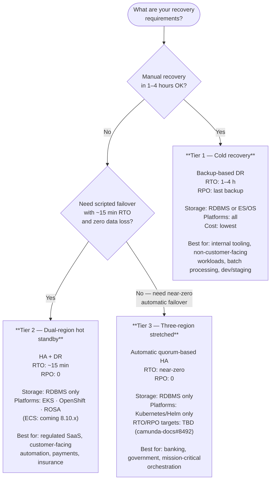

# Diagram: High Availability Architectures — Tier Selection

Three named tiers replace ad-hoc multi-region patterns. Choose based on RTO/RPO requirements and platform constraints.

## Comparison table

| | Tier 1 | Tier 2 | Tier 3 |
|---|---|---|---|
| Name | Cold recovery | Dual-region hot standby | Three-region stretched |
| RTO | 1–4 h | ~15 min | near-zero |
| RPO | last backup | 0 | 0 |
| Regions | 1 (+ restore target) | 2 | 3 |
| Failover | Manual | Scripted | Automatic (quorum) |
| Standby cost | None | Active standby | Two standbys |
| Storage | RDBMS or ES/OS | RDBMS only | RDBMS only |
| Platforms (8.10 GA) | All | EKS, OpenShift, ROSA | Kubernetes/Helm |
| Operational complexity | Low | Medium | High |

> **Note:** If multi-region is on your roadmap, prefer RDBMS for the OC from day one — switching storage backend later requires a migration.
