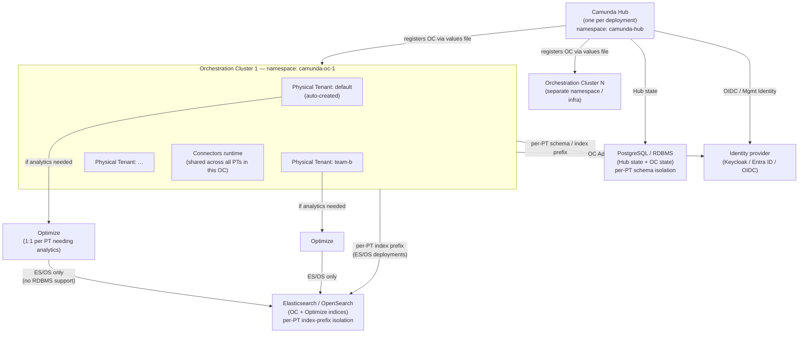

# Diagram: 8.10 Component Topology

Hub is the single management plane. Each Orchestration Cluster hosts one or more Physical Tenants. Optimize binds 1:1 to a PT.

## Key constraints

| Constraint | Detail |
|---|---|
| Hub count | One Hub per deployment; N OCs register to it |
| Physical Tenant binding | Each OC auto-creates one default PT; add more via `orchestration-values.yaml` |
| Optimize binding | 1:1 per PT — one Optimize instance per PT needing analytics; each needs its own Mgmt Identity app registration |
| Optimize storage | ES/OS only — no RDBMS support, none planned |
| Connectors runtime | One per OC, shared across all PTs in that OC |
| Identity surfaces | Two distinct surfaces: Mgmt Identity (Hub + Optimize) and OC Admin (Zeebe, Operate, Tasklist) |
| Bitnami subcharts | Removed in 8.10 — all dependencies must be provisioned externally before install |
