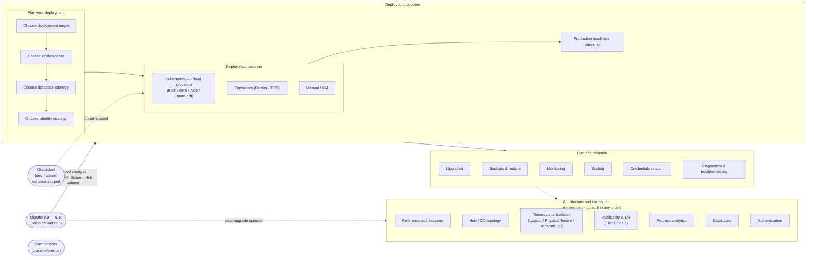

# Diagram: 8.10 Administrator Journey Overview

The sidebar is action-ordered to a production baseline, then branches into reference and operations.

## 8.9 vs 8.10 sidebar shape

| 8.9 | 8.10 |
|---|---|
| Categories to browse | Action path to baseline, then reference |
| Quickstart · Ref Arch · Deploy & manage · Concepts · Components · Upgrade | Quickstart · Deploy to production · Architecture and concepts · Run and maintain · Components · Migrate |
| Backup & restore buried under Concepts | Backup & restore top-level Run and maintain entry |
| Multi-region buried as one Concepts page | First-class Availability & DR with Tier 1 / 2 / 3 |
| Deployment target choice implicit | Deployment target chosen explicitly in Plan your deployment |
| "Concepts" mixes definitions with operations | Concepts → Architecture and concepts; Operations → Run and maintain |
