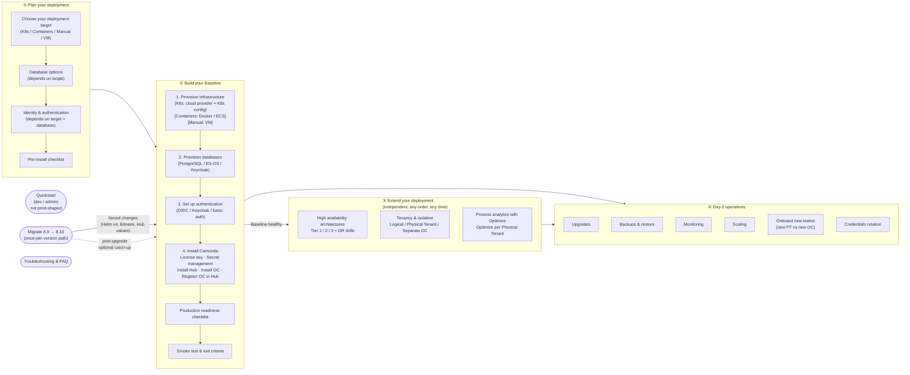

# Diagram: 8.10 Administrator Journey Overview

The four-phase journey replaces the 8.9 category-browse structure with an action-sequence structure.

## 8.9 vs 8.10 sidebar shape

| 8.9 | 8.10 |
|---|---|
| Categories to browse | Phases to act through |
| Quickstart · Ref Arch · Deploy & manage · Concepts · Components · Upgrade | Quickstart · ① Plan · ② Baseline · ③ Extend · ④ Day-2 · Migrate · Troubleshooting |
| Backup & restore buried under Concepts | Backup & restore top-level Day-2 entry |
| Multi-region buried as one Concepts page | First-class High availability architectures with Tier 1/2/3 |
| Deployment target choice implicit | Deployment target chosen explicitly in Plan |
| Bitnami subcharts removed but no migration path | Migrate from Bitnami in Migrate from 8.9 → 8.10 |
