# Diagram: Docs IA Rollout Phases

Three phases ordered by risk and independent value. Phase 1 ships before 8.10 GA with no IA risk. Phase 3 completes the full cleanup post-GA.

```mermaid
flowchart TB
    subgraph P1["Phase 1 — pre-8.10 GA  (low risk · no rewrites · single sidebars.js PR)"]
        direction LR
        p1a["Promote Backups & Restore\n→ Day-2 top-level\n(out of Concepts junk-drawer)"]
        p1b["Move monitoring / flow-control /\naudit-log / diagnostics → Day-2"]
        p1c["Flatten OpenShift duplication\n(ROSA + IPI as siblings,\nnot Amazon → OpenShift nesting)"]
        p1d["Add Production readiness\nchecklist page"]
        p1e["Extend glossary with 8.10 terms\n(Hub · OC · PT · Mgmt Identity\nTier 1/2/3 · RPO · RTO)"]
        p1f["Promote application-configs\nto address Helm-vs-app-config confusion\n(product-hub#3562)"]
        p1g["Move Helm v4 → next to install\nMove kind → Quickstart → For admins"]
    end

    subgraph P2["Phase 2 — ship with 8.10 GA  (8.10-tied changes)"]
        direction LR
        p2a["Introduce\nPlan → Baseline → Extend → Day-2\nspine (structure first, full content later)"]
        p2b["High availability architectures section\nTier 1 / 2 / 3 + CockroachDB-style\ntier comparison table"]
        p2c["Migrate 8.9 → 8.10 section\n(replaces Upgrade; slug /migrate/)"]
        p2d["Physical Tenant pages\n(Concept · Add PT · Per-PT creds & backups)"]
        p2e["Optimize-per-PT pages\n(Add Optimize · Hub BV · Storage req\nMgmt Identity reg · Sizing)"]
        p2f["Restructure Helm install order\nProvision K8s cluster → Install Helm\n→ K8s-specific config\nMerge 3 overview pages into 1"]
    end

    subgraph P3["Phase 3 — ship with 8.10.x  (full structural cleanup)"]
        direction LR
        p3a["Dissolve Concepts section entirely\nDB pages → 2. Provision databases\nAuth pages → Plan → Identity & authentication\nBackup pages already moved in Phase 1"]
        p3b["Build Provision databases sub-trees\nPostgreSQL / RDBMS full sub-tree\nElasticsearch / OpenSearch full sub-tree"]
        p3c["Build Ref Arch variants\nTier 2 blueprint · Tier 3 blueprint\nMulti-PT blueprint\n(tracked: product-hub#3561)"]
        p3d["Apply Confluent-style pattern\nacross all Extend option pages:\nWhen to use · When NOT to use\nUse cases · Implementation"]
    end

    P1 -->|"wins shipped, foundation stable"| P2
    P2 -->|"8.10 stable, team bandwidth available"| P3
```

## What each phase delivers to customers

| Phase | Customer-visible improvement |
|---|---|
| 1 | Backup docs are findable. OpenShift not duplicated. Kind is in Quickstart. Glossary has 8.10 terms. |
| 2 | 8.10 journey has a logical structure. Physical Tenants documented. Tier 1/2/3 DR is first-class. Migrate path is clear. |
| 3 | Concepts section gone — everything lives where you'd look for it. Full DB provisioning guidance. Reference architectures for Tier 2/3/multi-PT. |
