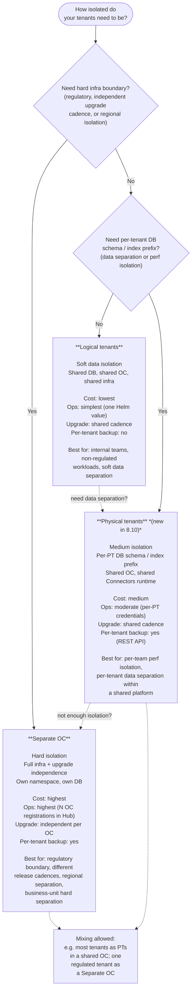

# Diagram: Tenancy & Isolation Model Selection

Three isolation levels. Models can be mixed — e.g., most tenants as Physical Tenants within a shared OC, one regulated tenant as a Separate OC.

## Comparison table

| | Logical tenants | Physical tenants | Separate OC |
|---|---|---|---|
| New in 8.10 | No | **Yes** | No |
| What's isolated | Data (soft, app-level) | DB schema / index prefix | Full infra |
| Infra cost | Lowest | Medium | Highest |
| Per-tenant IdP | No | Yes | Yes |
| Per-tenant backup | No | Yes (REST API) | Yes |
| Per-tenant perf isolation | No | Partial (own partitions) | Full |
| Upgrade cadence | Shared | Shared | Independent |
| Operational complexity | Low | Medium | High |
| Enable via | `global.multitenancy.enabled` | `camunda.physical-tenants.*` | Separate Helm release |
